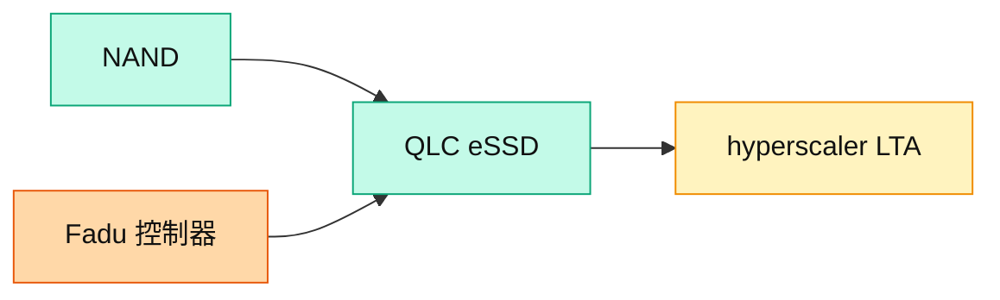

# SNDK.US(sandisk)

## 基本資料
SanDisk 為由 Western Digital 分拆的 **NAND / SSD 大廠**，摩根士丹利維持 OW，看好 NAND/DRAM 供需與資料中心儲存轉型。積極擴張 datacenter 儲存業務並取得 hyperscaler LTA；公司表示 datacenter 占營收 > 20%，未來將提升至 35–40%。業界普遍看好其 QLC eSSD。資料來源：[[260702_ms_nand-industry]]、[[大和 韓國記憶體產業電話會議摘要]]。

## 核心技術／競爭優勢
- **DC 儲存轉型**：datacenter 營收占比由 >20% 拉升目標 35–40%，QLC eSSD 為主力產品。
- **供需能見度**：LTA 支撐定價能見度，市場可望維持緊俏 2–3 年；<10x P/E，2027 有意義庫藏股。
- **控制器夥伴**：eSSD 控制器由 Fadu（韓廠，eSSD 控制器） 供應（key eSSD controller supplier to SanDisk）。

## 產品與應用
| 產品 / 服務 | 應用 | 相關客戶 / 下游 |
|-------------|------|-----------------|
| QLC eSSD | 資料中心大容量儲存 | hyperscaler |
| Client SSD / NAND | PC、消費 | 品牌、通路 |

## 圖片 / 架構圖

圖說：SanDisk 以 QLC eSSD 切入 hyperscaler 資料中心儲存，控制器由 Fadu 供應，datacenter 營收占比目標拉升至 35–40%。

## 目標價與評等

| 券商 | 報告日 | 評等 | 目標價 | 評價基礎 | 來源 |
|------|--------|------|--------|----------|------|
| Bernstein | 2026-06-30 | Outperform | $3,000（↑from $1,700） | 11x FY28E EPS $272 或 14x through-cycle（FY26-30）avg EPS $213 | [[報告_Bernstein_SanDisk_20260630]] |

## EPS 預估

| 年度 | EPS（USD） | 備註 | 券商 |
|------|-----------|------|------|
| 2025A | $2.99 | 實際值 | Bernstein |
| 2026E | $65.43 | — | Bernstein |
| 2027E（base） | $243.73 | — | Bernstein |
| 2027E（bull） | $350 | 漲價超預期 | Bernstein |
| 2028E（base） | $272 | — | Bernstein |
| 2028E（bull） | $400 | — | Bernstein |

## New Memory LTA（長期協議）關鍵數據（Bernstein 2026-06-30）

| 指標 | SNDK | MU |
|------|------|----|
| LTA 協議數 | 5 筆（3 筆 FQ3 + 2 筆 FQ4） | 16 筆 SCA |
| RPO（剩餘履約義務）| $41.6B（3 筆 Q3 協議）→ 全部 5 筆估 ~$69B | ~$100B |
| 財務擔保 | >$11B（多為第三方帳戶條件性擔保） | $22B 現金 + $4B 信用狀 |
| 合約期限 | 1/2/3/5 年混合；多數 3-5 年（平均估~4 年） | 多數 5 年（2026-2030） |
| NAND 地板價 | **$0.29/GB**（≈ CQ2'26 現貨 ASP） | 估 CQ2 的 ~50% 以下（高毛利但更保守） |
| NAND 上限價 | 未揭露（後期有上行分潤） | CQ2'26 市場價（固定上限） |
| 未來 12 月可認列 | ~15% of RPO | ~$1.8B（Q3 RPO 部份） |
| FY27 供量已鎖定 | 超過 1/3 | ~20% DRAM + ~33% NAND |

**核心論點**：舊式 LTA 對供應商毫無保護；新式 LTA 有三大差異：①價格固定或設區間；②客戶預付財務承諾（動態覆蓋率越到後期越高）；③合約期長達 3-5 年。即使最壞情境（ASP 腰斬 72% 至 $0.11/GB），SNDK FY30 EPS 仍有 $214（vs 無 LTA 僅 $81）。

## 時間軸
| 時間 | 事件 | 類型 | 重要性 | 備註 |
|------|------|------|--------|------|
| 2026-06-30 | Bernstein TP $3,000（↑from $1,700）；LTA 地板價 $0.29/GB；FY27E EPS $243 | 評等升幅 | ⭐⭐⭐ | 新記憶體 LTA 典範轉移 |
| 2026 | datacenter 占比 >20% → 35–40% | 放量 | ⭐⭐⭐ | QLC eSSD 帶動 |
| 2027 | 有意義庫藏股 | 事件 | ⭐⭐ | 資本回饋 |

→ 對照 [[時程_2026記憶體與AI催化劑]]

## 供應鏈位置
- 上游：NAND 設備、eSSD 控制器（Fadu（韓廠，eSSD 控制器））
- 下游：hyperscaler、PC 品牌
- 所屬供應鏈：[[供應鏈_記憶體]]；相關技術 [[技術_NAND快閃記憶體]]

## 相關公司
| 公司 | 關係 | 說明 |
|------|------|------|
| [[285A.JP(kioxia)]] | 合資背景 / 同業 | 共同 NAND 廠背景，DC 儲存競合 |
| [[MU.US(micron)]] | 同業 | NAND/DRAM 競爭者 |
| [[005930.KR(samsung)]] | 同業 | NAND 競爭者 |

> [!warning] 風險與注意事項
> - 產品定位：業界推測其 datacenter 用低規 NAND 晶片，但仍具溢價；QLC eSSD 品質評價為觀察點。
> - 循環風險：NAND ASP 若因中國廠擴產反轉，DC 儲存溢價收斂。

## 來源
- [[報告_Bernstein_SanDisk_20260630]]（Bernstein，2026-06-30；TP $3,000↑；LTA 地板價 $0.29/GB；FY27E EPS $243.73、FY28E $272）
- [[260702_ms_nand-industry]] — 摩根士丹利，2026-07-02
- [[大和 韓國記憶體產業電話會議摘要]] — 大和，2026-07-02

## 相關頁面

- [[分析_記憶體超級循環2026]]
