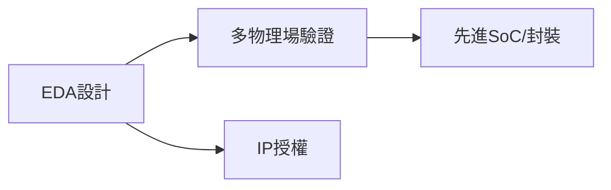

# SNPS.US(synopsys)

## 基本資料
Synopsys 是 EDA 軟體與半導體 IP 供應商，2025 年併購 Ansys 後擴充多物理場模擬。FY2026Q3（2026-08-26）營收約 24.77 億美元、backlog 109 億美元；非 GAAP 營業利益率 41.6%，財報電話會議數字以公司逐字稿為準。

## 核心技術／競爭優勢
- RTL-to-GDS 設計流程與先進節點 PDK 整合。
- Ansys 多物理場模擬補足熱、電磁與機械設計。
- IP 授權與長期合約形成高續約率和 backlog。

## 產品與應用
|產品|應用|下游|
|---|---|---|
|Fusion Compiler／EDA|AI加速器與先進SoC|[[NVDA.US(nvidia)]]、晶片設計商|
|Ansys multiphysics|封裝、熱與電磁模擬|半導體與系統公司|
|DesignWare IP|介面與運算矽智財|ASIC／SoC 廠|

## 圖片 / 架構圖

## 時間軸
|時間|事件|類型|重要性|
|---|---|---|---|
|FY2026H2|Ansys 整合與成本協同|整合|⭐⭐⭐|
|2027|Agentic EDA 與多物理場滲透|新品|⭐⭐|

## 供應鏈位置
- 上游：晶圓代工 PDK、計算基礎設施。
- 下游：IC 設計、系統與封裝廠；所屬主題：[[供應鏈_AI伺服器PCB]]。

## 相關公司
|公司|關係|說明|
|---|---|---|
|[[NVDA.US(nvidia)]]|EDA客戶|AI加速器設計需求|

> [!warning] 風險與注意事項
> - Ansys 併購整合、攤銷與成本協同落地速度影響利潤。
> - 半導體設計支出若受景氣或出口管制影響，IP 與 EDA 訂單可能延後。

## 來源
- [[活動_Synopsys_FY2026Q3法說_20260826]]（AlphaMemo.ai，2026-08-26）

## 相關頁面

- [[分析_20260826_AI軟體與晶片平台法說]]
