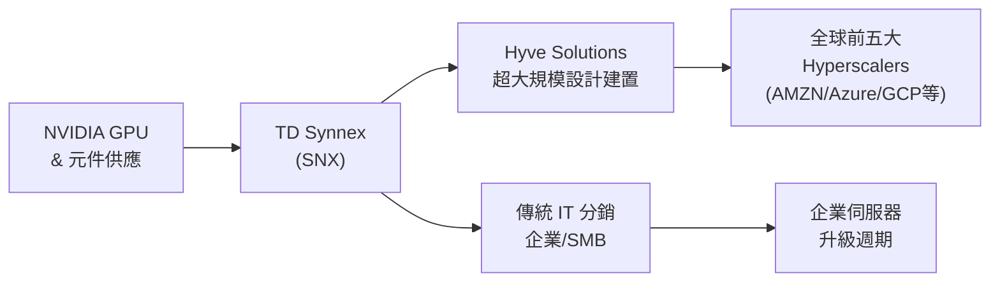

# SNX.US(td_synnex)

## 基本資料

TD Synnex（NYSE: SNX）是全球最大的 IT 產品分銷商，旗下子公司 **Hyve Solutions** 直接為全球前五大超大規模雲端業者（hyperscalers）設計並建置伺服器機架及資料中心基礎設施，是 SNX 區別於同業（CDW、Ingram Micro）的核心差異。

- Hyve 客戶：全球前五大 hyperscalers；三家合約在 2H26/2027 有機性成長加速
- 2026-06-23：摩根士丹利發行超過 300 萬股 SNX 認股權（warrants）給 AMZN，長期夥伴關係信號
- MS CY27 EPS 預估 USD 21.33，高於共識 11.8%；PT USD 341（25.8% 上調）

定位：兼具傳統 IT 分銷（on-prem 企業端，受惠企業伺服器更新週期）與 Hyve 超大規模基礎設施建置（AI 資料中心直接受益）的雙重曝險，是 MS 在北美 IT 硬體覆蓋中最偏好（首選 OW）的標的。

資料來源：報告_MS_IT硬體企業伺服器_20260623（MS IT Hardware 報告，2026-06-23）

## 核心技術／競爭優勢

- **Hyve 超大規模設計建置能力**：為全球前五大 hyperscalers 客製化設計與建置伺服器機架及整個資料中心基礎設施，有別於一般 IT 分銷商，具備工程設計能力
- **AMZN 長期夥伴關係**：2026-06-23 向 AMZN 發行 3M+ 認股權，歷史上是長期採購夥伴關係的看漲信號
- **雙重受惠結構**：Hyve（hyperscale AI capex 直接受益）＋傳統分銷（企業伺服器更新週期），比純分銷商 CDW/INGM 更廣泛的伺服器曝險
- **全球規模優勢**：全球最大 IT 分銷商，對傳統企業 on-prem 伺服器需求有廣泛涵蓋

## 產品與應用

| 產品 / 服務 | 應用 | 相關客戶 / 下游 |
|-------------|------|-----------------|
| Hyve 超大規模基礎設施設計建置 | AI 資料中心機架設計、伺服器建置 | 全球前五大 hyperscalers（AWS/Azure/GCP/Meta/Oracle 等）|
| IT 分銷（傳統）| 企業伺服器、儲存、網路設備、PC 分銷 | 企業、SMB、政府 |
| 企業 AI 基礎設施分銷 | GPU 伺服器、AI 工廠組建 | 企業、NeoCloud |

## 圖片 / 架構圖

> 來源：報告_MS_IT硬體企業伺服器_20260623；Hyve 為 SNX 子公司，直接服務 hyperscalers

## EPS 預估

| 年度 | 摩根士丹利 EPS（報告日：2026-06-23）| 市場共識 | MS vs 共識 |
|------|--------------------------------------|----------|------------|
| CY26 / FY27E | USD 17.80 | USD 17.04 | +4.5% |
| CY27 / FY28E | USD 21.33 | USD 19.07 | +11.8% |

## 目標價與評等

| 券商 | 報告發布日 | 評等 | 目標價 | 評價基礎 | 來源 |
|------|------------|------|--------|----------|------|
| 摩根士丹利 | 2026-06-23 | Overweight（首選）| USD 341 | 16x FY27E EPS $21.33 | 報告_MS_IT硬體企業伺服器_20260623 |

## 時間軸

| 時間 | 事件 | 類型 | 重要性 | 備註 |
|------|------|------|--------|------|
| 2026-06-23 | MS 上調 PT $271→$341（+25.8%）；維持 OW 首選 | 評等 | ⭐⭐⭐ | Hyve 三家客戶 2H26/2027 加速成長 |
| 2026-06-23 | AMZN 獲 SNX 認股權 3M+（長期夥伴信號）| 業務 | ⭐⭐⭐ | 歷史上看漲先行指標 |
| 2026-06-25 | Q2 財報（法說）| 財報 | ⭐⭐⭐ | MS 視為正向催化劑 |
| 2H26–2027 | Hyve 三家 hyperscaler 客戶加速建置 | 放量 | ⭐⭐⭐ | 非有機成長（新合約上線）|

## 供應鏈位置

- **Hyve** 直接為全球前五大 hyperscalers 設計建置伺服器機架，在 AI 資料中心供應鏈中位置接近 ODM
- 傳統分銷：上游為 DELL、HPE 等 OEM，下游為企業終端用戶
- 所屬供應鏈：[[供應鏈_AI伺服器散熱]]（間接，AI 伺服器基礎設施建置）

## 相關公司

| 公司 | 關係 | 說明 |
|------|------|------|
| [[DELL.US(dell)]] | 競合 / 補充 | 傳統分銷合作；AI 伺服器各有不同定位 |
| [[NVDA.US(nvidia)]] | 上游 | GPU 為 Hyve AI 伺服器核心元件 |
| AMZN（hyperscaler）| Hyve 客戶 / 長期夥伴 | 2026-06-23 AMZN 獲 3M+ SNX 認股權 |

> [!warning] 風險與注意事項
> - **客戶集中（Hyve）**：Hyve 業務高度依賴前五大 hyperscalers 資本支出週期，若 CSP capex 縮減，Hyve 成長斜率快速下滑
> - **傳統分銷毛利薄**：IT 分銷業務毛利率低，依賴規模與周轉；DRAM/NAND 漲價使 ASP 提升，但下游企業最終可能出現抗拒
> - **企業拉貨提前**：目前企業伺服器需求部分為提前採購（pull-forward），一旦 2027 消化期來臨，傳統分銷收入成長有反轉風險

## 來源

- 報告_MS_IT硬體企業伺服器_20260623（MS IT Hardware 企業伺服器需求報告，2026-06-23）
