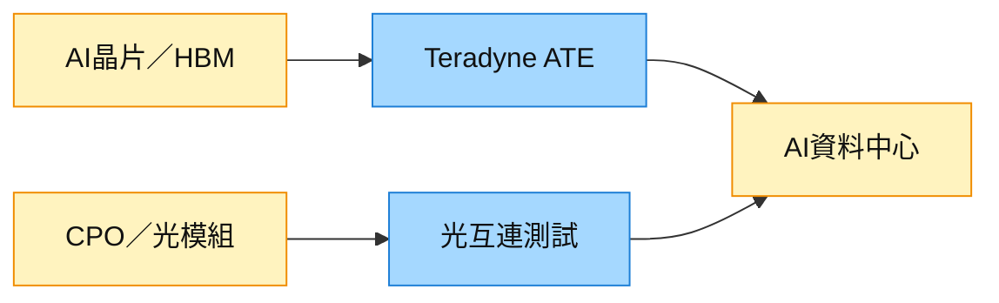

# TER.US(teradyne)

## 基本資料

Teradyne 是美國自動化測試設備廠，產品涵蓋 SoC、記憶體與系統測試，並延伸至工業自動化／協作機器人。AI 加速器、HBM、chiplet 與先進封裝提高測試複雜度，使 Compute、Memory 與光互連測試成為本輪成長焦點。來源：[[報告_富邦_Teradyne2Q26法說_20260730]]。

## 核心技術／競爭優勢

- 半導體測試產品覆蓋 SoC、記憶體、類比與混合訊號。
- 「Wafer to AI Data Center」策略將晶片測試、光互連 board test 與自動化串接。
- 透過 Quantifi Photonics、Photon 100 與 MultiLane 建構 CPO／高速光測試工具組合。

## 產品與應用

| 產品 / 服務 | 應用 | 相關下游 |
|---|---|---|
| SoC / Compute ATE | AI 加速器、CPU、GPU | Hyperscaler 與晶片設計商 |
| Memory Test | HBM、DDR、NAND final test | 記憶體廠 |
| 光互連測試 | CPO、高速光模組、板級測試 | [[技術_CPO]] |
| 自動化 | 電子製造與資料中心自動化 | ODM／資料中心 |

## 圖片 / 架構圖

圖說：Teradyne 由晶片 ATE 延伸至 CPO 光測試與資料中心自動化，受惠於高價值系統提高測試強度。

## EPS 記錄

| 季度 | non-GAAP EPS（US$） | 備註 |
|---|---:|---|
| 2Q26A | 2.47 | 營收 US$1.329bn、Semi Test 逾 US$1.1bn |

## EPS 預估

| 年度 | 富邦預估（報告日：2026-07-30） |
|---|---:|
| FY2026E | 7.32 |
| FY2027E | 10.59 |
| FY2028E | 14.17 |

## 時間軸

| 時間 | 事件 | 類型 | 重要性 | 備註 |
|---|---|---|---|---|
| 3Q26 | 營收指引 US$1.2–1.3bn | 營運 | ⭐⭐ | 公司指引 |
| 2027 | Compute 市占率改善目標 | 放量 | ⭐⭐⭐ | 第二家 Hyperscaler 驗證後，屬公司展望 |
| 2028 | CPO 測試市場 US$0.3–0.7bn | 市場形成 | ⭐⭐ | 公司／券商估計 |

→ [[時程_2026記憶體與AI催化劑]]

## 供應鏈位置

- 所屬主軸：[[供應鏈_半導體測試設備]]。
- 競爭對手：[[6857.JP(advantest)]]；測試機選型與 AI Compute 客戶導入是主要觀察點。

## 相關公司

| 公司 | 關係 | 說明 |
|---|---|---|
| [[6857.JP(advantest)]] | 競爭 | ATE、尤其 SoC／AI Compute 測試市場的主要同業 |

> [!warning] 風險與注意事項
> - Compute 訂單時點與 Mobile 需求轉弱，可能使季度營收波動。
> - Hyperscaler 認證到量產通常需 9–12 個月，市占改善未必按預期兌現。
> - CPO 市場規模與採用節奏仍早期，不能視為已落地營收。

## 來源

- [[報告_富邦_Teradyne2Q26法說_20260730]] — 富邦，2026-07-30。
