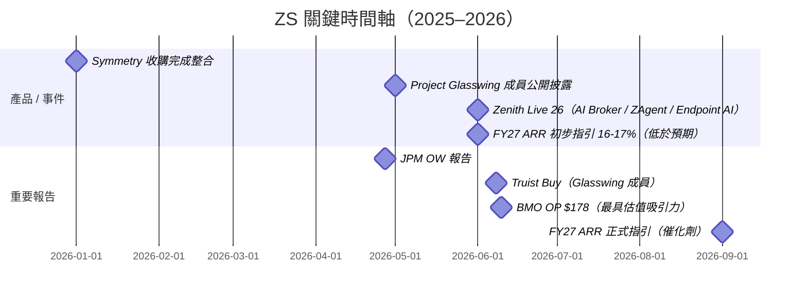

# ZS.US(zscaler)

## 基本資料

Zscaler 是全球最大的雲原生安全服務邊緣（SSE / SASE）公司，總部位於美國加州聖荷西，2007 年由 Jay Chaudhry 創辦，2018 年在 NASDAQ 上市。公司以「Zero Trust Exchange」平台提供用戶、裝置、應用程式的安全存取，所有流量透過 ZS 全球 150+ PoP 節點（入網點）進行零信任過濾，PoP 網路規模形成難以複製的護城河。

2026 年，ZS 在估值上面臨「AI 落後者」的感知挑戰（YTD -43%，BMO 2026-06），但公司在 Zenith Live 26 大會推出一系列 AI 資安新品，並在 Anthropic Project Glasswing 中擔任會員（Cloudflare 與 Zscaler 均公開披露參與）。

**近期財務規模（2026 年 6 月市場資料）**

| 指標 | 數值 | 來源 |
|---|---|---|
| 市值（2026-06-10） | ~$20B | BMO |
| 股價（2026-06-10） | $126.11 | BMO |
| NTM EV/FCF（2026-06） | 20.5x（↓ from 34.3x on 1/1/26） | BMO |
| FCF Margin（CY2026E） | 24.0% | BMO |
| FCF Margin（CY2027E） | 25.6% | BMO |
| Revenue Growth（CY2026E） | 20.9% | BMO |
| Revenue Growth（CY2027E） | 16.6%（FY27 ARR guide 16-17%） | BMO |
| EV/CY27E Revenue | 4.4x | BMO |

---

## 核心平台：Zero Trust Exchange

ZS 的核心架構是「全流量透過 ZS 雲端」的零信任過濾：不再依賴傳統防火牆，所有用戶、裝置、應用、代理人流量都透過 ZS PoP 節點驗證、審查與過濾。

| 產品類別 | 代表產品 | 說明 |
|---|---|---|
| SSE / ZTNA | Zscaler Private Access（ZPA） | 取代 VPN 的零信任遠端存取 |
| SWG | Zscaler Internet Access（ZIA） | 安全網路閘道，過濾網路威脅 |
| CASB | Cloud Access Security Broker | SaaS 應用存取管控 |
| DLP | Zscaler Data Protection | 資料外洩防護，整合跨渠道 |
| 身份 / AI 治理（新） | Symmetry（2026 收購）| AI Access Graph，識別身份-應用-資料連結 |
| AI Broker（新） | Zscaler AI Broker | 透過 MCP 保護 agentic 通訊，含 Agent Registry |
| Endpoint AI Security（新） | ZS Endpoint AI Security | 終端側 AI 威脅偵測（瀏覽器 / 外掛 / 本地 AI） |
| ZAgent Framework（新） | ZAgent | 跨零信任平台協調 ZS agents，自動化管理 |
| AI Protect | AI Protect（已有） | AI 資產管理 + 安全存取 AI + AI 基礎設施保護 |

### Zenith Live 26 新品（2026 年）

Zenith Live 26 是 ZS 年度用戶大會，2026 年發布重點：

- **AI Broker**：透過 MCP 協議保護 agentic 通訊，含 Agent Registry 管控代理人存取權限
- **Endpoint AI Security**：找出並阻止終端 AI 相關威脅（瀏覽器、外掛、擴充、本地 AI 工具）
- **ZAgent Framework**：協調跨平台 Zscaler agents，自動化管理任務
- **Symmetry 收購完整整合**：AI Access Graph 結合身份-應用-資料連結分析，提供 Agentic 政策設定競爭優勢

### Red Canary 收購（挑戰）

ZS 在 2025-2026 年間收購 Red Canary（MDR 廠商），但整合進度落後市場預期。BMO（2026-06-12）指出：FY27 ARR 初步指引（16-17%）已假設 Red Canary ARR 成長慢於合併後整體，投資人對 M&A 執行能力仍持懷疑態度。

---

## 投資觀察

### 熊市觀點（主要逆風）

1. **SASE 市場成熟化疑慮**：ZS 最大市場的成長率被認為已過了爆發期
2. **Red Canary 執行不力**：FY27 ARR 指引未達投資人預期，整合進度落後
3. **估值被感知為 AI 落後者**：NTM EV/FCF 從 34.3x（2026 年初）降至 20.5x，YTD -43%
4. **新 Logo 不足**：過度依賴現有客戶 upsell/cross-sell；ZS 已調整業務員薪酬，激勵新客戶開發

### 多頭觀點（BMO Outperform $178）

1. **絕對估值極具吸引力**：EV/CY27E FCF 17x vs 同業中位數 36x；EV/CY27E Rev 4.4x vs 最大競品 CRWD 22.9x / PANW 14.2x
2. **AI 安全推動長期需求**：BMO 指出資安支出將因 AI 威脅而在未來 12 個月持續改善
3. **ZAgent / AI Broker 新市場**：Agentic AI 安全治理是 ZS 相對身份廠商的競爭優勢（即時流量審查）
4. **AI Protect $100M bookings**：ZS 的 AI Protect 產品在過去 12 個月 bookings 突破 $100M，驗證需求真實存在
5. **NRR mid-teens 支撐**：1Q NRR 115%，16-17% ARR 成長不需要太多新 Logo 貢獻

---

## 券商評等與目標價

| 報告日 | 券商 | 評等 | 目標價 | 當時股價 | 上漲空間 |
|---|---|---|---|---|---|
| 2026-04-27 | J.P. Morgan | Overweight | — | $135.50（4/24） | — |
| 2026-06-08 | Truist Securities | Buy | — | $130.78 | — |
| 2026-06-10 | BMO Capital Markets | Outperform | $178 | $126.11 | +41% |

---

## 估值比較（BMO，2026-06）

| 指標 | ZS | CRWD | PANW | RBRK | DDOG |
|---|---|---|---|---|---|
| 市值（$M） | 20,049 | 167,040 | 210,839 | 14,526 | 83,024 |
| EV/CY27 Rev | 4.4x | 22.9x | 14.2x | 7.1x | 15.2x |
| EV/CY27 FCF | 17.3x | 71.0x | 36.4x | 34.6x | 56.4x |
| Rev Growth CY27 | 16.6% | 21.7% | 17.2% | 21.7% | 20.8% |
| (EV/FCF)/Rev Growth CY27 | **1.0x** | 3.3x | 2.1x | 1.6x | 2.7x |

ZS 是覆蓋範圍中最便宜的 best-of-breed 資安股（EV/FCF to Rev Growth 1.0x vs 同業中位數 1.9x）。

---

## 2026Q2 資安通路與 AI 安全更新

- Truist（2026-06-08）將 ZS 定位為 agent-driven AI 的 Zero Trust Exchange／治理層；UBS（2026-06-09／07-14）則觀察企業優先採用既有零信任、身份與資料控制點，AI 安全支出仍在評估期。
- Barclays（2026-07-07）通路預期 ZS 7 月可達計畫，主要由既有客戶續約與加購支撐，但大型企業新 logo 競爭升高，Netskope 開始向大型企業市場上攻。
- Wells Fargo（2026-07-20）SASE 調查中 Cloudflare 上升至第 3，ZS／PANW 仍爭奪大型企業；因此 ZS 的後續驗證點是新客戶取得、AI／SASE 加購與競爭下的折扣紀律。

## 相關公司

| 關係 | 公司 | 備註 |
|---|---|---|
| 主要競品（SASE） | [[PANW.US(palo alto networks)]] | PANW Prisma SASE 市占第一；ZS 傳統 SASE 領域市占挑戰 |
| 主要競品（SSE） | [[NET.US(cloudflare)]] | Cloudflare One；ZS 與 NET 在 SASE 市場重疊 |
| 身份整合夥伴 | [[OKTA.US(okta)]] | ZS 採夥伴模式整合 Okta（access layer）；ZS 自己做 governance layer |
| 身份競品（治理層） | [[SAIL.US(sailpoint)]] | ZS Agent 治理 vs SAIL 身份治理，論述重疊 |
| MDR 整合（收購） | Red Canary（未建頁） | 2025-2026 收購，整合進度落後預期 |
| AI 資安收購 | Symmetry（未建頁） | AI Access Graph，2026 年完成整合 |
| AI 身份競品 | CyberArk（PANW 子品牌） | PAM / Agentic Identity |

---

## 時間軸

---

## 來源

- [[報告_JPMorgan_資安_20260427]] — J.P. Morgan，Weapons of Mass Disruption，2026-04-27
- [[報告_Truist_MythosAndDaybreak_20260608]] — Truist，Rise of the Models，2026-06-08
- [[報告_UBS_Gartner資安峰會_20260609]] — UBS，Gartner 安全峰會，2026-06-09
- [[報告_BMO_資安可觀測性_20260612]] — BMO，資安可觀測性（Zenith Live 26），2026-06-12
- [[報告_Jefferies_資安_20260416]] — Jefferies VAR Survey，2026-04-16

### 本批新增來源

- [[Cybersec 260608 Truist_The age of Mythos & Daybreak]] — Truist，2026-06-08
- [[Cybersec 260609 UBS_Themes from Gartner security conference]] — UBS，2026-06-09
- [[Cybersec 260707 Barclays_Security VaR Call]] — Barclays，2026-07-07
- [[Cybersec 260714 UBS_Positive June Q checks]] — UBS，2026-07-14
- [[Cybersec 260720 WF_2Q26 on-cycle security reseller survey]] — Wells Fargo，2026-07-20

## 相關頁面

- [[CHKP.US(check point software)]]
- [[FTNT.US(fortinet)]]
- [[DDOG.US(datadog)]]
- [[分析_AI驅動資安支出2026]]
- [[技術_SASE]]
