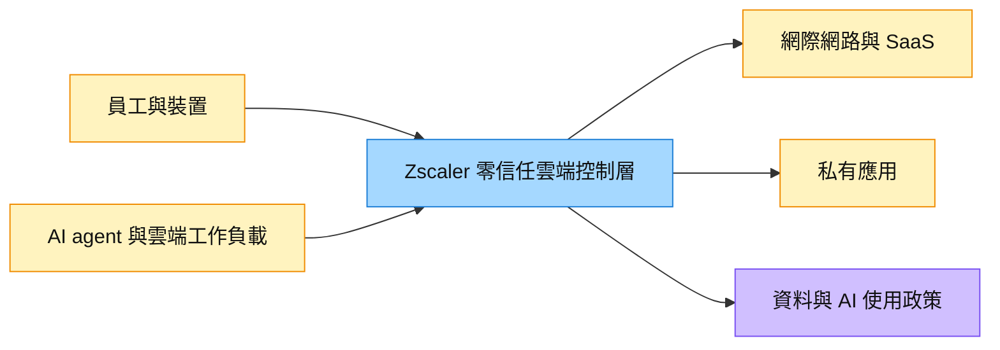
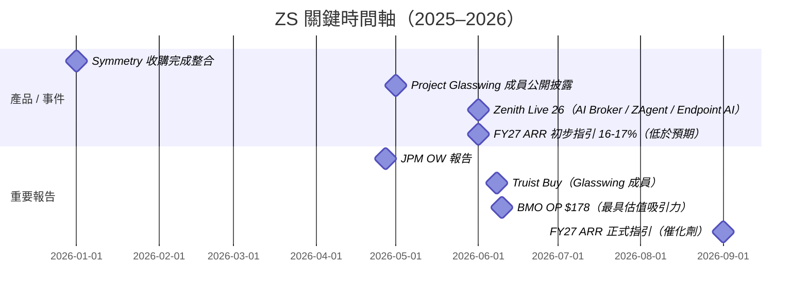

# ZS.US(zscaler)

## 基本資料

Zscaler 是全球最大的雲原生安全服務邊緣（SSE / SASE）公司，總部位於美國加州聖荷西，2007 年由 Jay Chaudhry 創辦，2018 年在 NASDAQ 上市。公司以「Zero Trust Exchange」平台提供用戶、裝置、應用程式的安全存取，所有流量透過 ZS 全球 150+ PoP 節點（入網點）進行零信任過濾，PoP 網路規模形成難以複製的護城河。

2026 年，ZS 在估值上面臨「AI 落後者」的感知挑戰（YTD -43%，BMO 2026-06），但公司在 Zenith Live 26 大會推出一系列 AI 資安新品，並在 Anthropic Project Glasswing 中擔任會員（Cloudflare 與 Zscaler 均公開披露參與）。

**近期財務規模（2026 年 6 月市場資料）**

| 指標 | 數值 | 來源 |
|---|---|---|
| 市值（2026-06-10） | ~$20B | BMO |
| 股價（2026-06-10） | $126.11 | BMO |
| NTM EV/FCF（2026-06） | 20.5x（↓ from 34.3x on 1/1/26） | BMO |
| FCF Margin（CY2026E） | 24.0% | BMO |
| FCF Margin（CY2027E） | 25.6% | BMO |
| Revenue Growth（CY2026E） | 20.9% | BMO |
| Revenue Growth（CY2027E） | 16.6%（FY27 ARR guide 16-17%） | BMO |
| EV/CY27E Revenue | 4.4x | BMO |

---

## 核心平台：Zero Trust Exchange

ZS 的核心架構是「全流量透過 ZS 雲端」的零信任過濾：不再依賴傳統防火牆，所有用戶、裝置、應用、代理人流量都透過 ZS PoP 節點驗證、審查與過濾。

| 產品類別 | 代表產品 | 說明 |
|---|---|---|
| SSE / ZTNA | Zscaler Private Access（ZPA） | 取代 VPN 的零信任遠端存取 |
| SWG | Zscaler Internet Access（ZIA） | 安全網路閘道，過濾網路威脅 |
| CASB | Cloud Access Security Broker | SaaS 應用存取管控 |
| DLP | Zscaler Data Protection | 資料外洩防護，整合跨渠道 |
| 身份 / AI 治理（新） | Symmetry（2026 收購）| AI Access Graph，識別身份-應用-資料連結 |
| AI Broker（新） | Zscaler AI Broker | 透過 MCP 保護 agentic 通訊，含 Agent Registry |
| Endpoint AI Security（新） | ZS Endpoint AI Security | 終端側 AI 威脅偵測（瀏覽器 / 外掛 / 本地 AI） |
| ZAgent Framework（新） | ZAgent | 跨零信任平台協調 ZS agents，自動化管理 |
| AI Protect | AI Protect（已有） | AI 資產管理 + 安全存取 AI + AI 基礎設施保護 |

### 2026-09 多產品與非席次計價更新

Barclays（2026-09-29）將 Zscaler 的成長驗證拆成既有 ZIA／ZPA 與較快成長的新產品，以下為券商對產品／計價的描述，並非已公布的新收入指引：

| 產品／服務 | 應用與計價維度 | 投資觀察 |
|---|---|---|
| ZIA／ZPA | 員工網際網路與私有應用存取，主要依使用者計價 | 仍是主要業務，需觀察 SASE 競爭、新客戶取得與續約折扣 |
| Zero Trust Branch | 分支據點與裝置防護，依裝置數 | 裝置擴張能否增加合約價值與交叉銷售 |
| Zero Trust Cloud | 雲端工作負載保護，依工作負載數或流量 | 保護範圍能否延伸至員工席次之外 |
| Data Security | 部分模組依使用者、部分依資料量 | 必須區分產品組合、單價與用量對 ARR 的貢獻 |
| Security for AI | Token 或消耗量計價 | AI agent 流量增加能否成為可收費用量，仍待客戶採購驗證 |
| Agentic SecOps／Zero Trust for Agents | Jefferies（2026-09-24）稱前者已於 9 月 9 日正式推出，後者仍為 early access | 產品可用不等同收入；Jefferies 預期 FY27H2 才較有利 |

來源：[[報告_Barclays_Zscaler_投資人日預覽_20260929]]、[[報告_Jefferies_Zscaler_CRO交接_20260924]]；產品狀態為券商轉述／fact／中信心，成長貢獻為 thesis／中信心。

## 圖片 / 架構圖

```mermaid
flowchart LR
    U[員工與裝置] --> Z[Zscaler 零信任雲端控制層]
    A[AI agent 與雲端工作負載] --> Z
    Z --> I[網際網路與 SaaS]
    Z --> P[私有應用]
    Z --> D[資料與 AI 使用政策]
    classDef core fill:#a5d8ff,stroke:#1c7ed6,color:#111;
    classDef customer fill:#fff3bf,stroke:#f08c00,color:#111;
    classDef process fill:#d0bfff,stroke:#7950f2,color:#111;
    class Z core;
    class U,A,I,P customer;
    class D process;
```

圖說：依 RBC（2026-09-24）與 Barclays（2026-09-29）整理的概念架構；零信任控制層連接員工、裝置與工作負載，非席次計價的收入增量須另行驗證。本批沒有適合說明產品架構的來源圖。

![[報告_Barclays_Zscaler_投資人日預覽_20260929_001.png]]
*Barclays（2026-09-29），PDF 第 3 頁：FY27／FY28 EPS 新舊預估同為 US$4.88／5.46，目標價上調主要來自估值倍數，不能解讀為本次盈利預估上修。*

### Zenith Live 26 新品（2026 年）

Zenith Live 26 是 ZS 年度用戶大會，2026 年發布重點：

- **AI Broker**：透過 MCP 協議保護 agentic 通訊，含 Agent Registry 管控代理人存取權限
- **Endpoint AI Security**：找出並阻止終端 AI 相關威脅（瀏覽器、外掛、擴充、本地 AI 工具）
- **ZAgent Framework**：協調跨平台 Zscaler agents，自動化管理任務
- **Symmetry 收購完整整合**：AI Access Graph 結合身份-應用-資料連結分析，提供 Agentic 政策設定競爭優勢

### Agent 端防護架構（2026-06-09 發表，網路搜尋補強）

Zscaler 的論述是把 Zero Trust Exchange 從「人」延伸到「agent」，分三個控制點：agent 如何連線、如何取用資料、在裝置上如何執行。來源：[[research_Zscaler_Okta_Agent防護_20261005]]（新聞稿與 SiliconANGLE、Futurum 報導）。

| 控制點 | 產品 | 機制（來源描述） | 備註 |
|---|---|---|---|
| 連線 | AI Broker + Agent Registry | 透過 MCP 與 A2A broker 代理 agent 通訊；Registry 記錄各 agent 可存取的對象並套用細粒度存取控制 | 需先登錄並分類 agent，盤點是前提（Futurum） |
| 資料 | AI Access Graph | 來自 Symmetry Systems（2026-05 宣布、$175M）；對應身份、應用、資料來源的連結，即時追蹤資料血緣並縮減多餘存取 | 為其他控制提供可視性 |
| 裝置 | Endpoint AI Security | 延伸到瀏覽器、擴充套件、外掛與本地 AI 工具，ZS 稱傳統端點產品不檢查這一層 | 2026-02 收購 SquareX（瀏覽器安全）為相關布局（SiliconANGLE） |
| 資產／存取／基礎設施 | AI Protect 增強（2026-01 推出） | 發現 SaaS／網路流量內嵌 AI、辨識公有雲 agent 與 MCP server、掃描 agentic 程式碼；250+ GenAI app 的 prompt 擷取；MCP server red teaming、prompt hardening、合規熱圖 | 另支援 Anthropic、OpenAI Compliance API |

> [!warning] 描述差異：ZAgent 與 AI Broker 範圍
> 本頁既有敘述寫 AI Broker「透過 MCP」、ZAgent「協調跨平台 Zscaler agents」。2026-06-09 新聞稿與 SiliconANGLE 的 AI Broker 涵蓋 **MCP 與 A2A**；Futurum 稱 ZAgent Framework 是「以自然語言管理 Zero Trust Exchange」，屬 AI 管理 ZS 自身平台，並非治理客戶 agent 的產品。SiliconANGLE 該篇未提及 ZAgent。兩種說法並列保留，以新聞稿原文為準時再修正。

- **未揭露項目**：SiliconANGLE 稱 Zscaler 未公布這批產品的定價與 GA 日期；與 Jefferies 轉述的「Zero Trust for Agents 仍為 early access」一致（見上方 2026-09 表）。fact／中信心。
- **未解的技術問題（Futurum，thesis）**：A2A 呼叫多為雲端內部東西向流量，可能不經過 ZS 傳統擅長的南北向檢查點；agent 盤點不完整時，治理難以成立。
- **管理層說法**：Jay Chaudhry 稱「傳統資安並非為數百萬自主 agent 設計」；KPMG 全球 CISO John Israel 以來賓身份背書資料血緣與 agent 對 agent 治理，非採購承諾。
- **競爭框架**：Futurum 認為 SASE 廠商、身份廠商、雲端大廠（如 Microsoft Agent 365 的 agent 盤點）與新創都在爭同一控制平面；與 Okta 的分工見 [[分析_Zscaler與Okta_Agent防護分工_20261005]]。

### Red Canary 收購（挑戰）

ZS 在 2025-2026 年間收購 Red Canary（MDR 廠商），但整合進度落後市場預期。BMO（2026-06-12）指出：FY27 ARR 初步指引（16-17%）已假設 Red Canary ARR 成長慢於合併後整體，投資人對 M&A 執行能力仍持懷疑態度。

---

## 投資觀察

### 熊市觀點（主要逆風）

1. **SASE 市場成熟化疑慮**：ZS 最大市場的成長率被認為已過了爆發期
2. **Red Canary 執行不力**：FY27 ARR 指引未達投資人預期，整合進度落後
3. **估值被感知為 AI 落後者**：NTM EV/FCF 從 34.3x（2026 年初）降至 20.5x，YTD -43%
4. **新 Logo 不足**：過度依賴現有客戶 upsell/cross-sell；ZS 已調整業務員薪酬，激勵新客戶開發

### 多頭觀點（BMO Outperform $178）

1. **絕對估值極具吸引力**：EV/CY27E FCF 17x vs 同業中位數 36x；EV/CY27E Rev 4.4x vs 最大競品 CRWD 22.9x / PANW 14.2x
2. **AI 安全推動長期需求**：BMO 指出資安支出將因 AI 威脅而在未來 12 個月持續改善
3. **ZAgent / AI Broker 新市場**：Agentic AI 安全治理是 ZS 相對身份廠商的競爭優勢（即時流量審查）
4. **AI Protect $100M bookings**：ZS 的 AI Protect 產品在過去 12 個月 bookings 突破 $100M，驗證需求真實存在
5. **NRR mid-teens 支撐**：1Q NRR 115%，16-17% ARR 成長不需要太多新 Logo 貢獻

---

## 券商評等與目標價

| 報告日 | 券商 | 評等 | 目標價 | 當時股價 | 上漲空間 |
|---|---|---|---|---|---|
| 2026-04-27 | J.P. Morgan | Overweight | — | $135.50（4/24） | — |
| 2026-06-08 | Truist Securities | Buy | — | $130.78 | — |
| 2026-06-10 | BMO Capital Markets | Outperform | $178 | $126.11 | +41% |

### 2026-09 目標價與評等（美元；券商 estimate／中信心）

| 券商 | 報告日 | 評等 | 目標價 | 評價基礎／變化 | 來源 |
|---|---|---|---:|---|---|
| Barclays | 2026-09-24 | Overweight | $200 | 本份 CRO 快評未更新估值；9/29 報告稱原基礎約 27x FY28E FCF | [[報告_Barclays_Zscaler_CRO交接_20260924]] |
| BNP Paribas | 2026-09-24 | Outperform | $230 | 9x CY27 EV/Sales、隱含 FCF yield 約 2.9% | [[報告_BNPParibas_Zscaler_CRO交接_20260924]] |
| Jefferies | 2026-09-24 | Buy | $220 | DCF，隱含 9x EV/FY27E Revenue | [[報告_Jefferies_Zscaler_CRO交接_20260924]] |
| RBC | 2026-09-24 | Outperform | $236（前 $210） | 9x CY27E Revenue $4,231M；上修理由為同業倍數擴張 | [[報告_RBC_Zscaler_CRO交接_20260924]] |
| Barclays | 2026-09-29 | Overweight | $220（前 $200） | 約 30x FY28E FCF ~$1.1B，前約 27x；上行／下行情境 $240／150 | [[報告_Barclays_Zscaler_投資人日預覽_20260929]] |
| Evercore ISI | 2026-09-29 | In Line（IL） | $155 | 第 2 頁跨公司附表，目標價未變；本份未提供 ZS 估值方法 | [[報告_EvercoreISI_OpenAIDevDay資安影響_20260929]] |

> [!warning] 多方估值並存
> Evercore ISI 的 $155 與 9 月個股報告的 $200–236 分歧較大，保留券商與日期，不能合併為單一共識。9/29 Evercore 附表僅標 Current Year／Next Year，未明示財年；其 $4.24／4.88 預估不強行併入下列有明確財年的矩陣。

## EPS 記錄

| 季度 | 調整後／營運稀釋 EPS（美元） | YoY | 來源 |
|---|---:|---:|---|
| FY26Q1 | $0.96 | 24.3% | [[報告_RBC_Zscaler_CRO交接_20260924]]，2026-09-24 |
| FY26Q2 | $1.01 | 29.6% | 同上 |
| FY26Q3 | $1.08 | 28.5% | 同上 |
| FY26Q4 | $1.19 | 34.3% | 同上 |
| FY26 全年 | $4.24 | 29.3% | 同上；Barclays 9/29 同值 |

上述為券商轉述實績／fact／中信心；財年截至 7 月，與 CY 曆年分開。

## EPS 預估

| 年度 | RBC（報告日：2026-09-24，Ops Diluted） | Barclays（報告日：2026-09-29，adj） | 備註 |
|---|---:|---:|---|
| FY27E | $4.87 | $4.88 | 美元；券商 estimate／中信心 |
| FY28E | $5.51 | $5.46 | 預測差異保留；Barclays 新舊預估相同 |
| FY29E | — | $6.03 | RBC 本份未提供 FY29E |

來源：[[報告_RBC_Zscaler_CRO交接_20260924]]、[[報告_Barclays_Zscaler_投資人日預覽_20260929]]。Barclays FY27／FY28 營收估 $3,923M／$4,491M、調整後營業利益率 23.7%／24.2%、FCF $910M／$1,130M；RBC 營收估 $3,923M／$4,550M、FCF $912.6M／$1,069.7M，均為報告日的 estimate。

---

## 估值比較（BMO，2026-06）

| 指標 | ZS | CRWD | PANW | RBRK | DDOG |
|---|---|---|---|---|---|
| 市值（$M） | 20,049 | 167,040 | 210,839 | 14,526 | 83,024 |
| EV/CY27 Rev | 4.4x | 22.9x | 14.2x | 7.1x | 15.2x |
| EV/CY27 FCF | 17.3x | 71.0x | 36.4x | 34.6x | 56.4x |
| Rev Growth CY27 | 16.6% | 21.7% | 17.2% | 21.7% | 20.8% |
| (EV/FCF)/Rev Growth CY27 | **1.0x** | 3.3x | 2.1x | 1.6x | 2.7x |

ZS 是覆蓋範圍中最便宜的 best-of-breed 資安股（EV/FCF to Rev Growth 1.0x vs 同業中位數 1.9x）。

---

## 2026Q2 資安通路與 AI 安全更新

- Truist（2026-06-08）將 ZS 定位為 agent-driven AI 的 Zero Trust Exchange／治理層；UBS（2026-06-09／07-14）則觀察企業優先採用既有零信任、身份與資料控制點，AI 安全支出仍在評估期。
- Barclays（2026-07-07）通路預期 ZS 7 月可達計畫，主要由既有客戶續約與加購支撐，但大型企業新 logo 競爭升高，Netskope 開始向大型企業市場上攻。
- Wells Fargo（2026-07-20）SASE 調查中 Cloudflare 上升至第 3，ZS／PANW 仍爭奪大型企業；因此 ZS 的後續驗證點是新客戶取得、AI／SASE 加購與競爭下的折扣紀律。

## CRO 交接與 10 月投資人日（2026-09 來源基線）

9/24 報告均轉述 Mike Rich 因個人因素離任、Ross Tackett 接任 CRO，10 月 1 日生效；Rich 留任策略顧問至 12 月 31 日。Tackett 已參與 FY27 預測與銷售策略，RBC 稱自 5 月擔任全球銷售主管。公告事件為券商轉述／fact／中信心，對交接平順度的判斷則為 thesis。

| 券商／日期 | 延續性與風險判斷 | 來源 |
|---|---|---|
| RBC／2026-09-24 | 與管理層交流後認為不涉及策略或績效歧見，不預期 GTM 轉向；前兩名銷售主管離職的保守假設已在指引中 | [[報告_RBC_Zscaler_CRO交接_20260924]] |
| BNP Paribas／2026-09-24 | 接班者與 Rich 同為 ServiceNow 背景，有利延續 account-centric／產業垂直銷售；仍擔心主管流失 | [[報告_BNPParibas_Zscaler_CRO交接_20260924]] |
| Jefferies／2026-09-24 | 指引發布時未納入本次離職，執行風險提高、可能限制近期上行；FY27H2 的新產品與人事就位較有利 | [[報告_Jefferies_Zscaler_CRO交接_20260924]] |
| Barclays／2026-09-24、29 | 未同步重申指引帶來疑問，但接班者參與預測；預期 10/6 投資人日再表達信心 | [[報告_Barclays_Zscaler_CRO交接_20260924]]、[[報告_Barclays_Zscaler_投資人日預覽_20260929]] |

> [!warning] 預期與已公布指引分開
> Barclays（2026-09-29）引述 FY27 ARR 指引 $4,396–4,426M，並**預期** 10/6 重申；它估長期營業利益率目標可能由 20–22% 調至 25–30%，$10B ARR 願景可能需 5 年以上、FY30 之後。這些不是 10/6 的已發生結果，也不是公司承諾的到達年。舊 6 月頁面的 16–17% ARR 初步指引與 9 月金額保留各自發布時間。

Evercore ISI（2026-09-29）認為 Codex Security 的近期替代壓力較集中在漏洞發現、程式碼安全與攻擊路徑分析，未改變其對 ZS 核心 runtime 防護的看法；這不等同 SASE 競爭或執行風險已消失。詳見 [[分析_DevSecOps_AI安全衝擊]]、[[分析_Zscaler_CRO交接與非席次計價_20261005]]。

## 相關公司

| 關係 | 公司 | 備註 |
|---|---|---|
| 主要競品（SASE） | [[PANW.US(palo alto networks)]] | PANW Prisma SASE 市占第一；ZS 傳統 SASE 領域市占挑戰 |
| 主要競品（SSE） | [[NET.US(cloudflare)]] | Cloudflare One；ZS 與 NET 在 SASE 市場重疊 |
| 身份整合夥伴 | [[OKTA.US(okta)]] | ZS 採夥伴模式整合 Okta（access layer）；ZS 自己做 governance layer |
| 身份競品（治理層） | [[SAIL.US(sailpoint)]] | ZS Agent 治理 vs SAIL 身份治理，論述重疊 |
| MDR 整合（收購） | Red Canary（未建頁） | 2025-2026 收購，整合進度落後預期 |
| AI 資安收購 | Symmetry（未建頁） | AI Access Graph，2026 年完成整合 |
| AI 身份競品 | CyberArk（PANW 子品牌） | PAM / Agentic Identity |

---

## 時間軸

| 時間 | 事件 | 類型 | 重要性 | 備註／來源 |
|---|---|---|---|---|
| 2026-06-09 | Zenith Live 26 發表 AI Broker、Endpoint AI Security、AI Access Graph；未公布價格與 GA | 產品發表 | ⭐⭐ | [[research_Zscaler_Okta_Agent防護_20261005]]，fact／高（公司新聞稿） |
| 2026-09-09（券商轉述） | Agentic SecOps 正式推出；Zero Trust for Agents 為 early access | 產品發表 | ⭐⭐ | [[報告_Jefferies_Zscaler_CRO交接_20260924]]，fact／中 |
| 2026-10-01（公布生效日） | Ross Tackett 接任 CRO | 管理層交接 | ⭐⭐⭐ | [[報告_Barclays_Zscaler_CRO交接_20260924]]；依 9/24 報告基線，未另驗證實際完成 |
| 2026-10-06（依報告排程） | 紐約投資人日，驗證 FY27 指引、長期利益率與計價模式 | 投資人日／驗證 | ⭐⭐⭐ | [[報告_Barclays_Zscaler_投資人日預覽_20260929]]；25–30% 為預期 |
| 2026-12-31（公布安排） | Mike Rich 策略顧問任期結束 | 管理層交接 | ⭐⭐ | [[報告_RBC_Zscaler_CRO交接_20260924]] |
| FY27H2（2027-02～07，預估） | 銷售團隊磨合、新產品商業化驗證 | 訂單／成長驗證 | ⭐⭐⭐ | [[報告_Jefferies_Zscaler_CRO交接_20260924]]，thesis／中 |

雙寫追蹤：[[時程_2026AI軟體與軍工AIoT催化劑]]。

```mermaid
gantt
    title ZS 關鍵時間軸（2025–2026）
    dateFormat YYYY-MM-DD
    section 產品 / 事件
    Symmetry 收購完成整合 :milestone, 2026-01-01, 0d
    Project Glasswing 成員公開披露 :milestone, 2026-05-01, 0d
    Zenith Live 26（AI Broker / ZAgent / Endpoint AI） :milestone, 2026-06-01, 0d
    FY27 ARR 初步指引 16-17%（低於預期） :milestone, 2026-06-01, 0d
    section 重要報告
    JPM OW 報告 :milestone, 2026-04-27, 0d
    Truist Buy（Glasswing 成員） :milestone, 2026-06-08, 0d
    BMO OP $178（最具估值吸引力）:milestone, 2026-06-10, 0d
    FY27 ARR 正式指引（催化劑） :milestone, 2026-09-01, 0d
```

---

## 供應鏈位置

- 位於企業雲端安全存取與流量政策執行層，主要產品映射 [[技術_SASE]]；本批 RBC 稱 FY27 將擴大較低階大型企業覆蓋，以 AI Protect 作為不需先購 ZIA／ZPA 的新客戶入口。
- 本批未揭露新的具名客戶或供應商合約；不得由 AI 流量成長敘事推定與模型廠商的採購關係。Vault 尚無對應的 SASE 供應鏈頁，暫由技術頁與 [[分析_AI驅動資安支出2026]] 串接。

> [!warning] 本批風險與注意事項
> - **執行與人員流失**：CRO 交接並非發布 FY27 指引時已知的事件；內部接班有利延續策略，但不能保證銷售生產力不受影響。
> - **成長與計價**：席次之外的裝置、工作負載、Token 計價仍須驗證加購率與收入；長期利益率上修不能取代新客戶與有機 NNARR 改善。
> - **來源口徑**：RBC 的營運稀釋 EPS、Barclays 的調整後 EPS、CY27 EV/Sales 與 FY28 FCF 倍數各自保留；不直接當作 GAAP 或相同年度的估值。

## 來源

- [[research_Zscaler_Okta_Agent防護_20261005]] — 網路搜尋（Zscaler 新聞稿、SiliconANGLE、Futurum），Agent 端防護，2026-10-05 擷取。
- [[報告_Barclays_Zscaler_CRO交接_20260924]] — Barclays，2026-09-24。
- [[報告_BNPParibas_Zscaler_CRO交接_20260924]] — BNP Paribas，2026-09-24。
- [[報告_Jefferies_Zscaler_CRO交接_20260924]] — Jefferies，2026-09-24。
- [[報告_RBC_Zscaler_CRO交接_20260924]] — RBC Capital Markets，2026-09-24。
- [[報告_Barclays_Zscaler_投資人日預覽_20260929]] — Barclays，2026-09-29。
- [[報告_EvercoreISI_OpenAIDevDay資安影響_20260929]] — Evercore ISI，2026-09-29。

- [[報告_JPMorgan_資安_20260427]] — J.P. Morgan，Weapons of Mass Disruption，2026-04-27
- [[報告_Truist_MythosAndDaybreak_20260608]] — Truist，Rise of the Models，2026-06-08
- [[報告_UBS_Gartner資安峰會_20260609]] — UBS，Gartner 安全峰會，2026-06-09
- [[報告_BMO_資安可觀測性_20260612]] — BMO，資安可觀測性（Zenith Live 26），2026-06-12
- [[報告_Jefferies_資安_20260416]] — Jefferies VAR Survey，2026-04-16

### 本批新增來源

- [[Cybersec 260608 Truist_The age of Mythos & Daybreak]] — Truist，2026-06-08
- [[Cybersec 260609 UBS_Themes from Gartner security conference]] — UBS，2026-06-09
- [[Cybersec 260707 Barclays_Security VaR Call]] — Barclays，2026-07-07
- [[Cybersec 260714 UBS_Positive June Q checks]] — UBS，2026-07-14
- [[Cybersec 260720 WF_2Q26 on-cycle security reseller survey]] — Wells Fargo，2026-07-20

- [[Cybersec 260707 Evercore_Cybercheck round 1]]（2026-07-07）
- [[Cybersec 260710 WF_Preventive security sees temporary boost]]（2026-07-10）

## 相關頁面

- [[分析_Zscaler_CRO交接與非席次計價_20261005]]
- [[分析_Zscaler與Okta_Agent防護分工_20261005]]

- [[分析_Netskope_2026Q2_AI資安商業化]]
- [[時程_2026Q3Q4_AI網通與硬體催化劑]]
- [[CHKP.US(check point software)]]
- [[FTNT.US(fortinet)]]
- [[DDOG.US(datadog)]]
- [[分析_AI驅動資安支出2026]]
- [[技術_SASE]]
