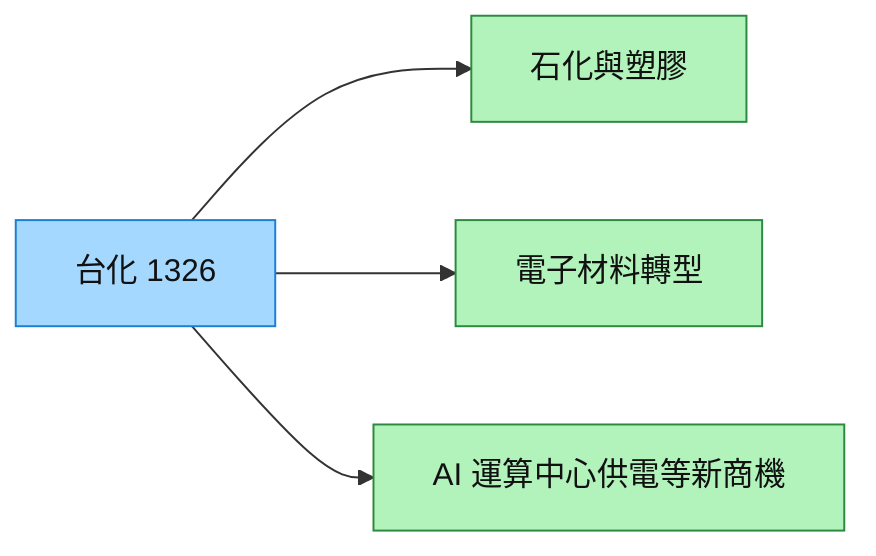

# 1326_台化（市）

## 基本資料

台化是台塑集團的綜合化學材料供應商，產品涵蓋芳香烴、SM、合成酚、ABS、PS、PP、PC、PTA/PIA 與電子材料。CTBC 2026-07-23 指出，2Q26 營收 871.5 億元，石化景氣與油價推升營收，但歲修與同業競爭壓抑本業；公司同時以 2030 年電子相關營收占比 30% 為轉型目標。

## 核心技術／競爭優勢

- 石化垂直整合與大型產能，能在原料與產品間調配。
- 多元產品組合降低單一石化品種風險。
- 既有化工製程能力可延伸至半導體／AI 伺服器電子材料。

## 產品與應用

| 產品 | 應用 | 供應鏈位置 |
|---|---|---|
| 芳香烴、SM、合成酚 | 石化與樹脂 | 基礎化學材料 |
| ABS、PS、PP、PC | 工業與消費材料 | 塑膠材料 |
| 電子化學材料 | 半導體、AI 伺服器 | 轉型成長選項 |

## 圖片 / 架構圖

圖說：台化以既有石化垂直整合為基礎，向電子材料與 AI 基礎設施相關商機延伸。

## EPS 預估

| 年度 | EPS | 類型／來源 |
|---|---:|---|
| 2026E | 3.54 元 | CTBC estimate，2026-07-23 |
| 2027E | 2.67 元 | CTBC estimate，2026-07-23 |

## 時間軸

| 時間 | 事件 | 類型 | 重要性 | 備註 |
|---|---|---|---|---|
| 2026Q3 | ARO-3、PTA-6 歲修完成，產銷量回升 | 營運修復 | ⭐⭐ | 公司／券商展望 |
| 2030 | 電子相關營收占比目標 30% | 結構轉型 | ⭐⭐⭐ | 公司目標，需追蹤實際營收 |

→ 跨公司比較詳見 [[時程_2026記憶體與AI催化劑]]

## 供應鏈位置

- 集團關係：[[6505_台塑化（市）]]、台塑（公司頁尚未建立）。
- 電子材料轉型與 [[供應鏈_AI伺服器PCB]]、[[技術_CCL]] 有潛在交集，具體客戶與訂單仍待驗證。

## 相關公司

| 公司 | 關係 | 說明 |
|---|---|---|
| [[6505_台塑化（市）]] | 集團／投資關係 | 台化業外收益來源之一 |
| 台塑（公司頁尚未建立） | 集團關係 | 台塑集團石化垂直整合 |

> [!warning] 風險與注意事項
> - 中國市場競爭與石化景氣循環可能壓抑價差與毛利。
> - 電子材料與 AI 供電商機仍屬轉型目標，不能視為已確定訂單或量產事實。

## 來源

- [[台化(1326,OW_增加持股)-CTBC260723]] — 中國信託證券投資顧問，2026-07-23
