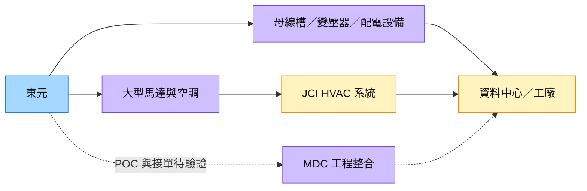

# 1504_東元（市）

## 基本資料

東元提供馬達、變壓器、配電盤、開關設備、空調及機電工程整合，業務分為機電系統、電力能源、空調科技與能源暨系統自動化。依 [[活動_華南投顧_東元1504_20261006]]，2026 年成長主要來自電力能源與機電系統，資料中心則由零組件供應延伸至模組化資料中心（MDC）工程整合。

資料中心產品包括匯流排／母線槽（Busway）、變壓器、配電盤及大型空調馬達；透過 Johnson Controls（JCI，未建頁）供應大型 HVAC 馬達，間接接觸美國資料中心需求。MDC 整合 IT、電力、散熱與現場安裝，晶片由客戶採購安裝，定位偏工程整合商。掛牌別依 [證交所個股資料](https://www.twse.com.tw/pdf/ch/1504_ch.pdf) 確認為上市；營運數字均為華南 memo 轉述，未逐項核對公司公告。

## 核心技術／競爭優勢

- **跨設備整合**：馬達、配電與空調可共同支援資料中心及工廠需求，價值在設備與工程的協同交付。
- **既有 HVAC 客戶渠道**：透過 JCI 大型馬達供應關係切入資料中心空調，屬間接終端曝險，不推定 CSP 直接客戶名單。
- **東南亞製造與工程布局**：安達康馬來西亞檳城廠供應母線槽設備，當地資料中心與台商建廠提供工程需求；實際擴產仍受訂單及交付限制。

## 產品與應用

| 產品／服務 | 應用 | 相關客戶／下游 |
|---|---|---|
| 匯流排、變壓器、配電盤與開關設備 | 資料中心、工廠及電網供電 | 資料中心與工程客戶未具名 |
| 大型馬達 | HVAC、石化與工業設備 | JCI（未建頁），間接資料中心需求 |
| 空調及節能改造 | 商業空調、工廠更新與資料中心冷卻 | 工廠／電子廠；未揭露專案客戶 |
| MDC 工程整合 | 模組化資料中心建置 | 日本／美國潛在客戶，現階段仍待 POC 與接單 |

## 圖片 / 架構圖

圖說：依華南 2026-10-06 memo，設備供應與 MDC 工程整合分別形成成長路徑；虛線為待驗證的商業化。來源圖片皆為券商裝飾，故補結構圖。

## EPS 記錄

| 期間 | EPS（元） | YoY | 備註 |
|---|---:|---|---|
| 2026Q2 | 1.12 | 未提供 | 營收 166 億元、毛利率 25.1%；金融資產評價約 11 億元為主要獲利貢獻，不能直接外推常態 EPS；fact／中信心 |

## 時間軸

| 時間 | 事件 | 類型 | 重要性 | 備註 |
|---|---|---|---|---|
| 2026-11–12（預估） | 約 2.7MW MDC POC 完成 | 驗證 | ⭐⭐⭐ | 約對應 2MW 算力單元，完成後邀潛在客戶查看；estimate／中 |
| 2027（預估） | 資料中心營收占比可能由不到 3% 提高至約 7–8% 以上 | 放量 | ⭐⭐⭐ | 華南觀點；手上訂單尚未納入 MDC 潛在貢獻，避免重複計算 |
| 2027Q4（預估） | 馬來西亞新產線開出 | 擴產 | ⭐⭐ | 收購公司產能近滿載，公司規劃；estimate／中 |

跨公司時程：[[時程_2026-2028華南六家公司商業化節點]]。

## 供應鏈位置

位於工廠與資料中心的機電設備／工程整合環節，工業應用見 [[供應鏈_工業自動化]]。安達康為 memo 所述子公司；JCI 為大型馬達客戶，兩者尚無公司頁，先保留具名關係。未揭露 CSP 直接交易，不將潛在 MDC 客戶寫成已接單。

## 相關公司

| 公司 | 關係 | 說明 |
|---|---|---|
| 安達康（未建頁） | 子公司 | 馬來西亞檳城新廠生產資料中心母線槽設備；華南轉述／中信心 |
| Johnson Controls（JCI，未建頁） | 下游客戶 | 大型 HVAC 馬達，間接對應美國資料中心；華南轉述／中信心 |

## 風險與注意事項

> [!warning] 驗證與獲利品質
> - POC 完成、邀客戶參觀與正式接單為不同步驟；來源估下單至建置完成約 9 個月，不設定尚未接單專案的完工日。
> - 金融資產評價使 2026Q2 EPS 包含業外成分；需以本業毛利、工程認列與現金流追蹤成長。
> - 海外工程、新產線、人力與匯率均可能影響交付；2–3 年海外營收占比 60% 為目標，非既成事實。

## 來源

- [[活動_華南投顧_東元1504_20261006]] — 華南投顧，2026-10-06；公司座談轉述，歷史實績 fact／中、未來營收與時程 estimate／中。
- [證交所東元基本資料](https://www.twse.com.tw/pdf/ch/1504_ch.pdf) — 掛牌別核對，2026-10-08 查閱。

## 相關頁面

- [[分析_華南六家公司成長動能與商業化驗證_20261008]]
