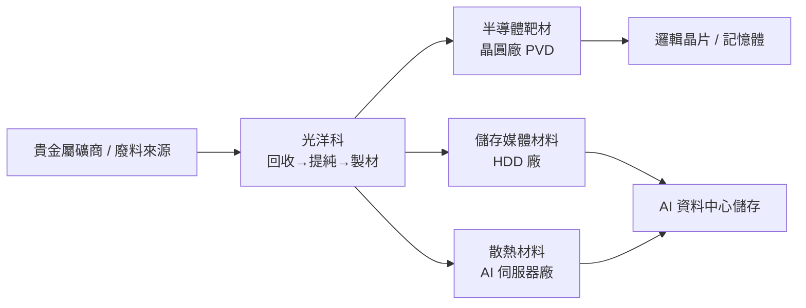

# 1785_光洋科（市）

## 基本資料

光洋科（1785.TW）為台灣特殊材料公司，核心業務橫跨化學、金屬、陶瓷三大領域，並以「逆地循環」模式（材料→客戶→廢料回收→高階原料→再製造）建立循環經濟護城河。成立於 1978 年，2018 年起正式切入前端半導體材料領域，2022 年進入先進半導體段。

**主要產品／服務**：
- **靶材（VAS 部分）**：全球最大印尼靶材供應商；台灣功能性磨成半導體靶材最大供應商；化學品、合金靶材、陶瓷靶材
- **貴金屬回收**：每年回收提取超過 200 噸矽金屬；白金等貴金屬循環
- **特殊材料（VAS）**：各式半導體製程材料、儲存媒體材料（含 HAMR 技術相關）

**營收驅動**：儲存媒體（2026Q1 佔比 49%）、電子半導體（35%）。去年集團總營收約 1,700 億元（含關係企業），光洋科本體年營收約 400 億元。

**EPS 表現**：2025 EPS 3.1 元，2026Q1 EPS 2.5 元（YoY +18.85%）。

**供應鏈位置**：半導體材料上游（靶材供應→晶圓廠）、儲存媒體材料供應商（→ HDD 廠）、AI 伺服器散熱材料（開發中）。

*來源：法說 2026-06-01（AlphaMemo.ai）。*

---

## 核心技術／競爭優勢

- **逆地循環模式（Circular Economy Moat）**：廢料由客戶端回收→提純→再製造，形成獨立、穩定的戰略資源供應鏈；在中國管制原料出口的地緣政治環境下，循環回收成為差異化護城河
- **半導體靶材全球領先地位**：為全球最大印尼靶材供應商、台灣功能性磨成半導體靶材最大供應商，材料研發週期 3–5 年提前布局，技術壁壘高
- **多材料平台（化學＋金屬＋陶瓷）**：能橫跨儲存媒體（HAMR）、半導體製程（靶材、前端材料）、散熱（液冷材料、伺服器蓋材）等多應用場景，單一客戶可採購多品項
- **貴金屬回收規模優勢**：年回收逾 200 噸矽金屬；每年節省約 38 萬公噸採礦量；碳足跡低，符合 ESG 與減碳趨勢

---

## 產品與應用

| 產品 / 服務 | 應用 | 相關客戶 / 下游 |
|-------------|------|-----------------|
| 半導體靶材（合金、陶瓷） | 晶圓製造 PVD 製程 | 晶圓廠（前端半導體） |
| 儲存媒體材料（HAMR 相關） | HDD 磁頭材料 | Western Digital 等 HDD 廠 |
| 液冷／散熱材料（開發中） | AI 伺服器熱管理 | 伺服器廠 |
| 貴金屬回收（白金、銀等） | 循環再製造 | 電子製造商 |
| 化學品 VAS | 客戶製程使用 | 半導體廠、電子廠 |

---

## 圖片 / 架構圖

> 光洋科「逆地循環」模式：材料出廠→客戶使用→廢料回流→高階原料再製，形成閉環。

---

## EPS 記錄

| 季度 / 年度 | EPS (元) | YoY | 備註 |
|------------|---------|-----|------|
| 2025 全年 | 3.1 | — | 年度 EPS |
| 2026Q1 | 2.5 | +18.85% | 歷史高點存貨 20,212 噸 |

*毛利率：2025 約 14.8% → 2026Q1 18.2%；淨利率 10%。*

---

## 時間軸

| 時間 | 事件 | 類型 | 重要性 | 備註 |
|------|------|------|--------|------|
| 2026Q1 | EPS 2.5、毛利率 18.2% | 財報 | ⭐⭐⭐ | 歷史存貨高點，循環回收需求帶動 |
| 2026 持續 | HAMR 技術進入量產 | 產品放量 | ⭐⭐⭐ | HDD 單碟容量提升，靶材需求成長 |
| 2026 下半年 | 散熱材料（液冷）佈局 | 新市場 | ⭐⭐ | AI 伺服器熱管理需求爆發 |
| 中長期 | 先進半導體靶材（陶瓷）深化 | 技術升級 | ⭐⭐⭐ | 2nm 以下製程材料需求 |
| 2026-2027 | 循環回收 B2B 模式轉型 | 商業模式 | ⭐⭐ | 從材料製造→循環服務，提升毛利率 |

---

## 供應鏈位置

- 上游：貴金屬礦商、廢料回收來源（電子廠、半導體廠）
- 下游客戶：晶圓代工廠（半導體靶材）、HDD 廠（儲存媒體材料）、AI 伺服器廠（散熱材料開發中）
- 所屬供應鏈：[[供應鏈_AI伺服器散熱]]（散熱材料段，開發中）
- 無直接對應的靶材專屬供應鏈頁

---

## 相關公司

| 公司 | 關係 | 說明 |
|------|------|------|
| 創聚（未上市） | 子公司 | 半導體金屬材料部門分拆，獨立運作 |

---

> [!warning] 風險與注意事項
> - **原物料價格波動**：業務收入含貴金屬價值，白金等大幅波動（去年單月 20 年最大漲幅）可能造成存貨評價損失
> - **中國原料管制升級**：鎢、銦等關鍵材料受中國出口管制，若替代料源不足，成本將上升並影響供貨穩定性
> - **AI 散熱材料尚在早期**：液冷、散熱材料仍處早期開發與佈建階段，量產時程不確定
> - **顯示產業轉型尚需時間**：顯示（Display）部門持續衰退，汽車產業轉向伺服器應用的轉型期業績仍有壓力

---

## 來源

- [[活動_光洋科法說_20260601]]
