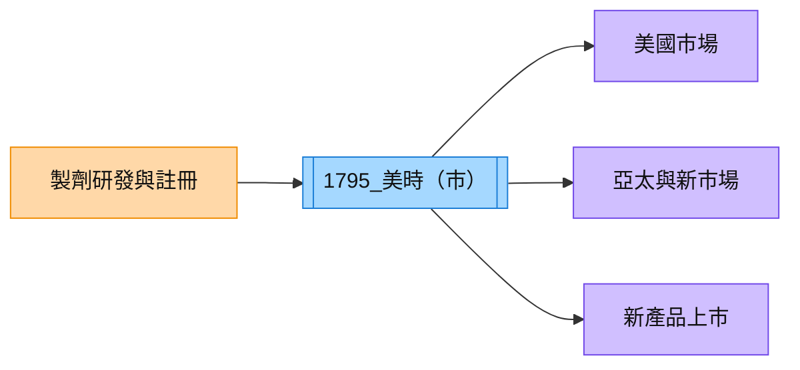

# 1795_美時（市）

## 基本資料

美時（Lotus Pharmaceutical）是台灣特殊學名藥與複方製劑公司，透過自有產品、授權與海外市場上市擴大營收。2026 年重點在美國 Alvogen US 業務，以及 Nintedanib、Enzalutamide 等新產品於新市場上市。

## 核心技術／競爭優勢

- 特殊學名藥與高難度製劑的產品組合，毛利率高於一般學名藥。
- 具跨區域註冊、上市與商業化能力，可將產品推進美國及亞太市場。
- 新產品上市節奏能改善單一產品生命週期與毛利波動。

## 產品與應用

| 產品 / 服務 | 應用 | 觀察點 |
|---|---|---|
| Lenalidomide | 腫瘤治療 | 高毛利產品貢獻波動 |
| Nintedanib | 特殊疾病治療 | 預計 4Q26 新產品上市 |
| Enzalutamide | 腫瘤治療 | 預計 4Q26 新產品上市 |

## 圖片 / 架構圖

圖說：美時以製劑研發與註冊能力連結美國、亞太與新市場，上市節點是營收與毛利率的主要觀察變數。

## 券商觀點

CTBC（2026-08-17）指出 2Q26 營收約 NT$88.1 億元、EPS 2.47 元，估 2026E／2027E 營收約 NT$349.7／352.4 億元，並以 2027E EPS 12 倍給予目標價 NT$194，維持中立；新產品 4Q26 上市與 2027 年貢獻屬券商估計。

## 時間軸

| 時間 | 事件 | 類型 | 備註 |
|---|---|---|---|
| 2026Q4 | Nintedanib、Enzalutamide 新市場上市 | 新產品 | 券商預估 |
| 2027 | 新產品營收貢獻提高 | 放量 | 能見度仍有限 |

> [!warning] 風險與注意事項
> - Lenalidomide 高毛利貢獻下降會造成產品組合壓力。
> - 新市場上市、訂單與定價仍受註冊及商業化進度影響。

## 來源

- [[美時(1795,N_中立)-CTBC260817]] — CTBC，2026-08-17

## 相關頁面

- [[時程_2026記憶體與AI催化劑]]
