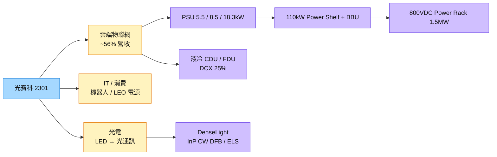

# 2301_光寶科（市）

## 基本資料

光寶科由零組件廠轉型為電源系統與方案供應商，三大部門為雲端物聯網（伺服器 PSU、Power Shelf、BBU、Power Rack、液冷）、IT 與消費性（工業自動化、機器人、低軌衛星電源）、光電（可見光／不可見光 LED 封裝與模組，延伸至光通訊）。

- **營運：** 1H26 營收 961 億元（YoY +25%）、毛利率 24.7%（YoY +2.4ppts）、營益率 12.8%、EPS 4.8 元；Data Center 營收占比已超過一半（YoY +60%）。2Q26 營收 527 億元（YoY +30%）、EPS 3.14 元。雲端物聯網占營收比重 1–6 月由 52% 升至 56%，5–6 月該部門 YoY 超過 80%（群友整理月報）。
- **雲端電源：** 2025 年雲端部門營收 YoY +70%，2026 年預估再 +70%；2H25 切入 Oracle 電源供應；1H26 主要出貨 GB 系列 5.5kW PSU，2H26 開始對 VR 客戶出貨 110kW Power Shelf（18.3kW PSU）；AWS 新平台出貨 8.5kW PSU＋BBU；800VDC Power Rack（1.5MW）內部測試中，未來數月送樣。
- **產能與投資：** 2026 年產能翻倍、集中非中地區擴產（台灣 22%、越南 28%、中國 40%、美國 9%、其他 4%）；資本支出 2025 年 70 億元→2026 年 180 億元。
- **併購布局：** DenseLight（InP 磊晶與 CW DFB laser、ELS）切入光模組；DCX（系統／設施級 CDU、FDU，主要出貨 Neocloud）取得 25% 股權，補齊冷板、Manifold 等液冷機構。

資料來源：[[活動_光寶科2301_元大論壇Memo_20260909]]（元大投資論壇，2026-09-09）

## 核心技術／競爭優勢

- **PSU→Power Shelf→Power Rack 系統整合：** 2020 年推出 3kW PSU（A100），2024 年整合 6 顆 5.5kW PSU 成 GB 系列 Power Shelf，再整合 BBU、PSU 與電源軟體成次系統。
- **關鍵零部件自家設計：** Power Rack 內 PDU、PSU、BBU 與電源轉換皆自行設計，毛利率可優於現有平均；客戶要求 BBU 與 PSU 一對一設計。
- **非中產能：** 擴產集中台灣、越南、北美，符合 CSP 供應鏈分散要求。
- **ROIC 改善：** 資源集中於高價值事業，1H26 ROIC 22%，2H26 預估更佳。

## 產品與應用

| 產品 / 服務 | 應用 | 相關客戶 / 下游 |
|-------------|------|-----------------|
| AI 伺服器 PSU（5.5kW／8.5kW／18.3kW） | GB、VR、AWS ASIC 平台 | [[NVDA.US(nvidia)]] 生態系、AWS、Oracle |
| 110kW Power Shelf、BBU | VR 機櫃供電與備援 | VR 客戶 |
| 800VDC Power Rack（1.5MW） | HVDC 資料中心供電 | 送樣中 |
| CDU／FDU（DCX，持股 25%） | 系統／設施級液冷 | Neocloud |
| CW DFB laser、ELS（DenseLight） | 光模組光源 | 光模組客戶 |
| LED 封裝與模組、工業電源 | 工控、機器人、低軌衛星電源 | — |

## 圖片 / 架構圖

圖說：光寶科 AI 電源由單顆 PSU 往 Power Shelf、Power Rack 系統級升級，同時以 DCX 與 DenseLight 延伸至液冷與光模組光源。

![[報告_MorganStanley_整合電源方案_20261006_光寶平滑供電.png]]

圖說：MS 2026-10-06 p37 引用光寶展示的 5.5kW 與 18.3kW power shelf 波形；特定測試的電流波動改善，不能直接換算所有機房的節電率。

![[報告_MorganStanley_整合電源方案_20261006_光寶財測.png]]

圖說：MS p85 的五年模型顯示雲端產品組合與營運槓桿帶動毛利率及 EPS，2026–2028E 為券商估計。

## EPS 記錄

| 期間 | EPS (元) | 備註 |
|------|---------|------|
| 2Q26 | 3.14 | 營收 527 億元，YoY +30%；6 月單月 EPS 1.31 元 |
| 1H26 | 4.8 | 毛利率 24.7%、營益率 12.8% |

## EPS 預估

| 年度 | Morgan Stanley EPS（報告日：2026-10-06） | 備註 |
|------|------------------------------------------|------|
| 2026E | 11.07 | estimate／信心中 |
| 2027E | 15.97 | estimate／信心中 |
| 2028E | 21.07 | estimate／信心中 |

來源：[[報告_MorganStanley_整合電源方案_20261006]]（p85–86）。3Q／4Q26E EPS 2.77／3.51；2025 EPS 6.64 為該報告歷史欄，尚未外部核對。

## 目標價與評等

| 券商 | 報告發布日 | 評等 | 目標價 | 評價基礎 | 來源 |
|------|------------|------|--------|----------|------|
| Morgan Stanley | 2026-10-06 | Equal-weight | NT$315（原 176） | 17x 2027–2028E 平均 EPS；estimate／中 | [[報告_MorganStanley_整合電源方案_20261006]] |

MS p83／87 牛市／基準／熊市情境為 NT$500／315／200、27x／17x／11x 平均 EPS；目標價調整伴隨覆蓋交接與評價期間變化，不能只解讀為當年獲利上修。

### 2026-10-06 MS：雲端放量與毛利正常化

| MS 指標 | 2026E | 2027E | 2028E |
|---------|-------|-------|-------|
| 營收（NT$億元） | 2,248.29 | 2,979.64 | 3,576.70 |
| 毛利率 | 25.0% | 26.3% | 27.4% |
| 營益率 | 13.4% | 15.1% | 16.8% |

MS 估 2025–2028 營收／獲利 CAGR 約 29%／47%，Cloud & AIoT 營收占比 2025 年 45%→2028E 74%。4Q26 營收模型 QoQ +16.2%；2Q26 毛利率 27.2% 含庫存沖銷回轉與前季遞延高毛利產品，MS 估 3Q／4Q 回到 24.6%／25.6%，不能把 2Q 水準當作後續保底。

MS 認為公司為 AI 電源第二大供應者、HVDC 與液冷進度落後台達，HVDC power rack 仍在客戶驗證；年底起可增加少數 CSP 份額，均屬券商 estimate／thesis，信心中，未確認全部五大 CSP 已量產。DenseLight 持股 21%、InP 磊晶／晶片製程搭配光寶封裝發展 optical engine／module 為來源轉述，尚未給有意義營收貢獻時點。

> [!warning] CAPEX 與產能口徑並列
> - 元大論壇 memo（2026-09-09）記錄 2026 CAPEX NT$180 億；MS（2026-10-06，p85／88／93）模型 NT$132.87 億、正文約 130 億。未核對是否為預算／認列時點或範圍差異，保留兩方，不自動改成下修。
> - MS 2026 產能分配為中國／越南／台灣／美國／其他約 40%／27%／20%／10%／3%；舊 memo 為 40%／28%／22%／9%／4%（合計 103%），兩方都是概略數，不能混用以回推工廠產能。

來源：[[報告_MorganStanley_整合電源方案_20261006]]（2026-10-06，p14–15、85–93；estimate／thesis，信心中）。

## 時間軸

| 時間 | 事件 | 類型 | 重要性 | 備註 |
|------|------|------|--------|------|
| 2026Q4 | MS 估雲端拉動營收 QoQ +16.2%，毛利率 25.6% | 放量 | ⭐⭐⭐ | 2026-10-06，p86；estimate／中 |
| 2026年底起 | 少數 CSP 份額增加；HVDC power rack 客戶驗證轉量產觀察 | 驗證／放量 | ⭐⭐⭐ | MS p14；未具名，不推定客戶 |
| 2027年底–2028 | HVDC 產業擴大採用窗口 | 規格升級 | ⭐⭐⭐ | MS 產業估計；非光寶已確認訂單 |
| 2H26 | 110kW Power Shelf（18.3kW PSU）出貨 VR 客戶 | 放量 | ⭐⭐⭐ | [[活動_光寶科2301_元大論壇Memo_20260909]] |
| 2026-09 | 傳台達 VR200 18.4kW PSU 電容問題，客戶部分轉單光寶 | 供應鏈事件 | ⭐⭐ | 群友轉述，rumor，信心低 |
| 2026 年底前 | 800VDC Power Rack（1.5MW）樣機出貨 | 新品 | ⭐⭐ | 公司說法 |
| 2026–2027 | 目標切入全部 5 大 CSP；2027 續擴電源與儲能產能 | 擴產 | ⭐⭐ | 切入 IT rack 內 DC-DC 與 converter |

→ 跨公司時程詳見 [[時程_2026能源與AI電力設備]]

## 供應鏈位置

- 下游：CSP 與 AI 伺服器（GB／VR／AWS ASIC 平台）、Oracle、Neocloud
- 同業：[[2308_台達電（市）]]（AI 電源主要競爭者）
- 所屬供應鏈：AI 伺服器電源，參見 [[技術_800VDC供電架構]]、[[分析_AI資料中心供電與電熱整合]]
- 儲能系統位置：[[技術_BBU與CBU機櫃儲能]]；既有散熱主軸見 [[供應鏈_AI伺服器散熱]]，不據此推定新客戶資格。

## 相關公司

| 公司 | 關係 | 說明 |
|------|------|------|
| [[2308_台達電（市）]] | 同業 / 競爭 | AI 伺服器 PSU 與 Power Shelf 主要競爭者 |
| [[NVDA.US(nvidia)]] | 平台客戶 | GB、VR 平台電源（經 ODM／CSP） |

## 風險與注意事項

> [!warning] 風險與注意事項
> - **電源規格快速迭代：** 800VDC 推進時程有遞延聲音（基金經理人認為 400VDC 仍可運作、導入不如預期），新架構導入時點影響 Power Rack 放量。
> - **中國產能占比仍高：** 2026 年產能仍有約 40% 在中國。
> - **轉單訊息未證實：** 台達 PSU 電容事件與轉單光寶為群組轉述，需以公司或客戶公告為準。
> - **毛利率拆解不足：** 公司未拆各 BU 毛利率，2Q26 獲利跳升有多少來自組合改善仍待財報確認。

## 來源

- [[報告_MorganStanley_整合電源方案_20261006]] — Morgan Stanley，2026-10-06；p14–15、37、83–103，雲端電源、EPS／估值與毛利正常化。
- [[活動_光寶科2301_元大論壇Memo_20260909]] — 元大投資論壇即時 Memo，2026-09-09
- [[memo_LINE投資人超商_產業消息與群友討論彙整_20260725-20261004]] — 群友 2Q26 財報整理（I020、I021）、台達 PSU 電容事件轉述（I053）

## 相關頁面

- [[供應鏈_AI光互聯]]
- [[分析_2026Q3法說季_AI供應鏈瓶頸與擴產節奏_LINE彙整]]
