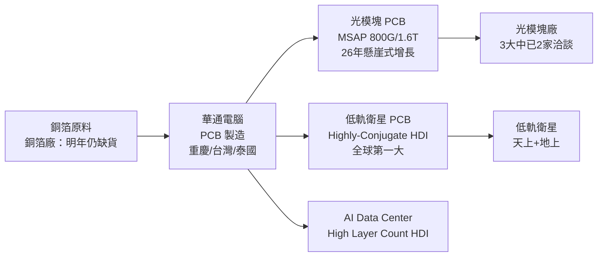

# 2313_華通（市）

## 基本資料

華通電腦股份有限公司（台股代號 2313，TWSE 上市）是台灣最老牌的 PCB（印刷電路板）廠之一，提供硬板、軟板、軟硬複合板及 SMT 全系列解決方案。近年快速轉型，從消費性電子主力 PCB 廠，轉型為全方位 PCB 供應商，重點佈局：

1. **光模塊 PCB**（MSAP 製程，800G/1.6T，Data Center）：2026 年呈懸崖式增長，重慶廠二廠年底前滿載
2. **低軌衛星 PCB**（Highly-Conjugate HDI，天上/地上）：穩居全球最大供應商
3. **AI Data Center HDI**（台灣/泰國，High Layer Count HDI）

2025 年營收目標 NT$760 億元；2028 年目標 ≥NT$1,000 億元（光模塊+衛星合計 >50%）。8 座全球工廠分佈台灣、大陸（重慶）、泰國。26Q1 毛利率 18%，預期逐季提升。

資料來源：[[活動_華通法說_20260529]]（2026-05-29 法說）

## 核心技術／競爭優勢

- **MSAP 製程能力**：800G 以上光模塊 PCB 採 MSAP（12–14 層），製程技術複雜度超越手機板；全球能在中國及海外同時提供大量 MSAP 產能的廠商極少，華通為少數之一
- **低軌衛星全球第一大供應商**：天上衛星用 Highly-Conjugate HDI 與地上基站 PCB 雙線，材料規格持續升級（天上 M7→M8，地上 M4/M6→M7），ASP 持續提升
- **台灣+大陸+泰國三地產能**：2027 年底台灣/大陸光模塊產能達 1：1（各 10–12.5 萬平方英尺），可因應地緣政治分散需求；泰國廠負責 HDI 產能
- **老牌客戶信任關係**：台灣最老牌 PCB 廠，長期合作品質口碑，在波動市場中客戶轉向尋求穩定供應

## 產品與應用

| 產品 / 服務 | 應用 | 相關客戶 / 下游 |
|-------------|------|-----------------|
| 光模塊 PCB（MSAP，800G/1.6T）| AI Data Center 光模塊（Scale-out）| 大陸及海外大型光模塊廠（前三大已 2 家洽談）|
| 低軌衛星天上 PCB（Highly-Conjugate HDI）| 低軌衛星天上部分 | 低軌衛星客戶（V3.0 改版中）|
| 低軌衛星地上 PCB（HDI）| 地上基站 / 控制系統 | 低軌衛星客戶 |
| AI Data Center HDI（High Layer Count）| AI 伺服器主板/背板 | CSP、伺服器廠 |
| 消費性電子 PCB（HDI/FPC）| 手機、消費性電子 | 傳統消費電子客戶 |
| 軟板 / 軟硬複合板 | 手機、穿戴裝置 | 消費電子（轉型中）|

## 圖片 / 架構圖

> 自製 產品結構示意圖；來源：[[活動_華通法說_20260529]]

## EPS 記錄

| 季度 | 財務指標 | 備註 |
|------|---------|------|
| 26Q1 | 毛利率 18% | 預期逐季提升 |

- 2025 年營收目標：NT$760 億元
- 衛星毛利率：>30%；光模塊毛利率：>30%；消費電子毛利率：受壓抑
- 光模塊重慶廠初估投資約 NT$450 億元

## 時間軸

| 時間 | 事件 | 類型 | 重要性 | 備註 |
|------|------|------|--------|------|
| 2026 全年 | 光模塊 PCB 懸崖式增長，重慶廠二廠滿載 | 放量 | ⭐⭐⭐ | 僅能滿足至 2027 年底需求 |
| 2026 Q3 後 | 低軌衛星下一代（V3.0）開始發射，天上用量大增 | 訂單 | ⭐⭐⭐ | 天上設計需求增一倍 |
| 2026 年底 | 台灣軟板廠開始裝線並進行認證 | 產能 | ⭐⭐ | 新業務機會 |
| 2026 年底 | 台灣/大陸光模塊產能達 1：1 配比 | 產能 | ⭐⭐⭐ | 20–25 萬平方英尺 |
| 2027 | 低軌衛星天上衛星 PCB 較 2026 翻倍 | 出貨 | ⭐⭐⭐ | |
| 2028 | 光模塊+衛星佔總營收 ≥50%，總營收 ≥NT$1,000 億 | 展望 | ⭐⭐⭐ | 法說目標 |

## 供應鏈位置

- 上游原料：銅箔（銅箔廠明年仍缺）、MSAP 材料（目前僅日本廠認證）
- [[供應鏈_AI伺服器PCB]]：光模塊 MSAP PCB、AI Data Center HDI
- 低軌衛星 PCB：全球第一大供應商，技術為 Highly-Conjugate HDI

## 相關公司

| 公司 | 關係 | 說明 |
|------|------|------|
| 滬士電子 | 競爭同業 | 光模塊 PCB 競爭者 |
| 勝宏科技 | 競爭同業 | Data Center PCB 競爭者 |

> [!warning] 風險與注意事項
> - **銅箔原料缺貨**：銅箔廠明年仍缺，後年應不缺；MSAP 材料目前僅剩日本廠商認證，供應鏈風險集中
> - **產能擴充資本密集**：重慶廠光模塊初估投資約 NT$450 億，加上台灣/泰國擴廠，資本支出龐大；若需求不及預期或地緣政治阻礙，回收期大幅延長
> - **低軌衛星進度延遲**：主要客戶 V3.0 改版及缺料影響 2026 年成長低於年初預期，發射時程受地緣政治及技術因素影響
> - **消費電子轉型風險**：傳統消費電子業務萎縮中，轉型過度依賴 AI/衛星兩大主題；若 AI Capex 週期放緩，成長驅動力將明顯縮減

## 來源

- [[活動_華通法說_20260529]]（2026-05-29，華通法說；財務長 呂範）
