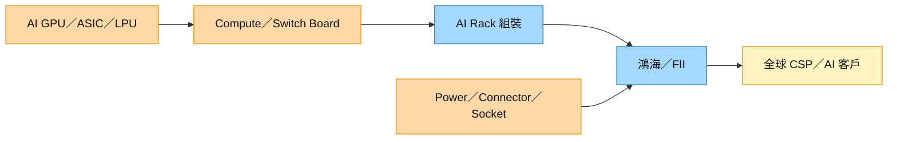

# 2317_鴻海（市）

## 基本資料

鴻海精密工業（2317.TW，Hon Hai Precision / Foxconn）是全球最大電子製造服務（EMS）商，主要業務為代工組裝 iPhone（Apple 最大代工廠）、AI 伺服器、PC 等。在 AI 伺服器浪潮中，鴻海積極承接 NVIDIA GB200/GB300 NVL72 rack 生產，是三大主力 ODM 之一。

**業務多元化方向**：除 EMS 代工外，鴻海積極進軍 EV（電動車）、AI 伺服器設計製造、以及 NVIDIA Blackwell 生態圈。

---

## 核心技術／競爭優勢

- **全球最大 EMS 規模**：生產基地遍布台灣、中國大陸、印度、越南等，供應鏈彈性高
- **GB200/Groq 3 LPX 生產**：2025Q2 起 GB200 rack 良率持續改善（MS/JPM 確認）；Computex 2026 展示 Groq 3 LPX compute tray，預計 3Q26 量產（MS 渠道確認）
- **Apple iPhone 核心代工**：iPhone 是最大單一業務，提供穩定現金流
- **EV 布局（Model C、Model B）**：透過 MIH 聯盟切入 EV 設計製造，長期多元化

---

## AI 伺服器出貨預估

| 時間 | GB200/300 NVL72 rack 預估 | 備註 |
|------|--------------------------|------|
| 2025Q2 May | ~1,000 rack（MS）/ 600–800 rack-eq（JPM） | MS 2025-06-09 |
| 2025Q2 全季 | 3,000–4,000 rack | MS 預期 |
| 2025H2 | GB200 → GB300 轉換 | 4Q25 GB300 量產 |
| **2026Q2 Jun** | **~3.3K rack（flattish MoM）** | MS 2026-07-08；6月營收 NT$821.8B（-4% MoM, +52% YoY）；iPhone 拉貨放緩，AI 伺服器持續 |
| **2026Q2 全季** | **~10.3K rack（+21% QoQ）** | 略高於預估 ~10K；3Q 預計 AI rack 維持成長（暗示前估 7.5K 有上修空間） |
| **2026-07** | **~3.6K rack（MoM +9%）** | MS 2026-08-07；三大 ODM 中單月最高 |
| **CY26 全年鴻海** | **~31.7K rack** | MS 2026-08-07 estimate、信心中 |
| **CY26 全年行業** | **80-85K rack（YoY +100%+）** | MS 2026-08-07 上修後區間；偏好排序：緯創 > 鴻海 > 廣達 |

## 圖片 / 架構圖

圖說：鴻海的 AI rack 價值不只來自整機組裝，亦延伸至 switch board、connector、power component 與 socket；本次瑞銀報告未抽出可用來源圖，故以 Mermaid 補位。

![[CLSA-2317 20260812_002.png]]

圖說：CLSA／SinoPac 的股價與相對大盤走勢圖，搭配 2026-08-12 的 NT$375 目標價，用於追蹤 AI rack 獲利上修能否轉化為估值重評。

---

## 目標價與評等

| 來源 | 日期 | 評等 | 備註 |
|------|------|------|------|
| 摩根士丹利 | 2025-06-01 | OW（第二順位） | 偏好順序：技嘉 > 鴻海 > 廣達 > 緯創 > 緯穎 |
| 摩根大通 | 2025-06-11 | OW | 偏好順序：廣達 > 鴻海 > 緯創 |
| 瑞銀 | 2026-07-20 | Buy | 目標價 NT$320（原 NT$310）；15x 2027E EPS；[[報告_瑞銀_鴻海_20260720]] |
| CLSA／SinoPac | 2026-08-12 | Outperform | 目標價 NT$375（原 NT$320）；14x 2027E SOTP（AI 18x／非 AI 9x）；[[報告_CLSA_鴻海2Q26財報_20260812]] |

## EPS 預估

| 年度 | 瑞銀（2026-07-20） | CLSA／SinoPac（2026-08-12） | 備註 |
|------|----------------------|-------------------------------|------|
| 2026E | 18.00 | 17.90 | CLSA 估 AI rack 與費用控制推升獲利 |
| 2027E | 22.00 | 27.13 | Rubin 與新 ASIC 平台市占提升假設 |
| 2028E | 26.00 | 31.75 | estimate；信心中 |

## 時間軸

| 時間 | 事件 | 類型 | 重要性 | 備註 |
|------|------|------|--------|------|
| 2026Q3 | iPhone 18 拉貨與 foldable NPI | 放量 | ⭐⭐ | Cloud & Networking 仍是主要動能 |
| 2026–2027 | LPU rack、Vera Rubin、ASIC server 放量 | 放量 | ⭐⭐⭐ | 瑞銀估 Cloud & Networking 2026 年增 74% |
| 2027 | AI rack 估 29.0k | 放量 | ⭐⭐⭐ | 2026E 27.2k；estimate |
| 2027–2028 | Rubin Ultra NVL rack 估 100k／130k | 放量 | ⭐⭐⭐ | CLSA／SinoPac estimate；ODM volume play 假設 |

→ 跨公司時程詳見 [[時程_2026記憶體與AI催化劑]]。

---

## 供應鏈位置

- 上游：[[NVDA.US(nvidia)]]（GPU）、[[AAPL.US(apple)]]（iPhone SoC）、[[5274_信驊（市）]]（BMC）
- 下游：AWS、Azure、GCP 等 CSP；全球 Apple 零售
- 同業：[[2382_廣達（市）]]、[[3231_緯創（市）]]、[[6669_緯穎（市）]]
- 所屬主題鏈：[[供應鏈_AI伺服器PCB]]、[[供應鏈_AI伺服器散熱]]

---

## 相關公司

| 公司 | 關係 | 說明 |
|------|------|------|
| [[AAPL.US(apple)]] | 最大客戶 | iPhone 主力代工；佔鴻海最大業務比重 |
| [[NVDA.US(nvidia)]] | AI 伺服器客戶/上游 | GB200/GB300 rack 生產 |
| [[5274_信驊（市）]] | 上游 BMC | 信驊 BMC 供應鴻海伺服器主板 |

---

## 來源

- [[20260709_0823_260708_ms_nvl72-racks]]（MS，2026-07-08；鴻海 2Q26 rack ~10.3K，6月 NT$821.8B +52% YoY；偏好排序 緯創>鴻海>廣達）
- [[報告_摩根士丹利_大中華科技硬體_20250601]]（MS，2025-06-01；GB200 新 CSP 訂單，鴻海偏好排序第二）
- [[報告_摩根大通_台灣ODM_20250611]]（JP Morgan，2025-06-11；GB200 rack 鴻海 May 出貨量 600-800 rack-eq）
- [[報告_MS_GB200機櫃出貨_20250609]]（MS，2025-06-09；5 月鴻海 GB200 ~1,000 rack，2Q25 預估 3,000–4,000 rack）
- 報告_MS_Computex2026_20260607（MS，2026-06-07；鴻海展示 Groq 3 LPX compute tray，3Q26 量產）
- [[報告_瑞銀_鴻海_20260720]]（瑞銀，2026-07-20；AI rack、EPS 與目標價上修）
- [[報告_CLSA_鴻海2Q26財報_20260812]]（CLSA／SinoPac，2026-08-12；2Q26、Rubin／ASIC 市占、EPS 與目標價上修）
- [[報告_MorganStanley_NVL72機櫃出貨_20260807]]（Morgan Stanley，2026-08-07；7 月約 3.6K rack、2026 全年約 31.7K）

## 相關頁面

- [[GOOGL.US(alphabet)]]
- [[時程_2026記憶體與AI催化劑]]
- [[2059_川湖（市）]]
- [[8261_富鼎（市）]]
- [[ORCL.US(oracle)]]
