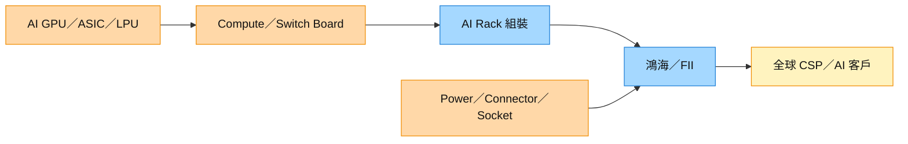

# 2317_鴻海（市）

## 基本資料

鴻海精密工業（2317.TW，Hon Hai Precision / Foxconn）是全球最大電子製造服務（EMS）商，主要業務為代工組裝 iPhone（Apple 最大代工廠）、AI 伺服器、PC 等。在 AI 伺服器浪潮中，鴻海積極承接 NVIDIA GB200/GB300 NVL72 rack 生產，是三大主力 ODM 之一。

**業務多元化方向**：除 EMS 代工外，鴻海積極進軍 EV（電動車）、AI 伺服器設計製造、以及 NVIDIA Blackwell 生態圈。

---

## 核心技術／競爭優勢

- **全球最大 EMS 規模**：生產基地遍布台灣、中國大陸、印度、越南等，供應鏈彈性高
- **GB200/Groq 3 LPX 生產**：2025Q2 起 GB200 rack 良率持續改善（MS/JPM 確認）；Computex 2026 展示 Groq 3 LPX compute tray，預計 3Q26 量產（MS 渠道確認）
- **Apple iPhone 核心代工**：iPhone 是最大單一業務，提供穩定現金流
- **EV 布局（Model C、Model B）**：透過 MIH 聯盟切入 EV 設計製造，長期多元化

---

## AI 伺服器出貨預估

| 時間 | GB200/300 NVL72 rack 預估 | 備註 |
|------|--------------------------|------|
| 2025Q2 May | ~1,000 rack（MS）/ 600–800 rack-eq（JPM） | MS 2025-06-09 |
| 2025Q2 全季 | 3,000–4,000 rack | MS 預期 |
| 2025H2 | GB200 → GB300 轉換 | 4Q25 GB300 量產 |
| **2026Q2 Jun** | **~3.3K rack（flattish MoM）** | MS 2026-07-08；6月營收 NT$821.8B（-4% MoM, +52% YoY）；iPhone 拉貨放緩，AI 伺服器持續 |
| **2026Q2 全季** | **~10.3K rack（+21% QoQ）** | 略高於預估 ~10K；3Q 預計 AI rack 維持成長（暗示前估 7.5K 有上修空間） |
| **2026-07** | **~3.6K rack（MoM +9%）** | MS 2026-08-07；三大 ODM 中單月最高 |
| **CY26 全年鴻海** | **~31.7K rack** | MS 2026-08-07 estimate、信心中 |
| **CY26 全年行業** | **80-85K rack（YoY +100%+）** | MS 2026-08-07 上修後區間；偏好排序：緯創 > 鴻海 > 廣達 |

## 圖片 / 架構圖

![[報告_GoldmanSachs_鴻海_20261005_月營收.png]]
> 高盛 2026-10-05 的月營收與年增率圖；9 月為實績，10–11 月淡色柱為券商預估。

![[報告_GoldmanSachs_鴻海_20261005_002.png]]
> 高盛歷史評等與目標價變動圖，右軸為成交量；不代表公司未來營運指引。

```mermaid
flowchart LR
    CHIP[AI GPU／ASIC／LPU] --> BOARD[Compute／Switch Board]
    BOARD --> RACK[AI Rack 組裝]
    RACK --> FOX[鴻海／FII]
    FOX --> CSP[全球 CSP／AI 客戶]
    PWR[Power／Connector／Socket] --> FOX
    classDef upstream fill:#ffd8a8,stroke:#f08c00,color:#111;
    classDef core fill:#a5d8ff,stroke:#1c7ed6,color:#111;
    classDef customer fill:#fff3bf,stroke:#f08c00,color:#111;
    class CHIP,BOARD,PWR upstream;
    class RACK,FOX core;
    class CSP customer;
```

圖說：鴻海的 AI rack 價值不只來自整機組裝，亦延伸至 switch board、connector、power component 與 socket；本次瑞銀報告未抽出可用來源圖，故以 Mermaid 補位。

![[CLSA-2317 20260812_002.png]]

圖說：CLSA／SinoPac 的股價與相對大盤走勢圖，搭配 2026-08-12 的 NT$375 目標價，用於追蹤 AI rack 獲利上修能否轉化為估值重評。

---

## 目標價與評等

| 來源 | 日期 | 評等 | 目標價與方法 |
|------|------|------|-------------|
| Goldman Sachs | 2026-10-05 | Buy（Conviction List） | NT$400 不變，17.9x 2027E EPS；estimate／中，[[報告_GoldmanSachs_鴻海_20261005]] |

| 來源 | 日期 | 評等 | 備註 |
|------|------|------|------|
| 摩根士丹利 | 2025-06-01 | OW（第二順位） | 偏好順序：技嘉 > 鴻海 > 廣達 > 緯創 > 緯穎 |
| 摩根大通 | 2025-06-11 | OW | 偏好順序：廣達 > 鴻海 > 緯創 |
| 瑞銀 | 2026-07-20 | Buy | 目標價 NT$320（原 NT$310）；15x 2027E EPS；[[報告_瑞銀_鴻海_20260720]] |
| CLSA／SinoPac | 2026-08-12 | Outperform | 目標價 NT$375（原 NT$320）；14x 2027E SOTP（AI 18x／非 AI 9x）；[[報告_CLSA_鴻海2Q26財報_20260812]] |

## EPS 預估

| 年度 | Goldman Sachs（2026-10-05）EPS（元） | 營收（兆元） | 分類／信心 |
|------|-----------------------------------|--------------|-----------|
| 2026E | 19.56 | 11.2394 | estimate／中 |
| 2027E | 22.37 | 14.0537 | estimate／中 |
| 2028E | 25.20 | 18.1492 | estimate／中 |

高盛因 9 月營收優於預估，上調 2026 年淨利約 2%；3Q26／4Q26 EPS 預估為 5.55／6.25 元。下方歷史券商模型保留，不將預估寫入實績。

| 年度 | 瑞銀（2026-07-20） | CLSA／SinoPac（2026-08-12） | 備註 |
|------|----------------------|-------------------------------|------|
| 2026E | 18.00 | 17.90 | CLSA 估 AI rack 與費用控制推升獲利 |
| 2027E | 22.00 | 27.13 | Rubin 與新 ASIC 平台市占提升假設 |
| 2028E | 26.00 | 31.75 | estimate；信心中 |

## 時間軸

| 時間 | 新增催化劑 | 分類／信心 | 追蹤 |
|------|-----------|-----------|------|
| 4Q26 | 新 AI rack、新手機／摺疊手機與 CPO 交換器推動營收；高盛估季增 18%、年增 37% | estimate／中；非已實現出貨量 | [[時程_2026Q3Q4_AI網通與硬體催化劑]] |

| 時間 | 事件 | 類型 | 重要性 | 備註 |
|------|------|------|--------|------|
| 2026Q3 | iPhone 18 拉貨與 foldable NPI | 放量 | ⭐⭐ | Cloud & Networking 仍是主要動能 |
| 2026–2027 | LPU rack、Vera Rubin、ASIC server 放量 | 放量 | ⭐⭐⭐ | 瑞銀估 Cloud & Networking 2026 年增 74% |
| 2027 | AI rack 估 29.0k | 放量 | ⭐⭐⭐ | 2026E 27.2k；estimate |
| 2027–2028 | Rubin Ultra NVL rack 估 100k／130k | 放量 | ⭐⭐⭐ | CLSA／SinoPac estimate；ODM volume play 假設 |

→ 跨公司時程詳見 [[時程_2026記憶體與AI催化劑]]。

---

## 供應鏈位置

- 上游：[[NVDA.US(nvidia)]]（GPU）、[[AAPL.US(apple)]]（iPhone SoC）、[[5274_信驊（市）]]（BMC）
- 下游：AWS、Azure、GCP 等 CSP；全球 Apple 零售
- 同業：[[2382_廣達（市）]]、[[3231_緯創（市）]]、[[6669_緯穎（市）]]
- 所屬主題鏈：[[供應鏈_AI伺服器PCB]]、[[供應鏈_AI伺服器散熱]]

---

## 相關公司

| 公司 | 關係 | 說明 |
|------|------|------|
| [[AAPL.US(apple)]] | 最大客戶 | iPhone 主力代工；佔鴻海最大業務比重 |
| [[NVDA.US(nvidia)]] | AI 伺服器客戶/上游 | GB200/GB300 rack 生產 |
| [[5274_信驊（市）]] | 上游 BMC | 信驊 BMC 供應鴻海伺服器主板 |

---

## 近期營運與研究更新

### 2026-10-05 Goldman Sachs：9 月營收優於預估

- 9 月營收 NT$1.1586 兆元，YoY +38%、MoM +26%，較高盛／市場共識高 15%／21%；3Q26 營收 NT$3.0269 兆元，YoY +47%、QoQ +20%，較兩者高 5%／7%。屬券商轉述公司營收實績（fact／中高，未另查公司公告）。
- 4Q26 營收預估 NT$3.5671 兆元，QoQ +18%、YoY +37%；10／11／12 月預估為 NT$1.1644／1.1819／1.2208 兆元。原報告 Exhibit 2 標題寫「+18% MoM」，但正文與表格顯示季度 QoQ，採正文與季度表口徑。
- 高盛稱鴻海為 CPO switch 主要供應商，將其與新 AI rack／手機列為成長來源；屬券商供應商判斷（thesis／中），未揭露可核對的特定平台訂單或 CPO 營收占比，不延伸成特定客戶獨家地位。
- Foxtron 子公司 9 月營收約 NT$11 億元；此處保留子公司名稱與來源，不另建未有公司頁的 wikilink。

來源：[[報告_GoldmanSachs_鴻海_20261005]]。

### 2026-09-08 GFHK 散熱產業更新

- GFHK 將鴻海列為 Rubin 平台 ODM／OEM 受惠者之一，並與 Supermicro 一起列為 AI 伺服器整合觀察標的；此為產業鏈觀察，未等同鴻海已取得特定 Rubin 訂單。來源：[[報告_GHHK_AI伺服器散熱_20260901]]。

## 來源

- [[報告_GoldmanSachs_鴻海_20261005]]（Goldman Sachs，2026-10-05；9 月／3Q26 營收、4Q26 預估、CPO switch 供應定位、EPS、Buy／TP NT$400）

- [[20260709_0823_260708_ms_nvl72-racks]]（MS，2026-07-08；鴻海 2Q26 rack ~10.3K，6月 NT$821.8B +52% YoY；偏好排序 緯創>鴻海>廣達）
- [[報告_摩根士丹利_大中華科技硬體_20250601]]（MS，2025-06-01；GB200 新 CSP 訂單，鴻海偏好排序第二）
- [[報告_摩根大通_台灣ODM_20250611]]（JP Morgan，2025-06-11；GB200 rack 鴻海 May 出貨量 600-800 rack-eq）
- [[報告_MS_GB200機櫃出貨_20250609]]（MS，2025-06-09；5 月鴻海 GB200 ~1,000 rack，2Q25 預估 3,000–4,000 rack）
- 報告_MS_Computex2026_20260607（MS，2026-06-07；鴻海展示 Groq 3 LPX compute tray，3Q26 量產）
- [[報告_瑞銀_鴻海_20260720]]（瑞銀，2026-07-20；AI rack、EPS 與目標價上修）
- [[報告_CLSA_鴻海2Q26財報_20260812]]（CLSA／SinoPac，2026-08-12；2Q26、Rubin／ASIC 市占、EPS 與目標價上修）
- [[報告_MorganStanley_NVL72機櫃出貨_20260807]]（Morgan Stanley，2026-08-07；7 月約 3.6K rack、2026 全年約 31.7K）

- [[260607_ms_computex]]（2026-06-07）
- [[260807_ms_nvl72-racks]]（2026-08-07）
- [[260827_citi_nvda-implication]]（2026-08-27）
- [[260827_ms_NVDA-implication]]（2026-08-27）
- [[Servers JPM 260723]]（2026-07-23）
- [[memo_AI供應鏈_JeffPu更新_20260617]]（2026-06-17）
- [[memo_廣發海外電子通信月度電話會議_20260814]]（2026-08-14）
- [[凱基-電子硬體產業-20260616]]（2026-06-16）
- [[報告_GFHK_Dell_20260828]]（2026-08-28）
- [[報告_GHHK_AI伺服器散熱_20260901]]（2026-09-08）
- [[報告_GoldmanSachs_鴻海2317_20260907]]（2026-09-07）
- [[報告_JPMorgan_Google2Q26伺服器供應鏈_20260723]]（2026-07-23）
- [[報告_MS_伺服器市場_20250616]]（2025-06-16）
- [[報告_MorganStanley_SEMICON台灣_20260902]]（2026-09-02）
- [[報告_凱基投顧_美國軟體產業_ORCL_SNOW_MDB_20260611]]（2026-06-11）
- [[富鼎(8261,Note)-CTBC260730]]（2026-07-30）

- [[報告_Citi_US市場回饋_AI硬體_20260920]]（2026-09-20）

- [[報告_UBS_智慧型手機記憶體成本_20260922]]（2026-09-22）

## 相關頁面

- [[DELL.US(dell)]]
- [[分析_20260827_NVIDIA供應鏈與AI伺服器]]
- [[時程_2026Q3Q4_AI網通與硬體催化劑]]
- [[GOOGL.US(alphabet)]]
- [[時程_2026記憶體與AI催化劑]]
- [[2059_川湖（市）]]
- [[8261_富鼎（市）]]
- [[ORCL.US(oracle)]]

## Citi 2026-09-20 更新

- Citi 認為鴻海可受惠 Vera Rubin rack 的較高 ASP，即使 rack 數量增速放緩，只要毛利率大致穩定，營收與獲利仍可能上升；鴻海亦在布局客製 ASIC／hyperscaler 的 CPU、TPU 相關系統，較有意義的貢獻可能落在明年後段，屬券商展望。
- 800VDC 對 Rubin 並非所有部署的必要條件；新建 AI 資料中心與 neocloud 的導入誘因較強，既有機房仍可採替代架構，因此高壓供電採用應按部署條件分階段追蹤。

來源：[[報告_Citi_US市場回饋_AI硬體_20260920]]（Citi，2026-09-20；券商觀點／信心中）。
