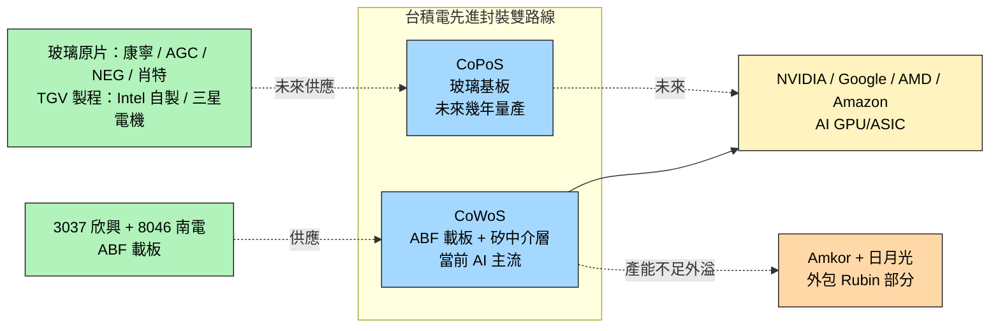

# 2330_台積電（市）

> [!note] 本頁範圍說明
> 本頁僅就本次 ingest 涵蓋的主題 — **先進封裝載板（ABF 與玻璃基板世代交替）** — 記錄台積電的角色。其他主題（2nm 製程細節、晶圓代工財務、地緣政治、Apple A 系列等）等之後 ingest 對應主題的來源時再補。

## 基本資料
台灣積體電路製造（TSMC），全球最大晶圓代工廠，AI 晶片時代的關鍵製造夥伴。在本次主題「先進封裝載板世代交替」中，台積電同時扮演**兩個角色**：

1. **CoWoS 主導者 + ABF 載板大客戶**：CoWoS 是當前 AI GPU 主流先進封裝方案，需要大量 ABF 載板（來自 [[3037_欣興（市）]]、[[8046_南電（市）]] 等）
2. **CoPoS / 玻璃基板推動者**：2026Q1 法說會提及玻璃基板 CoPoS 技術，「預計未來幾年內量產」（[[報告_其他_玻璃基板_20260511]]）

主要資料來源：[[報告_其他_玻璃基板_20260511]]（國金證券，2026-05-11）；[[報告_MS_ABF產業_260508]] 間接（從載板供應端反推）。

## 核心技術／競爭優勢（本次範圍）

- **CoWoS 產能擴張曲線**：月產能 2024 ~3.5 萬片 → 2026 年底 11.5–14 萬片 → 2027 ~17 萬片（claim 類型 estimate，信心中；國金引述）
- **AI GPU/ASIC + HBM 主力外包**：[[NVDA.US(nvidia)]]、Google、AMD、Amazon 共占 CoWoS / HBM **90% / 92%** 產能（國金引 Epoch AI 數據，2025）
- **CoWoS 外溢訊號**：[[NVDA.US(nvidia)]] **Rubin** 部分 CoWoS 外包给 [[AMKR.US(amkor)]] 與日月光（首次公開承認 CoWoS 產能不足）
- **CoPoS 玻璃基板路線**：26Q1 法說明確提及，「未來幾年內量產」（claim 類型 thesis，信心中）

## 產品與應用（本次範圍）

| 產品 / 服務 | 應用 | 相關客戶 / 下游 |
|-------------|------|-----------------|
| CoWoS 先進封裝 | AI GPU / AI ASIC + HBM 整合 | [[NVDA.US(nvidia)]]、Google、AMD、Amazon |
| CoPoS（玻璃基板封裝） | 下一世代 AI 封裝 | 客戶名單未公開 |

## 圖片 / 架構圖
![[報告_其他_玻璃基板_20260511_001.png]]
> 台積電制程迭代歷程（來源：國金證券「玻璃基板行業深度」）

![[報告_其他_玻璃基板_20260511_004.png]]
> 台積電不同先進封裝工藝示意（來源：國金證券，原引「AI 芯天下」）

## EPS 記錄

| 季度 | EPS (元) | YoY | 備註 |
|------|----------|-----|------|
| 2025Q2 | 15.36 | +60.69% | 5/3nm 比重 60%，毛利率 58.62%，優於預期（宏遠，2025-07-18） |

## EPS 預估

| 季度/年度 | EPS（元） | 毛利率 | 備註 |
|----------|-----------|--------|------|
| 2025Q3F | 14.95 | 56.51% | 台幣升值影響 -2.6%，匯兌逆風；宏遠中間值預估 |
| 2025F | 59.18 | 57.65% | 全年 YoY+25.51%；宏遠 2025-07-18 |

## 目標價與評等

| 來源 | 日期 | 評等 | 目標價 | 評價方法 |
|------|------|------|--------|---------|
| 宏遠投顧 | 2025-07-18 | 買進 | 1302 元 | 22x 2025F EPS 59.18 |

## 時間軸（本次範圍）

| 時間 | 事件 | 類型 | 重要性 | 備註 |
|------|------|------|--------|------|
| 2024 | CoWoS 月產能 ~3.5 萬片 | 產能基準 | ⭐⭐ | 國金引述 |
| 2026Q1 | 法說提及玻璃基板 CoPoS，「未來幾年內量產」 | 技術路線訊號 | ⭐⭐⭐ | 改寫 [[3037_欣興（市）]]、[[8046_南電（市）]] 中期論點 |
| 2026 底 | CoWoS 月產能目標 11.5–14 萬片 | 產能擴張 | ⭐⭐⭐ | 國金引述 |
| 2026 | NVIDIA Rubin 部分 CoWoS 外包给 [[AMKR.US(amkor)]] 與日月光 | 供應鏈外溢 | ⭐⭐⭐ | CoWoS 產能不足公開信號 |
| 2027 | CoWoS 月產能目標 ~17 萬片 | 產能擴張 | ⭐⭐ | 國金引述 |

## 供應鏈位置
- **上游 ABF 載板**：[[3037_欣興（市）]]、[[8046_南電（市）]]、Ibiden（日）、Shinko（日）
- **上游矽中介層**：自製為主
- **下游 OSAT 外溢**：[[AMKR.US(amkor)]]、日月光（Rubin CoWoS 外包）
- **終端客戶**：[[NVDA.US(nvidia)]]、AMD、Google、Amazon
- **未來玻璃基板上游**：康寧、AGC、NEG、肖特、中國 A 股供應鏈（凱盛 / 旗濱 / 戈碧迦 / 沃格光電 / 天承 / 江化微 / 德邦）
- **所屬供應鏈**：[[供應鏈_先進封裝載板]]

## 相關公司

| 公司 | 關係 | 說明 |
|------|------|------|
| [[3037_欣興（市）]] | 上游 ABF 載板 | CoWoS 載板來源 |
| [[8046_南電（市）]] | 上游 ABF 載板 | CoWoS 載板來源 |
| [[NVDA.US(nvidia)]] | 終端客戶 | CoWoS/HBM 90% 包攬之一；Rubin 部分 CoWoS 外包 |
| [[AAPL.US(apple)]] | 終端客戶 | 玻璃基板路線潛在客戶（Baltra AI server 經三星電機）|
| [[AMKR.US(amkor)]] | OSAT / CoWoS 外包夥伴 | 承接 NVIDIA Rubin 部分 CoWoS |
| [[INTC.US(intel)]] | 玻璃基板路線同儕 / 競爭 | Intel 自有玻璃基板量產（3DGS） |

> [!warning] 風險與注意事項（本次範圍）
> - **CoWoS 產能擴張節奏**：2024 → 2027 從 3.5 萬增至 ~17 萬月產能（國金 estimate，信心中），低於此預期會壓縮 ABF 載板需求
> - **玻璃基板量產時點不明**：26Q1 法說只說「未來幾年內」，與 Intel 2026-2030、Apple 2027 後並列（見 [[技術_玻璃基板]] 時程比較）
> - **CoWoS 外溢的雙面性**：Rubin 外包給 OSAT 是 TSMC 產能不足的訊號，後續更多 SKU 是否外包待觀察

## COUPE 平台確認（ECTC 2026）

TSMC COUPE（Compact Universal Photonic Engine）在 ECTC 2026 與 [[NVDA.US(nvidia)]] 及 [[LITE.US(lumentum)]] 共同發表 **DWDM CW-DFB 雷射陣列**論文，確認：
- COUPE 支援多波長 MRR DWDM 外部雷射共封裝
- PIC（N65）+ EIC（N7）SoIC 混合鍵合路線進入 CPO 實際驗證階段
- TSMC COUPE 客戶包含 NVIDIA（DWDM CW-DFB 論文掛名）

詳見 [[技術_CPO]]、[[技術_矽光子（SiPh）]]。

資料來源：[[research_simpletechtrend_CPO矽光子ECTC2026_20260629]]

## 來源
- [[報告_其他_玻璃基板_20260511]]（國金證券「玻璃基板行業深度」，2026-05-11，本頁主要來源；分析師李陽 S1130524120003）
- [[報告_MS_ABF產業_260508]]（Morgan Stanley，2026-05-08，提供 CoWoS 載板下游視角）
- [[research_simpletechtrend_CPO矽光子ECTC2026_20260629]]（COUPE 平台 ECTC 2026 確認；NVIDIA/Lumentum 論文掛名，2026-06-29）
- [[報告_中信_台積電2330_20251016]]（中信投顧，2025-10-16）
- [[報告_MS_台積電2330_20251208]]（摩根士丹利，2025-12-08）
- [[報告_外資_台積電2330_3Q25回顧_20251017]]（外資，3Q25 法說回顧，2025-10-17）
- [[報告_宏遠投顧_台積電_20250718]]（宏遠投顧，2025-07-18；2Q25 財報回顧 + TP 1302 買進）

## 相關頁面

- [[3167_大量科技（市）]]
- [[3551_世禾（市）]]
- [[3711_日月光投控（市）]]
- [[5536_聖暉（市）]]
- [[AMD.US(amd)]]
- [[GFS.US(globalfoundries)]]
- [[GLW.US(corning)]]
- [[MRVL.US(marvell)]]
- [[MU.US(micron)]]
- [[imec（未）]]
- [[供應鏈_CPO]]
- [[技術_混合鍵合]]
- [[技術_ABF載板]]

## 相關公司補充（Broadcom）

| 公司 | 關係 | 說明 |
|------|------|------|
| [[AVGO.US(broadcom)]] | 客戶 | Broadcom ~90% 晶圓由 TSMC 製造；AI ASIC 與網路晶片主要代工夥伴 |
