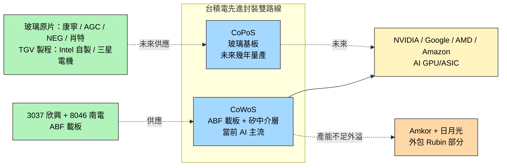

# 2330_台積電（市）

> [!note] 本頁範圍說明
> 本頁僅就本次 ingest 涵蓋的主題 — **先進封裝載板（ABF 與玻璃基板世代交替）** — 記錄台積電的角色。其他主題（2nm 製程細節、晶圓代工財務、地緣政治、Apple A 系列等）等之後 ingest 對應主題的來源時再補。

## 基本資料
台灣積體電路製造（TSMC），全球最大晶圓代工廠，AI 晶片時代的關鍵製造夥伴。在本次主題「先進封裝載板世代交替」中，台積電同時扮演**兩個角色**：

1. **CoWoS 主導者 + ABF 載板大客戶**：CoWoS 是當前 AI GPU 主流先進封裝方案，需要大量 ABF 載板（來自 [[3037_欣興（市）]]、[[8046_南電（市）]] 等）
2. **CoPoS / 玻璃基板推動者**：2026Q1 法說會提及玻璃基板 CoPoS 技術，「預計未來幾年內量產」（[[報告_其他_玻璃基板_20260511]]）

主要資料來源：[[報告_其他_玻璃基板_20260511]]（國金證券，2026-05-11）；[[報告_MS_ABF產業_260508]] 間接（從載板供應端反推）。

## 核心技術／競爭優勢

- **CoWoS 產能擴張曲線**：月產能 2024 ~3.5 萬片 → 2026 年底 11.5–14 萬片 → 2027 ~17 萬片（claim 類型 estimate，信心中；國金引述）
- **AI GPU/ASIC + HBM 主力外包**：[[NVDA.US(nvidia)]]、Google、AMD、Amazon 共占 CoWoS / HBM **90% / 92%** 產能（國金引 Epoch AI 數據，2025）
- **CoWoS 外溢訊號**：[[NVDA.US(nvidia)]] **Rubin** 部分 CoWoS 外包给 [[AMKR.US(amkor)]] 與日月光（首次公開承認 CoWoS 產能不足）
- **CoPoS 玻璃基板路線**：26Q1 法說明確提及，「未來幾年內量產」（claim 類型 thesis，信心中）

## 產品與應用

| 產品 / 服務 | 應用 | 相關客戶 / 下游 |
|-------------|------|-----------------|
| CoWoS 先進封裝 | AI GPU / AI ASIC + HBM 整合 | [[NVDA.US(nvidia)]]、Google、AMD、Amazon |
| CoPoS（玻璃基板封裝） | 下一世代 AI 封裝 | 客戶名單未公開 |

## 圖片 / 架構圖
![[報告_其他_玻璃基板_20260511_001.png]]
> 台積電制程迭代歷程（來源：國金證券「玻璃基板行業深度」）

![[報告_其他_玻璃基板_20260511_004.png]]
> 台積電不同先進封裝工藝示意（來源：國金證券，原引「AI 芯天下」）

## EPS 記錄

| 季度 | EPS (元) | YoY | 備註 |
|------|----------|-----|------|
| 2025Q2 | 15.36 | +60.69% | 5/3nm 比重 60%，毛利率 58.62%，優於預期（宏遠，2025-07-18） |
| 2Q26 | 27.25 | — | 法說彙整；毛利率 67.7%，業外收益優於部分券商預期（2026-07-16） |

## EPS 預估

| 年度 | EPS（元） | 毛利率 | 來源 |
|------|-----------|--------|------|
| 2025A | 66.25 | — | MS 2026-07-13 |
| 2026E | 107.56 | ~67-68% | MS base case（3Q26 GM 67-68%）|
| 2027E | 143.01 | — | MS 2026-07-13 |
| 2028E | 177.30 | — | MS 2026-07-13 |
| 2026E | 108.80–110.73 | 66.9%–67.0% | 富邦／Citi，2026-07-16，estimate |
| 2027E | 134.687–159.70 | 67.0%–67.5% | Daiwa／Macquarie，2026-07-16，estimate |
| 2025Q3F | 14.95 | 56.51% | 宏遠（2025-07-18）；台幣升值 -2.6% |
| 2025F | 59.18 | 57.65% | 宏遠 2025-07-18，全年 YoY+25.51% |

### MS 2Q26 法說情境分析（2026-07-13，法說日期 2026-07-16）

| 情境 | 3Q26 收入 | 全年 YoY | 3Q26 GM | Capex 2026F | 5yr AI CAGR | 股價影響 |
|------|-----------|----------|---------|-------------|-------------|---------|
| Scenario 1（樂觀）| +15% Q/Q | ~40% YoY | ~70% | US$60bn | 80% | +3-5% |
| Scenario 2（基準）| +10-15% Q/Q | 高30s% / ~40% | ~67-68% | US$56bn | ~70% | +1-3% |
| Scenario 3（保守）| +5-10% Q/Q | ~35% YoY | ~66-67% | US$54-56bn（不變）| 不變 | -3-5% |

> MS 建議在法說前累積部位，主要上行催化劑為全年收入指引上調至接近 40% YoY。

## 目標價與評等

| 來源 | 日期 | 評等 | 目標價 | 評價方法 |
|------|------|------|--------|---------|
| 宏遠投顧 | 2025-07-18 | 買進 | NT$1,302 | 22x 2025F EPS 59.18 |
| Nomura | 2026-06-30 | Buy | NT$3,425（舊 NT$2,820） | — |
| Goldman Sachs | 2026-07-02 | Buy | NT$3,000（舊 NT$2,750） | 22x 2027E EPS |
| **J.P. Morgan** | **2026-07-09** | **OW** | **NT$3,100** | 2026-07 升版 |
| Morgan Stanley | 2026-07-13 | OW | NT$2,888 | — |
| 富邦投顧 | 2026-07-16 | Buy | NT$3,500 | 2026E EPS NT$108.80；estimate |
| Citi | 2026-07-16 | Buy | NT$3,800 | 2026E EPS NT$110.73；estimate |
| Macquarie | 2026-07-16 | Outperform | NT$4,200 | 2027E EPS NT$159.70；estimate |

> [!warning] 目標價分歧（2026-07）
> GS NT$3,000（2026-07-02）vs MS NT$2,888（2026-07-13）；兩者評等均為 Buy/OW，差距 4%，主要來自 EPS 假設：MS 2026E EPS NT$107.56 / 2027E NT$143.01 / 2028E NT$177.30。

## 時間軸

| 時間 | 事件 | 類型 | 重要性 | 備註 |
|------|------|------|--------|------|
| 2024 | CoWoS 月產能 ~3.5 萬片 | 產能基準 | ⭐⭐ | 國金引述 |
| 2026Q1 | 法說提及玻璃基板 CoPoS，「未來幾年內量產」 | 技術路線訊號 | ⭐⭐⭐ | 改寫 [[3037_欣興（市）]]、[[8046_南電（市）]] 中期論點 |
| 2026 底 | CoWoS 月產能目標 11.5–14 萬片 | 產能擴張 | ⭐⭐⭐ | 國金引述 |
| 2026 | NVIDIA Rubin 部分 CoWoS 外包给 [[AMKR.US(amkor)]] 與日月光 | 供應鏈外溢 | ⭐⭐⭐ | CoWoS 產能不足公開信號 |
| 2027 | CoWoS 月產能目標 ~17 萬片 | 產能擴張 | ⭐⭐ | 國金引述 |
| 2026H2 | N2 快速爬坡、CoWoS 仍供不應求 | 技術下線／擴產 | ⭐⭐⭐ | 法說與券商彙整；2nm 初期稀釋毛利率 3–4%（公司／estimate） |
| 2027–2028 | N2／N3 與先進封裝大規模擴產 | 擴產 | ⭐⭐⭐ | 2026–2028 Capex 約 US$62–90bn／年，依券商口徑不同 |

## 供應鏈位置
- **上游 ABF 載板**：[[3037_欣興（市）]]、[[8046_南電（市）]]、Ibiden（日）、Shinko（日）
- **上游矽中介層**：自製為主
- **下游 OSAT 外溢**：[[AMKR.US(amkor)]]、日月光（Rubin CoWoS 外包）
- **終端客戶**：[[NVDA.US(nvidia)]]、AMD、Google、Amazon
- **未來玻璃基板上游**：康寧、AGC、NEG、肖特、中國 A 股供應鏈（凱盛 / 旗濱 / 戈碧迦 / 沃格光電 / 天承 / 江化微 / 德邦）
- **所屬供應鏈**：[[供應鏈_先進封裝載板]]

## 相關公司

| 公司 | 關係 | 說明 |
|------|------|------|
| [[3037_欣興（市）]] | 上游 ABF 載板 | CoWoS 載板來源 |
| [[8046_南電（市）]] | 上游 ABF 載板 | CoWoS 載板來源 |
| [[NVDA.US(nvidia)]] | 終端客戶 | CoWoS/HBM 90% 包攬之一；Rubin 部分 CoWoS 外包 |
| [[AAPL.US(apple)]] | 終端客戶 | 玻璃基板路線潛在客戶（Baltra AI server 經三星電機）|
| [[AMKR.US(amkor)]] | OSAT / CoWoS 外包夥伴 | 承接 NVIDIA Rubin 部分 CoWoS |
| [[INTC.US(intel)]] | 玻璃基板路線同儕 / 競爭 | Intel 自有玻璃基板量產（3DGS） |

> [!warning] 風險與注意事項（本次範圍）
> - **CoWoS 產能擴張節奏**：2024 → 2027 從 3.5 萬增至 ~17 萬月產能（國金 estimate，信心中），低於此預期會壓縮 ABF 載板需求
> - **玻璃基板量產時點不明**：26Q1 法說只說「未來幾年內」，與 Intel 2026-2030、Apple 2027 後並列（見 [[技術_玻璃基板]] 時程比較）
> - **CoWoS 外溢的雙面性**：Rubin 外包給 OSAT 是 TSMC 產能不足的訊號，後續更多 SKU 是否外包待觀察

| 公司 | 關係 | 說明 |
|------|------|------|
| [[AVGO.US(broadcom)]] | 客戶 | Broadcom ~90% 晶圓由 TSMC 製造；AI ASIC 與網路晶片主要代工夥伴 |
## COUPE 平台確認（ECTC 2026）

TSMC COUPE（Compact Universal Photonic Engine）在 ECTC 2026 與 [[NVDA.US(nvidia)]] 及 [[LITE.US(lumentum)]] 共同發表 **DWDM CW-DFB 雷射陣列**論文，確認：
- COUPE 支援多波長 MRR DWDM 外部雷射共封裝
- PIC（N65）+ EIC（N7）SoIC 混合鍵合路線進入 CPO 實際驗證階段
- TSMC COUPE 客戶包含 NVIDIA（DWDM CW-DFB 論文掛名）

詳見 [[技術_CPO]]、[[技術_矽光子（SiPh）]]。

資料來源：[[research_simpletechtrend_CPO矽光子ECTC2026_20260629]]

### 沿革

高盛 [[260702_gs_TSMC]]（2026-07-02）在 2Q26 法說（2026-07-16）前重申 Buy、TP 由 NT$2,750 上調至 **NT$3,000**（ADR US$600），核心為 AI/HPC 需求續強、產能與 GM 同步上修：

| 項目 | 高盛新估（2026-07-02） | 備註 |
|------|------------------------|------|
| EPS（2026/27/28E） | 102.99 / 136.34 / 175.24 元 | 較前估上修 6%/9%/6% |
| 毛利率（2026–28E） | 66.9% / 66.8% / 67.3% | 定價 + 組合 + 稼動率 |
| 2027E capex | US$78bn（前估 70bn） | 2028E 82bn、2026E 56bn 不變 |
| N3 / N2 年底 2027E 產能 | 200kwpm / 140kwpm | AI GPU/ASIC 主要瓶頸 |
| 2027E CoWoS（含 WMCM）產能 | 280kwpm（月）；年 2,730k 片 | 2026/28 年 1,275k / 3,480k |
| TP 評價基礎 | 22x 2027E EPS | ADR 溢價 20%、USD/TWD 30 |

> [!warning] 資訊更新：CoWoS 2027 產能口徑（多個來源）
> | 來源 | 估計日期 | 2027 年 CoWoS 年產能 / 月產能 | 口徑 / 備註 |
> |------|---------|------------------------------|------------|
> | 國金證券 | 2026-05-11 | 月 ~17 萬片（170k） | 不含 WMCM |
> | 定錨 | 2026-06 | 月 **19 萬片（190k）** | 不含 WMCM |
> | Nomura | 2026-06-30 | 年目標 2,000kpcs；Nomura 模型 1,800kpcs | 目標 vs 模型（WoS 瓶頸） |
> | 高盛 | 2026-07-02 | 月 **280kwpm**（年 2,730k） | **含 WMCM** |
> Nomura 認為 WoS（基板端）而非 CoW（台積電端）才是 2027 更大瓶頸，故模型只取 1,800kpcs（低於 2,000k 目標）。待 2026-07-16 法說確認。

### 沿革

定錨 [[memo_定錨_2026年中產業趨勢講座_4]]（2026年中）提供台積電最新產能規劃：

**資本支出預估（定錨）**：

| 年份 | 估計 capex | 備註 |
|------|-----------|------|
| 2026E | US$58bn | Arizona 廠務成本 5~6 倍於台灣 |
| 2027E | US$72bn | CoWoS + SoIC 雙線擴產 |
| 2028E | US$84bn | A14 ramp up 前期投資 |

**Arizona Fab 時程加速**：

| 廠區 | Phase | 原時程 | 加速後 | 備註 |
|------|-------|--------|--------|------|
| Fab21 | P2 主系統裝機 | 6~8 季 | 5~6 季 | — |
| Fab21 | P3 | 2027Q1 | **2026H2** | NVIDIA 需求上修催化 |
| Fab21 | P4 | 2028Q1 | **2027H2** | — |
| Fab22 | P3 | 2026Q2 | 2026Q1（已完成） | — |
| Fab22 | P4 | 2027Q1 | **2026Q3** | 半 N2 + 半 A16 |
| Fab22 | P5 | 2027Q2 | **2027Q1** | 半 N2 + 半 A16 |
| Fab22 | P7 | — | A16 | NVIDIA 需求上修 |

**先進封裝產能路線圖（定錨 2026年中）**：

| 技術 | 2026年底 | 2027年底 | 2028年底 |
|------|---------|---------|---------|
| CoWoS（不含 WMCM） | — | **190kwpm** | **255kwpm** |
| SoIC（Hybrid bonding） | **20kwpm** | **45kwpm** | — |
| CoPoS | — | 可能建第一條量產線 | **~10kwpm** 初步量產 |

**CoPoS 技術細節（定錨）**：台積電定案方形玻璃載具 **310×310mm**，僅作臨時支撐，**不留在封裝結構中、無需 TGV**。技術路徑沿襲 CoWoS-L（RDL + LSI + Micro Bump），差異僅在 Glass Carrier 改為方形，提升每片封裝效率。NVIDIA Rubin Ultra Package Size 達 7.5X Reticle Size，驅動台積電加速開發方形封裝。

**SoIC（Hybrid bonding）新驅動力**：
- NVIDIA CPO、Feynman、聯發科 TPU v10t Icefish 的 SoIC 需求
- TSMC COUPE 光引擎（EIC + PIC Hybrid bonding）
- N2 以下 SRAM 面積比重大，SoIC 垂直堆疊是「SoC 降成本、提升效能的最佳替代方案」

> [!note] SoIC 設備密度更高
> SoIC 設備資本密集度較 CoWoS 提升約 **50%**（潔淨度需奈米等級、精密度 2µm 以下）。

## J.P. Morgan 評估（2026-07-09）

來源：[[報告_JPM_台積電CoWoS先進封裝_20260709]]（J.P. Morgan，2026-07-09）

### 評等與目標價

- **評等**：Overweight（OW）
- **目標價**：NT$3,100（Jun-2027，升自前值）
- 核心論點：CoWoS 產能持續擴充 + 客戶組合改善（AMD Venice 大爬坡）驅動 2027-28 EPS 顯著上修

### 財務預估（JPM）

| 指標 | FY26E | FY27E |
|------|-------|-------|
| 營收（NT$B） | **5,342** | **7,192** |
| YoY | +40.3% | +34.7% |
| 毛利率 | **67.7%** | **71.4%** |
| EPS（NT$） | **103.97** | **138.24** |

### JPM CoWoS 客戶需求分配（2026/27/28E，萬片/年）

| 客戶 | 2026E | 2027E | 2028E |
|------|-------|-------|-------|
| NVIDIA | 72.5 | 119.6 | 173.5 |
| AMD | 9.5 | 35.5 | 54.0 |
| Broadcom（含 Google TPU）| 25.0 | 42.5 | 58.0 |
| 其他 | — | — | — |
| **合計** | **~124** | **~238** | **~332** |

- **TSMC 自有 CoWoS 產能**：end-2026E 115K → end-2027E 190K → end-2028E 225K（wfpm，月）
- **OSAT 外包 CoWoS**：end-2026E 15K → end-2027E 50K → end-2028E 85K（wfpm，月）

更新「目標價與評等」：

| 來源 | 日期 | 評等 | 目標價 |
|------|------|------|--------|
| J.P. Morgan | 2026-07-09 | OW | **NT$3,100** |

## 富邦法說更新（2026-07-16／07-28）

![[報告_富邦_台積電_20260716_001.png]]
*圖（富邦投顧，2026-07-16）：台積電單季營收與 EPS 走勢；圖中後段為富邦估計。*

| 指標 | 富邦觀點 | 性質／信心 |
|------|----------|-------------|
| 評等／目標價 | 買進／NT$3,500 | 券商估值，中 |
| 2026E／2027E EPS | NT$108.80／155.41 | estimate，中 |
| 2Q26 EPS／毛利率 | NT$27.25／67.7% | 財報實績，高 |
| 3Q26 指引 | 營收中值季增 12%；毛利率 65–67% | 公司指引，高 |
| 2026 營收／資本支出 | 全年營收成長逾 40%；capex US$60–64bn | 公司指引，高 |
| 2027 年底 N3／N2 產能 | 月產 21–22 萬片／12 萬片 | 富邦估計，中 |

富邦認為，資本支出上修反映 AI、伺服器 CPU 與先進製程需求仍強，但 N2 快速爬坡會壓低 3Q26 毛利率。公司另宣布亞利桑那州新增 US$100bn 投資與四座新廠；實際投產節奏仍受建廠、設備交期與客戶需求影響。

![[報告_富邦_2027年半導體展望_20260728_002.png]]
*圖（富邦投顧，2026-07-28）：台積電 CoWoS／CoPoS 季底月產能估計。富邦估 2027 年底 CoWoS 18 萬片、2028 年底 22 萬片。*

### CoWoS 分配與外溢

- 富邦估台積電 CoWoS 2027 年出貨 189 萬片，NVIDIA 約占 50%；聯發科取得的配置預期由 2026 年 1.5% 升至 2027 年 7.3%。
- 富邦估日月光 FoCoS 月產能可達 5 萬片，主要承接 CPU 與網通客戶；AMD 2027 年總配置約 30 萬片，增量主要來自日月光。
- 這套口徑與定錨 2027 年底 19 萬片、JPM 19 萬片及高盛含 WMCM 28 萬片並存。差異主要來自年底／年均、TSMC 自有／OSAT 外包及是否含 WMCM，不能直接互相比高低。
- Google 2028 年 TPU 目標 1,200–1,500 萬顆是富邦的供應鏈調查推估；富邦據此判斷 Intel EMIB-T 需要分擔部分封裝，不應視為 Google 或台積電正式指引。

## 來源
- [[報告_MS_台積電_20260713]]（Morgan Stanley，2026-07-13；OW、TP NT$2,888；2Q26 法說前情境分析，建議累積部位；MS EPS 2026E 107.56 / 2027E 143.01 / 2028E 177.30）
- [[260702_gs_TSMC]]（高盛，2026-07-02；重申 Buy、TP NT$3,000、2027E capex US$78bn、CoWoS 產能上修）
- [[報告_其他_玻璃基板_20260511]]（國金證券「玻璃基板行業深度」，2026-05-11，本頁主要來源；分析師李陽 S1130524120003）
- [[報告_MS_ABF產業_260508]]（Morgan Stanley，2026-05-08，提供 CoWoS 載板下游視角）
- [[research_simpletechtrend_CPO矽光子ECTC2026_20260629]]（COUPE 平台 ECTC 2026 確認；NVIDIA/Lumentum 論文掛名，2026-06-29）
- [[報告_中信_台積電2330_20251016]]（中信投顧，2025-10-16）
- [[報告_MS_台積電2330_20251208]]（摩根士丹利，2025-12-08）
- [[報告_外資_台積電2330_3Q25回顧_20251017]]（外資，3Q25 法說回顧，2025-10-17）
- [[報告_宏遠投顧_台積電_20250718]]（宏遠投顧，2025-07-18；2Q25 財報回顧 + TP 1302 買進）
- [[memo_定錨_2026年中產業趨勢講座_4]]（定錨，2026年中；Fab21/22 時程加速、CoWoS 190k/255k 2027/28 年底、SoIC 20k/45k 2026/27 年底、CoPoS 310×310mm 2028 量產）
- [[報告_富邦_台積電_20260716]]（富邦投顧，2026-07-16；2Q26 財報、3Q26 指引、capex 與 N2／N3 產能預估，買進、TP NT$3,500）
- [[報告_富邦_2027年半導體展望_20260728]]（富邦投顧，2026-07-28；CoWoS／FoCoS 產能、客戶分配、Rubin 架構與 Intel EMIB 估計）
- [[2330 TSMC 2Q26法說 review]]（富邦／外資報告彙整，2026-07-17；2Q26 法說、N2／N3 產能、Capex 與評價更新）

## 相關頁面

- [[6139_亞翔（市）]]
- [[6613_朋億（櫃）]]
- [[AMAT.US(applied_materials)]]
- [[8227_巨有科技（櫃）]]
- [[分析_CP_FT_BI_SLT測試產業與外包]]
- [[分析_晶片尺寸擴大與面板級封裝2026]]
- [[2379_瑞昱（市）]]
- [[分析_聯發科AI_ASIC]]
- [[1717_長興（市）]]
- [[3583_辛耘（市）]]
- [[5234_達興材料（市）]]
- [[6531_愛普（市）]]
- [[6920_恆勁科技（市）]]
- [[6937_天虹（市）]]
- [[分析_先進封裝與RDL]]
- [[1560_中砂（市）]]
- [[3443_創意電子（市）]]
- [[4749_達興材料（市）]]
- [[6488_環球晶（櫃）]]
- [[6770_力積電（市）]]
- [[TSEM.US(tower semiconductor)]]
- [[供應鏈_AI光互聯]]
- [[2303_聯電（市）]]
- [[2454_聯發科（市）]]
- [[3131_弘塑（櫃）]]
- [[3532_台勝科（市）]]
- [[3661_世芯-KY（市）]]
- [[5347_世界先進（市）]]
- [[6187_萬潤（市）]]
- [[6196_帆宣（市）]]
- [[6257_矽格（市）]]
- [[6515_穎崴（市）]]
- [[6640_均華精密（市）]]
- [[7751_竑騰（市）]]
- [[7769_鴻勁精密（市）]]
- [[7856_漢測（興）]]
- [[8482_創新服務（市）]]
- [[供應鏈_半導體測試設備]]
- [[技術_CoWoS與先進封裝]]
- [[技術_InP磷化銦]]
- [[時程_2026記憶體與AI催化劑]]
- [[3167_大量科技（市）]]
- [[3551_世禾（市）]]
- [[3711_日月光投控（市）]]
- [[5536_聖暉（市）]]
- [[AMD.US(amd)]]
- [[GFS.US(globalfoundries)]]
- [[GLW.US(corning)]]
- [[MRVL.US(marvell)]]
- [[MU.US(micron)]]
- [[imec（未）]]
- [[供應鏈_CPO]]
- [[技術_混合鍵合]]
- [[技術_ABF載板]]
## BofA 2026-08-18 更新

- 董事會核准資本支出撥款約 290 億美元，BofA 估 2026 年資本支出約 620 億美元、2027 年若撥款維持高檔可能達 800–850 億美元；均為券商 estimate。
- Arizona 廠 2Q26 營收約 NT$450 億元，季增 17%、年增 145%，約占公司營收 4%；海外擴產折舊壓力與 HPC 需求支撐並列觀察。
- 來源：[[260818_ml_TSMC]]（BofA Securities，2026-08-18）；資本支出與海外廠獲利為估計，信心水準：中。
