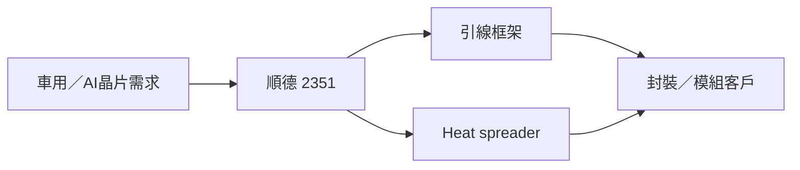

# 2351_順德（市）

## 基本資料

順德（SDI Corp，2351.TW）主要提供引線框架與精密金屬零件，應用涵蓋車用、工業、消費電子及 AI 封裝。2026 年 AI lead frame 與 heat spreader 成為新增長動能；Daiwa 2026-08-07 估 2Q26 AI lead frame 已占營收 6%，管理層目標 4Q26 達雙位數。

## 產品與應用

| 產品 | 應用 | 觀察 |
|---|---|---|
| 車用引線框架 | ADAS、電動車 | 2H26 受低庫存、在地化與新產品支撐 |
| AI lead frame | AI 晶片封裝 | 40 項新 AI 產品預計貢獻月營收逾 NT$150M（公司展望） |
| Heat spreader | AI／高功率晶片散熱 | 已取得美系客戶訂單，未來 6 個月開始貢獻營收（Daiwa estimate） |

## 圖片 / 架構圖

## 券商觀點與財務

- Daiwa 2026-08-07 維持 Buy，12 個月目標價 NT$265；以 1 年前瞻 PER 35 倍評價，屬 estimate，信心：中。
- 2Q26 營收 NT$3,559M、毛利率 20.7%、EPS NT$1.60；AI lead frame 占營收 6%，管理層預期 2H26 營收較 1H26 高個位數成長。

## 時間軸

| 時間 | 事件 | 類型 | 重要性 |
|---|---|---|---|
| 2026H2 | AI lead frame 比重提升、heat spreader 開始貢獻 | 放量 | ⭐⭐⭐ |
| 2026Q4 | AI lead frame 目標達營收雙位數 | 規格升級 | ⭐⭐⭐ |
| 2027–2028 | 新增台灣／中國以外生產據點 | 擴產 | ⭐⭐ |

## 風險與注意事項

1. 車用與消費電子終端需求不如預期。
2. AI lead frame 與 heat spreader 客戶認證、量產速度低於預期。
3. 銅價、匯率與毛利率改善不及預期。

## 來源

- [[260806_daiwa_SDI]]（Daiwa，2026-08-06）
- [[260807_daiwa_SDI]]（Daiwa，2026-08-07）

## 相關頁面

- [[3211_順達科技（櫃）]]
