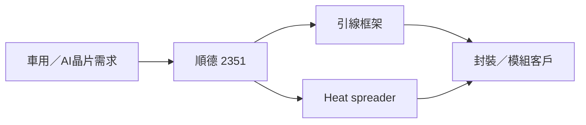

# 2351_順德（市）

## 基本資料

順德（SDI Corp，2351.TW）主要提供引線框架與精密金屬零件，應用涵蓋車用、工業、消費電子及 AI 封裝。2026 年 AI lead frame 與 heat spreader 成為新增長動能；Daiwa 2026-08-07 估 2Q26 AI lead frame 已占營收 6%，管理層目標 4Q26 達雙位數。Nomura（2026-09-11）稱順德為全球最大功率半導體導線架廠，主力在車用、工業與 AI 應用；客戶以國際 IDM 與封測廠為主。

## 核心技術／競爭優勢

- **功率導線架規模：** 全球最大功率半導體導線架供應商（Nomura，2026-09-11），直接受惠 IDM 的 AI 資料中心電源（Power Stage、PSU、800V HVDC）放量。
- **精密沖壓與共平面度：** 均熱片共平面度 20–30µm，優於產業平均 50–70µm（Nomura），是取得封測、車用與 IC 設計客戶共 4 張主要訂單的關鍵。
- **漲價與產品組合：** 1H26 已兩度漲價，Nomura 預期 2H26 價格再改善；車用與 AI 資料中心毛利率高於其他終端，組合轉佳推升毛利率。

## 產品與應用

| 產品 | 應用 | 觀察 |
|---|---|---|
| 車用引線框架 | ADAS、電動車 | 2H26 受低庫存、在地化與新產品支撐 |
| AI lead frame | AI 晶片封裝 | 40 項新 AI 產品預計貢獻月營收逾 NT$150M（公司展望） |
| Heat spreader | AI／高功率晶片散熱 | 已取得美系客戶訂單，未來 6 個月開始貢獻營收（Daiwa estimate） |

## 圖片 / 架構圖

```mermaid
flowchart LR
  A[車用／AI晶片需求] --> B[順德 2351]
  B --> C[引線框架]
  B --> D[Heat spreader]
  C --> E[封裝／模組客戶]
  D --> E
```

![[報告_Nomura_順德2351_20260911_001.png]]

圖說：順德產品線全貌——左側導線架涵蓋車用、工業、消費性與 AI lead frame（Power Stage、伺服器電源），右側新業務均熱片（Hat、Cavity、Ring、MCL 微流道蓋板），說明順德由導線架延伸到 AI 晶片散熱的產品擴張路徑。（來源：Nomura，2026-09-11）

![[報告_Nomura_順德2351_20260911_002.png]]

圖說：Nomura 估計的順德終端營收組合；2026F 起 AI 資料中心（淺粉）與均熱片（黑）開始成為可見區塊，2027F 營收 NT$192 億、2028F NT$239 億，成長主要來自這兩塊新業務與車用。（來源：Nomura，2026-09-11；estimate）

## 券商觀點與財務

- Daiwa 2026-08-07 維持 Buy，12 個月目標價 NT$265；以 1 年前瞻 PER 35 倍評價，屬 estimate，信心：中。
- 2Q26 營收 NT$3,559M、毛利率 20.7%、EPS NT$1.60；AI lead frame 占營收 6%，管理層預期 2H26 營收較 1H26 高個位數成長。

### 2026-09-11 Nomura：功率導線架 2H26–2027 更強，均熱片錦上添花

- **IDM 需求：** 全球 IDM 3Q26E 加權平均營收 YoY +17%、QoQ +7%（2Q26 為 +18%／+11%），為 3Q25 以來連續第 5 季年增。順德數家主要 IDM 客戶於 2Q26 法說上調 2026–27E AI 資料中心營收，其中兩家 2027E 相關營收可望年增一倍（Nomura 通路調查）。Infineon FY26／27 AI 資料中心營收目標逾 €16 億／€25 億，STM 2026／27E US$10 億／20 億，onsemi 2026E AI 營收較 2025 年 US$2.5 億倍增以上，Renesas 估 2029–30 年 AI／IT 基礎設施占營收 40%。（公司說法轉述，中高）
- **AI 功率導線架：** Nomura 估 2027F AI 相關功率導線架營收年增 134%，占總營收由 2026F 8% 升至 15%，目前進行中專案 60 個。（estimate，中）
- **毛利率：** 多個終端市場供給吃緊，1H26 兩輪漲價後 2H26 價格可再改善；2H26F／FY27F 毛利率估 22.1%／23.0%（1H26 20.0%）。
- **均熱片：** 管理層決定 2026–27 年增購 100／200／500 噸沖壓設備，產品含 hat、cavity、ring／stiffener 與 MCL，聚焦車用、ASIC／CPU 與 AI 資料中心網通；已取得封測、車用與 IC 設計客戶共 4 張主要訂單，管理層預期 2027 年起主要貢獻，Nomura 估占 2027F／28F 營收 3%／7%。
- **評價：** 2026F／27F EPS 上修 8%／17%，目標價由 NT$251 升至 NT$327（28x 2027F EPS NT$11.68；2015 年以來平均 22.5x），維持 Buy；報告時股價 NT$235.5。下行風險：車用／工業／消費需求復甦放緩、新產品量產延後、同業價格競爭、銅價短期急跌壓縮毛利率。
- 來源：[[報告_Nomura_順德2351_20260911]]（Nomura，2026-09-11）。

## EPS 預估

| 年度 | Nomura EPS（報告日：2026-09-11） | Nomura 營收（NT$ 百萬） | 毛利率 | 備註 |
|---|---|---|---|---|
| 2025A | 1.66 | 10,247 | 13.3% | 實績 |
| 2026F | 7.51（舊 6.96） | 14,830 | 21.2% | 3Q26F／4Q26F EPS 2.55／2.59 |
| 2027F | 11.68（舊 9.97） | 19,185 | 23.0% | AI 功率導線架占 15%、均熱片 3% |
| 2028F | 14.82 | 23,860 | 23.3% | 均熱片 7% |

## 目標價與評等

| 券商 | 報告發布日 | 評等 | 目標價 | 評價基礎 | 來源 |
|---|---|---|---|---|---|
| Daiwa | 2026-08-07 | Buy | NT$265 | 1 年前瞻 PER 35x | [[260807_daiwa_SDI]] |
| Nomura | 2026-09-11 | Buy（維持） | NT$327（舊 NT$251） | 28x 2027F EPS NT$11.68 | [[報告_Nomura_順德2351_20260911]] |

## 時間軸

| 時間 | 事件 | 類型 | 重要性 |
|---|---|---|---|
| 2026H2 | AI lead frame 比重提升、heat spreader 開始貢獻 | 放量 | ⭐⭐⭐ |
| 2026Q4 | AI lead frame 目標達營收雙位數 | 規格升級 | ⭐⭐⭐ |
| 2027–2028 | 新增台灣／中國以外生產據點 | 擴產 | ⭐⭐ |
| 2026–2027 | 增購 100／200／500 噸沖壓設備擴充均熱片 | 擴產 | ⭐⭐ |
| 2027 | 均熱片主要營收貢獻開始（Nomura 估占 3%）；AI 功率導線架年增 134% | 放量 | ⭐⭐⭐ |

→ 跨公司時程詳見 [[時程_2026Q3Q4_AI網通與硬體催化劑]]

## 供應鏈位置

- 上游：銅材（價格波動影響毛利率）、沖壓與電鍍設備。
- 下游：國際 IDM（功率元件）與封測廠；均熱片客戶包含封測、車用與 IC 設計公司，論壇資料點名 Cisco、[[AMKR.US(amkor)]]。
- 所屬主題鏈：[[供應鏈_AI伺服器散熱]]（均熱片／晶片封裝散熱）；AI 電源相關見 [[技術_800VDC供電架構]]。

## 相關公司

| 公司 | 關係 | 說明 |
|---|---|---|
| [[AMKR.US(amkor)]] | 均熱片客戶 | 國泰論壇 2026-08-25：Cisco 為首家 IC 設計客戶、Amkor 次之 |
## 風險與注意事項

> [!warning] 風險與注意事項
> 1. 車用與消費電子終端需求不如預期。
> 2. AI lead frame 與 heat spreader 客戶認證、量產速度低於預期。
> 3. 銅價、匯率與毛利率改善不及預期；Nomura 特別點出銅價短期急跌會壓縮近期毛利率。
> 4. 同業價格競爭；均熱片 2027 年貢獻仍屬管理層預期與券商估計。

## 本次 ingest 更新（2026-08-31）

- [[活動_順德法說_20260825]] 稱 AI lead frame 佔電子產品營收約 6%，Q3 可能達雙位數；heat spreader 已於 Q2 開始貢獻，客戶認證與出貨節奏仍待驗證。
- 2026 capex 由約 NT$1.3bn 上調至 1.4bn，另規劃土地支出；以上為管理層展望，信心中低。

## 2026-08-25 國泰論壇補充

- **均熱片（heat spreader）：** 2Q26 起貢獻，Cisco 為首家 IC 設計客戶、Amkor 次之，目前 4 家合格客戶（含車規客戶與前三大封測廠）皆已完成稽核；單一客戶月需求約 500 萬片。600 噸鍛造機月產能約 30 萬片，半年內先擴至月 100–200 萬片、一年內完成設備後逐步往月 2,000 萬片；小尺寸 ASP 約 30–40 元，高難度 NPI 毛利率可逾 30%（commodity 10–15%）；共平面度 20–30μm；最大已認證約 90×90（給 Cisco），現有設備可做 110×110，ASIC 為主要切入市場。
- **AI 導線架：** 占電子營收由 2025 年約 1% 升至 1H26 約 6%，7 月起明顯放大、3Q26 有機會達雙位數，應用為伺服器 Power Stage、PSU 與 800V HVDC；Power 導線架全球市占第一；AI 開發案約 60 個、開發週期約 9 個月–1 年；光阻式電鍍產線已送樣，產能全開時 AI 相關單月營收可達約 3 億元。
- **客戶與產能：** IDM：OSAT 約 55：45，Infineon、通富、ST 各逾 10%，Vishay 約 9%；新增瑞薩 VPD 案（最快 12 月–1 月貢獻）、德系 VPD 2H26 貢獻；8–11 月均有 AI 急單加價費，下半年誠意費約 3,000–4,000 萬元。台灣約 65% 產能、江蘇約 35%（China for China），規劃東南亞第三基地（集團 5–10% 產能）；2026 年 capex 往 14 億元邁進，另均熱片土地約 10 億元、第三基地 3–5 億元。
- 來源：[[活動_順德2351_國泰論壇_20260825]]（國泰證期，2026-08-25），公司說法，信心中。

## 來源

- [[活動_順德2351_國泰論壇_20260825]]（國泰證期論壇 Call Memo，2026-08-25）

- [[260806_daiwa_SDI]]（Daiwa，2026-08-06）
- [[260807_daiwa_SDI]]（Daiwa，2026-08-07）

- [[報告_Nomura_順德2351_20260911]]（2026-09-11）

## 相關頁面

- [[技術_800VDC供電架構]]
- [[2481_強茂（市）]]
- [[3211_順達科技（櫃）]]
