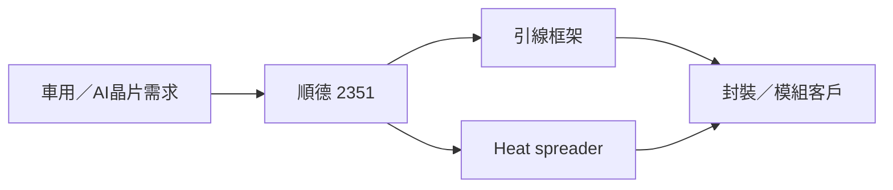

# 2351_順德（市）

## 基本資料

順德（SDI Corp，2351.TW）主要提供引線框架與精密金屬零件，應用涵蓋車用、工業、消費電子及 AI 封裝。2026 年 AI lead frame 與 heat spreader 成為新增長動能；Daiwa 2026-08-07 估 2Q26 AI lead frame 已占營收 6%，管理層目標 4Q26 達雙位數。

## 產品與應用

| 產品 | 應用 | 觀察 |
|---|---|---|
| 車用引線框架 | ADAS、電動車 | 2H26 受低庫存、在地化與新產品支撐 |
| AI lead frame | AI 晶片封裝 | 40 項新 AI 產品預計貢獻月營收逾 NT$150M（公司展望） |
| Heat spreader | AI／高功率晶片散熱 | 已取得美系客戶訂單，未來 6 個月開始貢獻營收（Daiwa estimate） |

## 圖片 / 架構圖

```mermaid
flowchart LR
  A[車用／AI晶片需求] --> B[順德 2351]
  B --> C[引線框架]
  B --> D[Heat spreader]
  C --> E[封裝／模組客戶]
  D --> E
```

## 券商觀點與財務

- Daiwa 2026-08-07 維持 Buy，12 個月目標價 NT$265；以 1 年前瞻 PER 35 倍評價，屬 estimate，信心：中。
- 2Q26 營收 NT$3,559M、毛利率 20.7%、EPS NT$1.60；AI lead frame 占營收 6%，管理層預期 2H26 營收較 1H26 高個位數成長。

## 時間軸

| 時間 | 事件 | 類型 | 重要性 |
|---|---|---|---|
| 2026H2 | AI lead frame 比重提升、heat spreader 開始貢獻 | 放量 | ⭐⭐⭐ |
| 2026Q4 | AI lead frame 目標達營收雙位數 | 規格升級 | ⭐⭐⭐ |
| 2027–2028 | 新增台灣／中國以外生產據點 | 擴產 | ⭐⭐ |

## 風險與注意事項

1. 車用與消費電子終端需求不如預期。
2. AI lead frame 與 heat spreader 客戶認證、量產速度低於預期。
3. 銅價、匯率與毛利率改善不及預期。

## 本次 ingest 更新（2026-08-31）

- [[活動_順德法說_20260825]] 稱 AI lead frame 佔電子產品營收約 6%，Q3 可能達雙位數；heat spreader 已於 Q2 開始貢獻，客戶認證與出貨節奏仍待驗證。
- 2026 capex 由約 NT$1.3bn 上調至 1.4bn，另規劃土地支出；以上為管理層展望，信心中低。

## 2026-08-25 國泰論壇補充

- **均熱片（heat spreader）：** 2Q26 起貢獻，Cisco 為首家 IC 設計客戶、Amkor 次之，目前 4 家合格客戶（含車規客戶與前三大封測廠）皆已完成稽核；單一客戶月需求約 500 萬片。600 噸鍛造機月產能約 30 萬片，半年內先擴至月 100–200 萬片、一年內完成設備後逐步往月 2,000 萬片；小尺寸 ASP 約 30–40 元，高難度 NPI 毛利率可逾 30%（commodity 10–15%）；共平面度 20–30μm；最大已認證約 90×90（給 Cisco），現有設備可做 110×110，ASIC 為主要切入市場。
- **AI 導線架：** 占電子營收由 2025 年約 1% 升至 1H26 約 6%，7 月起明顯放大、3Q26 有機會達雙位數，應用為伺服器 Power Stage、PSU 與 800V HVDC；Power 導線架全球市占第一；AI 開發案約 60 個、開發週期約 9 個月–1 年；光阻式電鍍產線已送樣，產能全開時 AI 相關單月營收可達約 3 億元。
- **客戶與產能：** IDM：OSAT 約 55：45，Infineon、通富、ST 各逾 10%，Vishay 約 9%；新增瑞薩 VPD 案（最快 12 月–1 月貢獻）、德系 VPD 2H26 貢獻；8–11 月均有 AI 急單加價費，下半年誠意費約 3,000–4,000 萬元。台灣約 65% 產能、江蘇約 35%（China for China），規劃東南亞第三基地（集團 5–10% 產能）；2026 年 capex 往 14 億元邁進，另均熱片土地約 10 億元、第三基地 3–5 億元。
- 來源：[[活動_順德2351_國泰論壇_20260825]]（國泰證期，2026-08-25），公司說法，信心中。

## 來源

- [[活動_順德2351_國泰論壇_20260825]]（國泰證期論壇 Call Memo，2026-08-25）

- [[260806_daiwa_SDI]]（Daiwa，2026-08-06）
- [[260807_daiwa_SDI]]（Daiwa，2026-08-07）

- [[報告_Nomura_順德2351_20260911]]（2026-09-11）

## 相關頁面

- [[技術_800VDC供電架構]]
- [[2481_強茂（市）]]
- [[3211_順達科技（櫃）]]
