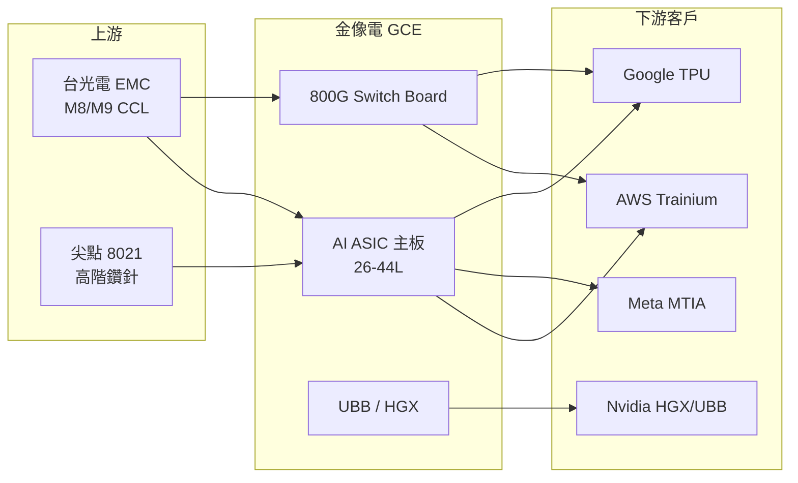

---
title: "2368_金像電（市）"
ticker: "2368.TW"
market: TW
exchange: TWSE
sector: PCB 印刷電路板
tags:
  - 產業/PCB
  - 公司/金像電
  - 技術/CCL
  - 供應鏈/AI伺服器PCB
  - 環節/PCB製造
  - 產業/AI伺服器
updated: 2026-08-29
aliases:
  - GCE
  - Gold Circuit Electronics
  - 金像電子
related_companies:
  - "[[2383_台光電（市）]]"
  - "[[3044_健鼎（市）]]"
  - "[[4958_臻鼎（市）]]"
  - "[[NVDA.US(nvidia)]]"
---

# 2368_金像電（市）

## 基本資料

金像電子（Gold Circuit Electronics，GCE），1981 年創立，台灣高階 PCB（印刷電路板）龍頭，全球伺服器/網通 PCB 市占 20%+（2022）。專注高層數 HDI PCB，最高層數達 50L+，是 AI 伺服器（ASIC 主板、400G/800G 交換機）的核心供應商。伺服器+網通合計占營收 70%+ 。四座工廠分布台灣、中國（×3），並在泰國建立新廠（2026H2 啟動）。

主要資料來源：[[報告_Citi_PCB_CCL_20260422]]（Citi，2026-04-22）、[[報告_GS_台灣CCL_PCB_20260418]]（Goldman Sachs，2026-04-18）、[[報告_GS_CCL_PCB_20260320]]（Goldman Sachs，2026-03-20）、[[報告_福邦_PCB載板產業展望_20260401]]（福邦投顧，2026-04-01）。

## 核心技術／競爭優勢

- **高層數設計能力**：最高 50L+，AI 伺服器 HLC（High Layer Count）主板的關鍵技術門檻
- **AI ASIC 主供地位**：AWS Trainium 系列、Meta MTIA、Google TPU 的 PCB 主供（或備供）；GCE 在 AI ASIC mainboard 有 30%+ 市占
- **Hyperscaler capex read-across**：摩根士丹利 2026-08-02 將金像電列為通用伺服器與 ASIC PCB 主要受惠者；Google、AWS 2026 capex 上修降低零組件漲價造成砍量的疑慮。
- **800G Switch 受惠**：800G 交換機滲透率加速（更高 ASP），GCE 為主要受惠廠之一
- **海外產能優先**：泰國廠 2026H2 啟動（Amazon/Meta），在取得 OOC（Out of China）訂單上握有關鍵優勢
- **非中國生產優先**：地緣政治緊張使客戶優先採購非中國廠區，GCE 台灣廠 + 泰國新廠受惠
- **高 ROI 擴產**：年化 ROI 300%+，GCE 持續積極擴產（2026 擴 33%）

## 產品與應用

| 產品 / 服務 | 規格 | 應用 | 主要客戶 |
|-------------|------|------|---------|
| AI ASIC 主板 | 26-44L HLC | AI 加速器伺服器 | AWS Trainium、Google TPU、Meta MTIA |
| GPU 伺服器主板 | 22-26L HLC | Nvidia GPU 伺服器 | Nvidia（備供） |
| 800G Switch Board | HLC+HDI | AI 資料中心交換機 | 各大 CSP |
| UBB（Universal Baseboard）| 高精度 HLC | Nvidia HGX | Nvidia |
| NB / 消費性 PCB | HDI | 筆電、平板 | 多元 |

## 圖片 / 架構圖

![[報告_金像電_2026H1法說簡報_20260819_009.png]]

*圖（金像電，2026-08-19）：公司製程能力由一般多層板延伸至 HDI、高階伺服器／網通板與 IC 測試板；薄板與厚板 HDI 是後續 AI 伺服器升級方向。*

## EPS 記錄

| 年度 | EPS (元) | YoY | 備註 |
|------|----------|-----|------|
| 2026H1 | 16.17 | +128% | 公司正式簡報；營收 435.92 億元、毛利率 34.72% |
| 2023A | NT$（原始數值待核對）.11 | — | — |
| 2024A | NT$（原始數值待核對）.98 | +71% | — |
| 2025A | NT$（原始數值待核對）.98 | +0% | 與 2024 持平（Citi 數字） |
| 1Q26E（Citi） | NT$（原始數值待核對）.69 | +93% YoY | 營收 NT$（原始數值待核對）.4 億，超預期 6% |

## EPS 預估

| 年度 | Citi（2026-04-22） | GS 3/20（2026-03-20） | GS 4/18（2026-04-18） | 備註 |
|------|------------------|----------------------|----------------------|------|
| 2026E | NT$（原始數值待核對）.53 | NT$（原始數值待核對）.49 | NT$（原始數值待核對）.68 | GS 4/18 最樂觀（2H26 漲價+HDI 升級） |
| 2027E | NT$（原始數值待核對）.11 | NT$（原始數值待核對）.38 | NT$（原始數值待核對）.27 | GS 2027E 大幅高於 Citi |
| 2028E | NT$（原始數值待核對）.37 | NT$（原始數值待核對）.24 | NT$（原始數值待核對）.66 | — |

> GS 對 GCE 2027E 估計（NT$（原始數值待核對）.27）較 Citi（NT$（原始數值待核對）.11）高 32%，主要差異在於 GS 假設 2H26-2027 PCB 再漲價 +10-40% 且 HDI 升級帶動 ASP 持續成長。

## 目標價與評等

| 券商 | 報告日 | 評等 | 目標價 | 評價基礎 | 來源 |
|------|--------|------|--------|----------|------|
| Citi | 2026-04-22 | Buy | NT$1,500 | 25x 2027E EPS NT$（原始數值待核對）.11 | [[報告_Citi_PCB_CCL_20260422]] |
| Goldman Sachs | 2026-03-20 | Buy | NT$1,210 | 22x 4Q26-3Q27E EPS | [[報告_GS_CCL_PCB_20260320]] |
| Goldman Sachs | 2026-04-18 | Buy | NT$1,380 | 22x 4Q26-3Q27E EPS（上調） | [[報告_GS_台灣CCL_PCB_20260418]] |

## 時間軸

| 時間 | 事件 | 類型 | 重要性 | 備註 |
|------|------|------|--------|------|
| 2026-03-20 | GS 上調 TP NT$1,060→NT$1,210 | 評等調整 | ⭐⭐ | PCB 漲價確認 |
| 2026-04-22 | Citi 上調 TP NT$1,100→NT$1,500，+36% | 大幅上調 | ⭐⭐⭐ | 1Q26 超預期，AWS/Google 需求加速 |
| 2026-04-18 | GS 再上調 TP NT$1,210→NT$1,380，+14% | 評等調整 | ⭐⭐ | 2H26 漲價假設、HDI 升級趨勢 |
| 2026-Q3 | AWS Trainium 需求開始放量 | 需求 | ⭐⭐⭐ | Citi：AWS 3Q26E 開始 ramp |
| 2026-Q4 | Google Trainium/TPU 需求跟進 | 需求 | ⭐⭐⭐ | Citi：Google 4Q26E 需求加入 |
| 2026-H2 | 泰國廠 A 區啟動（Amazon/Meta） | 產能 | ⭐⭐⭐ | OOC 訂單關鍵里程碑 |
| 2027 | ASIC AI PCB 規格升級 3+N+3→6+N+6 HDI | 技術升級 | ⭐⭐⭐ | GS：帶動 GCE 高端 HDI 設備投資 |
| 2026-08-19 | 公司揭露 2026H1 營收年增 68%、EPS 16.17 元 | 財務 | ⭐⭐⭐ | [[報告_金像電_2026H1法說簡報_20260819]] |
| 2026H2 | 已公告資本支出約 190 億元，後續仍可能增加 | 擴產 | ⭐⭐⭐ | 公司揭露；實際金額待公告 |

## 供應鏈位置

- **上游 CCL**：台光電（2383，M8/M9）、Doosan 斗山（M8）、生益科技（M8）
- **上游鑽針**：尖點（8021）、鼎泰高科
- **下游/客戶**：AWS（Trainium）、Meta（MTIA）、Google（TPU）、Nvidia（HGX/UBB）→ 透過 Celestica、Jabil、緯穎等 ODM
- **所屬供應鏈**：[[供應鏈_AI伺服器PCB]]

## 相關公司

| 公司 | 關係 | 說明 |
|------|------|------|
| [[2383_台光電（市）]] | 上游 CCL | M8/M9 主要 CCL 供應商 |
| [[3044_健鼎（市）]]（未建頁） | 同業/競爭 | CPU/Memory PCB，Citi Buy |
| [[4958_臻鼎（市）]]（未建頁） | 同業/競爭 | FPCB+PCB，Citi Sell / GS Buy |
| [[8021_尖點（市）]]（未建頁） | 上游鑽針 | 高階鑽針主供，金像電為最大客戶 |
| [[NVDA.US(nvidia)]] | 終端客戶 | HGX UBB、NVSwitch Tray |

> [!warning] 下行風險
> 1. AI 伺服器需求弱於預期或延遲
> 2. Nvidia OAM/UBB 產品驗證延誤
> 3. HDI 需求弱於預期
> 4. 泰國新廠爬坡效率不如預期
> 5. 中國競爭對手進入 AI 供應鏈（PCB Tier 2/3 宣稱 2H26 切入）

## 來源

- [[報告_Citi_PCB_CCL_20260422]]（Citi，2026-04-22；GCE 完整財務模型、Bull/Bear 分析）
- [[報告_GS_台灣CCL_PCB_20260418]]（Goldman Sachs，2026-04-18；TP 上調、HDI 升級趨勢）
- [[報告_GS_CCL_PCB_20260320]]（Goldman Sachs，2026-03-20；GCE PCB 漲價分析）
- [[報告_福邦_PCB載板產業展望_20260401]]（福邦投顧，2026-04-01；東南亞擴產、客戶供應格局）
- [[報告_摩根士丹利_美國Hyperscalers_2026Q2_20260802]]（摩根士丹利，2026-08-02；通用伺服器與 ASIC PCB 受惠）
- [[260811_gs_GCE]]（Goldman Sachs，2026-08-11；Trainium3、TPU share、泰國產能與 EPS）
- [[報告_金像電_2026H1法說簡報_20260819]]（金像電，2026-08-19；2026H1 財務與製程能力）
- [[活動_金像電法說_20260828]]（AlphaMemo.ai，2026-08-28；AI 逐字稿，前瞻說法需以公司公告驗證）

### 2026-08 Goldman Sachs 更新

- 2Q26 核心營業利益低於預期，主因零組件成本上漲與產品漲價不同步，以及泰國新廠爬坡成本；研究預期 3Q26 價格與產品組合改善。
- Goldman Sachs 估金像電可持有 Trainium3 3Q26 逾 70% 份額；TPU 供應鏈份額可能由 2026 年低於 5% 提升至 2027 年 20–30% 以上，屬券商 estimate，信心：低至中。
- 新增觀察：AI PCB 產能 2025–2028 CAGR 約 30%（研究估計），但 ASIC HDI 良率與泰國廠爬坡仍是主要風險。

### 2026-08-23 GCE 更新

- [[260807_ms_GCE]]、[[260811_ms_GCE]]、[[260811_daiwa_GCE]]：Trainium3 UBB PCB 自 2Q26 末爬坡，蘇州與泰國新廠預計 2H27 起量產；HDI 與 HLC 被視為並存路線，均屬公司展望／券商 estimate。
- [[260811_citi_GCE-tripod]]：CCL 漲價可望於 3Q26 轉嫁，Citi 予 GCE 目標價 NT$1,630；[[260811_daiwa_GCE]] 目標價 NT$1,650、[[260811_ms_GCE]] NT$1,450，差異保留。

## 相關頁面

- [[分析_2026-08_AI網通與硬體報告更新]]
- [[3715_定穎投控（市）]]
- [[分析_2026H2 PCB缺料與AI供應鏈]]
- [[時程_2026Q3Q4_AI網通與硬體催化劑]]
- [[時程_2026記憶體與AI催化劑]]
