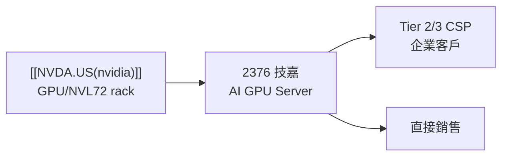

# 2376_技嘉（市）

## 基本資料

技嘉科技（2376.TW，Giga-Byte Technology）為台灣主要 AI 伺服器 OEM 廠商，同時生產主板、顯示卡、筆記型電腦等消費性產品。在 AI 伺服器浪潮中，技嘉被摩根士丹利列為台灣下游 AI 伺服器 OEM/ODM **Top Pick**，受惠 Tier 2/3 CSP 及企業 AI 伺服器需求。

**市場定位**：相對鴻海、廣達等超大型 ODM，技嘉在 AI GPU 伺服器（含高規格水冷機型）有較強定位，服務 Tier 2/3 雲端客戶與企業端。

---

## 核心技術／競爭優勢

- **AI GPU 伺服器領先品牌**：G482 等系列 AI 伺服器產品線，早期布局 NV GPU 伺服器市場
- **Tier 2/3 CSP 定位**：補位四大 Hyperscaler 以外的 AI 需求，市場較分散但技嘉相對具競爭力
- **主板 + 系統垂直整合**：主板自製能力減少外採成本，系統設計靈活度高
- **Gaming GPU + AI 伺服器雙驅動**：遊戲顯卡業務維持基本盤，AI 伺服器為高成長引擎

---

## 圖片 / 架構圖

---

## 目標價與評等

| 來源 | 日期 | 評等 | 目標價 | 備註 |
|------|------|------|--------|------|
| 摩根士丹利 | 2025-06-01 | Top Pick（OW） | — | 台灣 AI ODM/OEM 首選；GB200 需求受惠 |

## EPS 記錄

| 季度 | MS EPS 預估（元） | 與市場差異 | 備註 |
|------|------------------|------------|------|
| 2026Q2 | 8.74 | +15% | 營收 NT$144.2bn、OPM 6.1%，營運槓桿優於市場 |

---

## 時間軸

| 時間 | 事件 | 類型 | 重要性 | 備註 |
|------|------|------|--------|------|
| 2025Q3 起 | 新 Tier 2/3 CSP 訂單（非四大 Hyperscaler）| 業務 | ⭐⭐⭐ | MS 2025-06-01 指出 GB200 rack 新訂單帶動 |
| 2025H2 | GB200 伺服器出貨 | 放量 | ⭐⭐⭐ | MS 預估全年 AI server rack shipments 25-30k |

---

## 供應鏈位置

- 上游：[[NVDA.US(nvidia)]]（GPU）、電源、主板零組件
- 下游：Tier 2/3 CSP（非 AWS/Azure/GCP/Meta）、企業 IT
- 同業：[[2382_廣達（市）]]、[[2317_鴻海（市）]]、[[3231_緯創（市）]]、[[6669_緯穎（市）]]

---

## 相關公司

| 公司 | 關係 | 說明 |
|------|------|------|
| [[NVDA.US(nvidia)]] | 關鍵上游 | GPU 供應商；GB200/GB300 伺服器核心 |
| [[2317_鴻海（市）]] | 同業 AI ODM | MS 排序第二，接在技嘉之後 |
| [[2382_廣達（市）]] | 同業 AI ODM | GB200 rack assembly（L11）主力 |

---

## 來源

## 本次 ingest 更新（Citi，2026-08-14）

- 2Q26 淨利 NT$66 億，受費用控制與匯兌收益帶動，Citi 估 2026–2028E 獲利上修 28–46%，目標價升至 NT$595，屬券商 estimate。
- 公司引導 2H26 營收增速高於 1H26，主因 neo-cloud 需求；2026 年資本支出指引升至 NT$280–300 億，並核准最多 5,000 萬股 GDR，均屬公司展望／公司決議。

新增來源：[[報告_Citi_技嘉_20260814]]。

- [[報告_MS_硬體OEM財報前瞻_20260810]]（Morgan Stanley，2026-08-10；2Q26 EPS 預估高於市場 15%）
- [[報告_摩根士丹利_大中華科技硬體_20250601]]（MS，2025-06-01；技嘉 Top Pick，Tier 2/3 CSP GB200 新訂單）
- [[報告_摩根大通_台灣ODM_20250611]]（JP Morgan，2025-06-11；AI ODM 整體看法）

## 相關頁面

- [[時程_2026記憶體與AI催化劑]]
