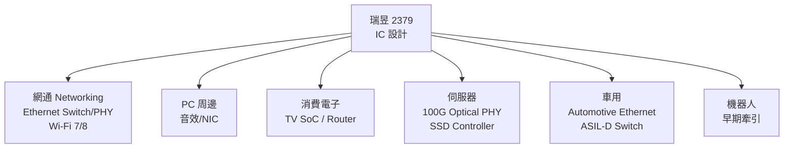

# 2379_瑞昱（市）

## CTBC 2026-07-31 更新

- 2Q26 營收 NT$375.5 億、毛利率 47%、EPS NT$7.42，低於市場共識；晶圓代工與記憶體成本上升是主要壓力。
- 公司規劃 3Q26 起調價，但未必可完全轉嫁成本。100G Optical PHY、SSD 控制器與伺服器連接產品預期 2027–2028 年才有較顯著貢獻。
- 中信投顧下修 2026E／2027E EPS 至 NT$30.0／33.7，維持中立、目標價 NT$680；均為券商 estimate。

來源：[[報告_CTBC_瑞昱_20260731]]（2026-07-31）。

## 基本資料

瑞昱半導體（2379 TT，Realtek Semiconductor）是全球前三大 IC 設計公司之一，產品線橫跨網通（Ethernet Switch、PHY、Wi-Fi）、PC 周邊（音效、網路卡）、消費電子（SoC、TV）、汽車電子（Automotive Ethernet）、儲存（SSD Controller）及伺服器應用（100G Optical PHY）。

主要資料來源：[[活動_瑞昱2379_2Q26Memo_20260805]]（2Q26 法說後 Call Memo，2026-08-05）。

## 圖解

## 2Q26 財務結果

| 指標 | 數值 | QoQ | YoY |
|------|------|-----|-----|
| 營收 | NT$37.6B | +3.1% | +17.7% |
| 毛利率 | 47.0% | -2.7ppt | -3.2ppt |
| 營業利益 | NT$3.73B | — | — |
| 稅後淨利 | NT$3.81B | — | — |
| EPS | NT$7.42 | vs NT$8.44 (1Q26) | vs NT$7.62 (2Q25) |
| 庫存天數 | 107 天 | vs 105 天 | — |

**毛利率下滑主因**：先進封裝產能瓶頸推高 ASP，帶來更高 DRAM 成本，加上嵌入記憶體 IC 組合偏移。

## 3Q26 展望

整體需求預期有韌性，但各部門能見度不同：
- **PC 市場**：高於公司平均的滑鼠及周邊受 AI 升規拉動，PC 整體仍受 DRAM/CPU 成本壓力
- **消費電子**：TV 世界盃後降溫；家電穩定；遊戲機因成本偏弱
- **網通**：企業更換週期 + Wi-Fi 7 持續帶動
- **車用**：2H 季節性強，EV 全球約 23M 台（+27-28% 總占比），Automotive Ethernet 量產支撐
- **SSD Controller**：採入頂尖 GPU AI 平台，持續進展

## 成長動能

### 100G Optical PHY（新興）
- 2026 Computex 展示
- 最早 1Q27 量產目標
- 初期聚焦 100G 收發器及 AOC 市場
- TAM 估每年數億美元

### Wi-Fi 升規
- Wi-Fi 7 筆電滲透率估今年約 30%
- Wi-Fi 8 為明年主要技術重點，互通性測試進行中
- 商業採用預期從 PC/路由器開始約 1Q28

### Automotive Ethernet
- 業界首款 ASIL-D 整合乙太網交換器，最多四個 10Gbps 連結
- 智慧座艙為快速成長應用
- EV 普及持續擴大 TAM

### AI 伺服器擴展
- 從現有 IP（10G Ethernet、I3C hub、USB hub、PON、控制平面交換機）擴展至 SmartNIC、光 PHY、高速資料交換機
- SSD Controller 已被頂尖 GPU AI 平台採用

### 機器人
- 市場仍在驗證階段
- 頂尖人形機器人品牌在參考設計採用 Realtek 連接方案（乙太交換機、USB hub、Wi-Fi）

## 毛利率壓力與對策

- DRAM/NAND 成本上升，以及先進封裝相關供應瓶頸
- 公司已自 6 月初與客戶協商新定價，新價格（適用部分）於 3Q26 生效
- 改善措施：優化供給安排、改善產品設計/成本結構、適度反映成本
- 長期期待產品組合優化、高附加值產品增加帶動毛利回升

## 關鍵觀察

| 指標 | 說明 |
|------|------|
| 100G Optical PHY 量產 | 最早 1Q27；TAM 數億美元，能見度仍低 |
| Wi-Fi 8 滲透 | 最早 2028，與 Mediatek 等同業正面競爭 |
| Managed Switch 市占 | 估計提升 ~2-3ppt；新設計勝出多在 2027-28 貢獻 |
| 受控/AI 伺服器 SSD | 已在頂尖 GPU AI 平台，進展順利 |
| 機器人早期牽引 | 廣泛市場採用要到 2030 年代後期 |

## 供應鏈位置

- **製程**：台積電成熟製程（16nm 以下含 7nm 等先進製程用於高性能 IC）
- **客戶**：全球 PC OEM/ODM、網通白牌廠、CSP（透過模組廠）、Tier-1 汽車供應商

## Morgan Stanley 2Q26 更新

- 2Q26 營收 NT$37.6bn（QoQ +3%、YoY +18%），但毛利率 47.0%、EPS NT$7.42，受記憶體漲價與封測產能緊張壓力影響而低於 MS 預期。
- MS 預期 3Q26 營收可能因中國手機需求走弱而承壓，惟部分客戶價格調整於 3Q 生效、企業基礎設施更新與 Wi‑Fi 7／multi-gig Ethernet 可支撐網通；Wi‑Fi 8 部署預估最早 1Q28。

來源：[[報告_MorganStanley_瑞昱_20260730]]（2026-07-30，券商 estimate）。

## 來源

- [[活動_瑞昱2379_2Q26Memo_20260805]] — 2Q26 法說後 Call Memo，2026-08-05

## 相關頁面

- [[分析_2026Q3半導體供需與AI伺服器供應鏈]]
- [[供應鏈_記憶體]]
- [[技術_NAND快閃記憶體]]
- 技術_Automotive_Ethernet
- 供應鏈_AI伺服器網路
- [[技術_光模塊]]

## UBS 2026-07-30 更新

- 2Q26 營收 NT$376 億元、毛利率 47.0%；UBS 認為記憶體與封測成本上升造成毛利率壓力，但 6 月調價可在 H2 陸續反映。
- UBS 上修 2026E／2027E 營收 3%／13%，目標價由 NT$525 上調至 NT$690，評等維持 Neutral；數字與估值屬券商 estimate。
- 網通、車用與家電需求相對穩定，但消費性需求與記憶體漲價轉嫁仍是風險。

來源：[[260730_ubs_realtek]]（UBS，2026-07-30）。

### 2026-08-23 Daiwa 更新

- [[260730_daiwa_realtek]]（2026-07-30）將晶圓代工／記憶體成本上升列為短期毛利壓力，並觀察 3Q26 起調價轉嫁程度；100G Optical PHY、SSD 控制器與伺服器連接產品的較大貢獻仍偏向 2027–2028，屬券商 estimate。
