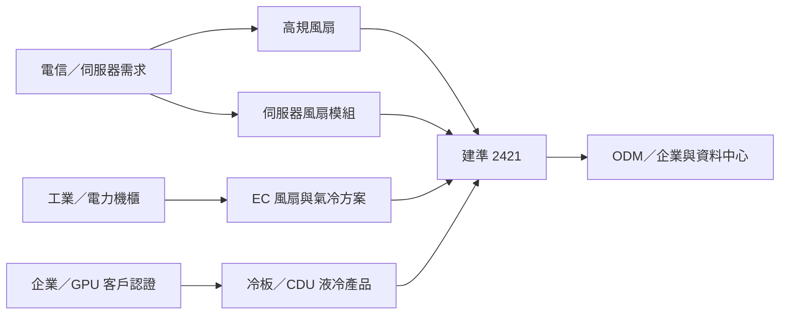

# 2421_建準（市）

## 基本資料

建準（Sunonwealth Electric Machine Industry，2421.TW）是台灣散熱風扇與散熱模組廠，產品涵蓋筆電、桌機、伺服器、通訊、工業與車用散熱。2026 年成長主軸為電信／伺服器需求、風扇規格升級，以及由單一風扇延伸至風扇模組、氣冷方案與液冷產品；Daiwa 2026-08-28 估 2026E 營收 NT$231.86 億、2027E NT$273.64 億。

## 核心技術／競爭優勢

- **風扇與模組整合**：由風扇規格升級延伸至伺服器風扇模組，提升單一客戶的產品價值量。
- **跨終端應用**：電信、伺服器、工業、醫療與汽車等應用分散，降低單一終端週期的影響。
- **EC 風扇與基礎設施散熱**：EC 風扇可切入基礎設施與工業應用，氣冷方案則受電力機櫃散熱需求帶動。
- **液冷產品切入**：冷板與 CDU 已進入企業／GPU 客戶認證或導入階段，提供由氣冷跨向液冷的選擇權。

## 產品與應用

| 產品 / 服務 | 應用 | 相關客戶 / 下游 |
|---|---|---|
| 風扇與風扇模組 | 伺服器、電信設備、筆電與桌機 | ODM、企業客戶 |
| EC 風扇 | 工業設備與基礎設施 | 工業／基礎設施客戶 |
| 氣冷散熱方案 | 電力機櫃與伺服器 | 電力與資料中心設備商 |
| 冷板、CDU 等液冷產品 | 企業 GPU、AI 伺服器與資料中心 | CSP 客戶（認證中） |

## 圖片 / 架構圖

圖說：建準以風扇與風扇模組為核心，向工業氣冷及企業／GPU 液冷產品延伸；本圖依 Daiwa 2026-08-28 報告整理。

## EPS 預估

| 年度 | Daiwa Core EPS（報告日：2026-08-28） | 備註 |
|---|---:|---|
| 2026E | 11.041 | estimate；較前次上修 5.7% |
| 2027E | 13.881 | estimate；較前次上修 13.6% |
| 2028E | 16.092 | estimate；較前次上修 13.2% |

## 目標價與評等

| 券商 | 報告發布日 | 評等 | 目標價 | 評價基礎 | 來源 |
|---|---|---|---:|---|---|
| Daiwa | 2026-08-28 | Buy (1) | NT$236（原 NT$205） | 18x 1-year forward EPS | [[260828_daiwa_ Sunonwealth Electric Machine Industry]] |

## 時間軸

| 時間 | 事件 | 類型 | 重要性 | 備註 |
|---|---|---|---|---|
| 2026Q4 | 冷板產品開始貢獻營收 | 驗證／放量 | ⭐⭐⭐ | 企業與 GPU 客戶低個位數營收貢獻估計 |
| 2026 年底 | 伺服器風扇模組交付 ODM 與企業客戶 | 放量 | ⭐⭐⭐ | Daiwa 轉述公司規劃，需追蹤實際出貨 |
| 2027 | 液冷產品營收比重提升 | 放量 | ⭐⭐⭐ | CSP 認證進度與客戶採用是關鍵 |

→ 跨公司比較詳見 [[時程_2026Q3Q4_AI網通與硬體催化劑]]。

## 供應鏈位置

- 上游：風扇馬達、軸承、金屬／塑膠結構件與液冷零組件。
- 中游：伺服器風扇、風扇模組、EC 風扇、氣冷方案與液冷產品。
- 下游：伺服器 ODM、企業客戶、電信與資料中心設備商。
- 所屬供應鏈：[[供應鏈_AI伺服器散熱]]。

## 相關公司

目前本批來源未明確揭露特定客戶、供應商或競爭者名稱，`related_companies` 暫留空；後續取得公司法說或客戶驗證資料再補具名關係。

> [!warning] 風險與注意事項
> - 液冷冷板與 CDU 尚在認證／早期貢獻階段，2027 年營收占比與 CSP 導入速度屬券商 estimate。
> - Daiwa 對伺服器、工業與汽車需求及毛利率擴張的判斷若不成立，EPS 上修與 NT$236 目標價可能失效。

## 來源

- [[260828_daiwa_ Sunonwealth Electric Machine Industry]]（Daiwa，2026-08-28；建準 2026-2028E 預估、液冷與伺服器風扇模組展望）

## 相關頁面

- [[供應鏈_AI伺服器散熱]]
