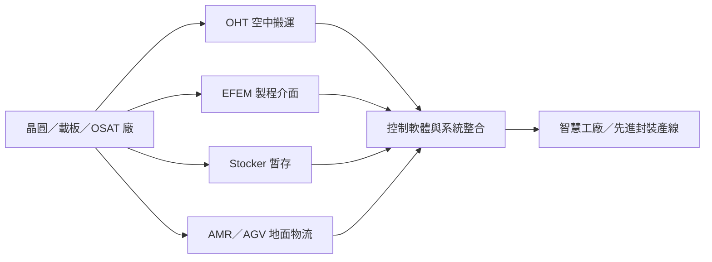

# 2464_盟立（市）

## 基本資料

盟立自動化（2464，MIRLE）是半導體與電子製造工廠的自動化設備及系統整合商，產品涵蓋 OHT、EFEM、Stocker、AMR／AGV、工廠軟體與機器人零組件。2026 年營運由先進封裝、高階載板與半導體廠擴產帶動；2Q26 營收 NT$21.69 億、毛利率 22.2%、EPS 0.42 元，1H26 已轉虧為盈。資料來源：[[報告_CTBC_盟立_20260917]]（中信投顧，2026-09-17）。

## 核心技術／競爭優勢

- **廠內物流整合**：OHT、EFEM、Stocker 與 AMR／AGV 可在晶圓／載板工廠內協同運作，兼具硬體設備、控制軟體與導入服務能力。
- **半導體場域經驗**：OHT 已在部分 OSAT 客戶完成認證並進入接單，Stocker 已通過晶圓廠客戶驗證，具設備導入後的系統黏著度。
- **產品標準化與模組化**：OHT 機種收斂、軌道規格統一與軟體平台模組化，有助擴產時複製設備與縮短交付週期。
- **機器人第二曲線**：旗下機器人與諧波減速機布局延伸至人形機器人關節模組，提供半導體自動化之外的中長期成長選項。

## 產品與應用

| 產品／服務 | 應用 | 相關客戶／下游 |
|---|---|---|
| OHT（Overhead Hoist Transport） | 晶圓／載板廠內空中搬運 | 半導體廠與 OSAT，客戶名稱未揭露 |
| EFEM | 晶圓／載板與製程設備介面自動化 | 晶圓廠、封裝與測試廠 |
| Stocker | 晶圓／載板暫存與物流緩衝 | 晶圓廠與先進封裝產線 |
| AMR／AGV | 廠內自主搬運與跨區物流 | 半導體、電子製造與智慧工廠 |
| 諧波減速機／關節模組 | 工業機器人與人形機器人 | 機器人整機商，客戶名稱未揭露 |

## 圖片 / 架構圖

圖說：盟立把 OHT、EFEM、Stocker、AMR／AGV 與控制軟體整合至晶圓／載板廠內物流；本圖依中信投顧報告的產品與場域描述整理。來源：[[報告_CTBC_盟立_20260917]]。

## EPS 記錄

| 期間 | EPS | 營收 | 備註 |
|---|---:|---:|---|
| 2Q26 | NT$0.42 | NT$21.69 億 | 毛利率 22.2%，QoQ +16%、YoY +7.9% |

## EPS 預估

| 年度 | 中信投顧 EPS（報告日：2026-09-17） | 備註 |
|---|---:|---|
| 2026E | NT$2.51 | 券商 estimate |
| 2027E | NT$6.80 | 券商 estimate；先進封裝擴產與機器人選項帶動 |

## 目標價與評等

| 券商 | 報告發布日 | 評等 | 目標價 | 評價基礎 | 來源 |
|---|---|---|---:|---|---|
| 中信投顧 | 2026-09-17 | 買進（Buy） | NT$238 | 2027E EPS × 35 倍 PER | [[報告_CTBC_盟立_20260917]] |

## 時間軸

| 時間 | 事件 | 類型 | 重要性 | 備註 |
|---|---|---|---|---|
| 2026 年底 | 累計訂單估約 NT$200 億；諧波減速機產能達 30 萬顆以上 | 訂單／擴產 | ⭐⭐⭐ | 公司／券商展望 |
| 2027 年底 | OHT 2,500–3,000 台、EFEM 3,000 台、Stocker 500–800 台、AMR 800–1,000 台 | 擴產 | ⭐⭐⭐ | 產能目標，仍待實際開出驗證 |
| 2027 年底前 | 目前約 75%–80% 在手訂單完成 | 出貨／認列 | ⭐⭐⭐ | 券商整理，非正式財測 |
| 2028 起 | 人形機器人與關節模組成為第二成長曲線 | 技術／新應用 | ⭐⭐ | 仍屬市場導入與客戶驗證階段 |

跨公司催化劑詳見 [[時程_2026Q3Q4_AI網通與硬體催化劑]]。

## 供應鏈位置

- **所屬供應鏈**：[[供應鏈_工業自動化]]、[[供應鏈_先進封裝載板]]。
- **上游／協作**：馬達、控制器、伺服、機器人關節與諧波減速機零組件；部分關鍵零件由集團／子公司布局，供應商名稱未完整揭露。
- **下游**：晶圓廠、OSAT、先進封裝與高階載板產線；先進封裝擴產是 2026–2027 年主要訂單驅動。

## 相關公司

| 公司 | 關係 | 說明 |
|---|---|---|
| — | 客戶／合作夥伴未具名 | 報告揭露北美客戶小量出貨與 OSAT／晶圓廠驗證，但未提供可確認的公司名稱。 |

> [!warning] 風險與注意事項
> - 在手訂單與 2027 年產能目標需由實際出貨、驗收與營收認列驗證，不能直接視為已實現營收。
> - 半導體資本支出、先進封裝擴產與客戶認證若延後，OHT／EFEM／Stocker 訂單可能遞延。
> - 人形機器人與諧波減速機仍屬第二成長曲線，北美小量出貨不等同大規模量產訂單。

## 來源

- [[報告_CTBC_盟立_20260917]]（中信投顧，2026-09-17）。
- 官方掛牌資訊：盟立為臺灣證券交易所上市公司，股票代號 2464；市場狀態依證交所公司資料確認。
