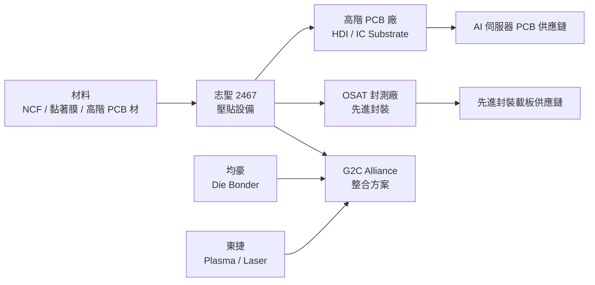

# 2467_志聖（市）

## 基本資料
志聖工業（2467）是台灣 PCB 壓貼（Lamination）設備起家，近年大幅轉型進入半導體先進封裝設備市場。核心技術為壓貼製程，應用於高階 PCB 積層及先進封裝熱壓接合。為 G2C 聯盟（G2C Alliance）的核心發起公司，與均豪、東捷等設備商以股權連結形成台灣先進封裝設備最大差異化聯盟。2021 年獲得 NVIDIA Partner 認證（2020 年由 NVIDIA 於 Communicates 活動頒授），已被 TSMC 供應鏈大會記錄為 G2C Alliance 夥伴。

業務轉型：半導體設備營收佔比從 2020 年 4%、先進 PCB 3% → 2025 年半導體預計達 40%，2024 Q1 已達 50%，顯示以先進封裝設備為主軸的結構性轉型。PCB 業務仍維持 HDI、IC substrate 等高階產品。

2023-2024 年宣布合計 NT$30 億元資本支出，建立研發中心與生產基地；2024 年 5 月通過成立美國子公司，積極拓展北美市場。

資料來源：[[活動_志聖法說_20260612]]（2026-06-12）

## 核心技術／競爭優勢
- **壓貼核心技術平台**：掌握壓貼製程核心技術，同時適用於 PCB 積層（高密度 HDI/IC substrate）及半導體先進封裝（熱壓接合），技術可跨域延伸，是 G2C 聯盟中壓貼環節的核心供應商
- **G2C 聯盟協同差異化**：以股權連結（而非純合作）組建 G2C Alliance，整合均豪（Die Bonder、Pick & Place、熱壓銲接）與東捷（Plasma、Laser、SI 系統整合）的互補技術，形成台灣先進封裝設備領域最完整的多元技術組合，能快速回應先進封裝劇烈技術迭代
- **Digital Twin / AI 輔助研發**：導入 NVIDIA Omniverse 等模擬技術，與 NVIDIA 合作於 Computex 發表成果；客戶對設備開發時程要求從 7 個季度壓縮至 3 個季度，虛擬設計縮短研發週期
- **NVIDIA Partner 認證 + 算力自持**：2021 年取得 NVIDIA Partner 認證，自行擁有算力並用於設備開發，是設備業中少見的 AI-driven 研發模式；TSMC 供應鏈大會首次以聯盟形式記錄 G2C
- **公司治理 + 指數納入**：公司治理評鑑進入台灣前 5%（從 80-100% 區間大幅躍升），納入 MSCI 中小型指數、台灣國育指數等，提升法人關注度

## 產品與應用

| 產品 / 服務 | 應用 | 相關客戶 / 下游 |
|-------------|------|-----------------|
| PCB 壓合機 | 高階 PCB（HDI、IC substrate）積層壓合 | PCB 廠、IC 載板廠 |
| 先進封裝熱壓設備 | Flip Chip 熱壓接合、先進封裝壓貼 | OSAT 封測廠（ASEPTI 等） |
| Digital Twin 設備模擬 | 縮短設備開發週期（7Q → 3Q） | 與 NVIDIA 合作研發 |
| G2C 聯盟整合方案 | PCB + 先進封裝完整製程設備組合 | TSMC 供應鏈體系客戶 |

## 圖片 / 架構圖

> 志聖在 G2C 聯盟中扮演壓貼核心，搭配均豪（接合）與東捷（電漿/雷射）形成先進封裝完整設備解決方案。

## EPS 記錄

| 期間 | EPS | 毛利率 | 備註 |
|------|-----|--------|------|
| 2024 全年 | — | 43.3% | 毛利率全年水準 |
| 2024 Q1 | 歷年單季最高 | 49.8% | 創歷史新高；YoY 接近翻倍（AI 轉錄，年份請以原始音檔為準） |

> 注意：法說為 2026-06-12 舉辦，部分財務數字 AI 轉錄標注「2024 Q1」，可能為 2026 Q1 數字被誤標。請以原始音檔核對。來源：[[活動_志聖法說_20260612]]

## 時間軸（催化劑）

| 時間 | 事件 | 類型 | 重要性 | 備註 |
|------|------|------|--------|------|
| 2024-05 | 通過設立美國子公司 | 海外布局 | ⭐⭐⭐ | 已尋找不動產設置據點，即時回應北美市場 |
| 2025-2026 | NT$30 億元資本支出建立研發中心/生產基地 | 擴產 | ⭐⭐⭐ | 2023-2024 年宣布，反映 5-10 年佈局決心 |
| 2026 | 新規格需求帶動設備開發 | 成長動能 | ⭐⭐⭐ | 2026 年起先進封裝新規格帶動設備需求回溫 |
| 2026 Computex | Digital Twin / AI 設備研發成果發表 | 技術里程碑 | ⭐⭐ | 與 NVIDIA 合作，Phase 1 成果展示 |

## 供應鏈位置
- **PCB 設備**：高階 PCB 積層壓合設備 → [[供應鏈_AI伺服器PCB]]
- **先進封裝設備**：熱壓接合、先進封裝壓貼 → [[供應鏈_先進封裝載板]]
- 上游：NCF（非導電膜）等封裝材料、模具材料
- 下游：高階 PCB 廠、IC 載板廠、OSAT 封測廠（ASEPTI 等）

## 相關公司

| 公司 | 關係 | 說明 |
|------|------|------|
| 均豪（G2C 盟友） | 聯盟 / 技術互補 | G2C Alliance 夥伴；負責 Die Bonder、Pick & Place、熱壓銲接環節 |
| 東捷（G2C 盟友） | 聯盟 / 技術互補 | G2C Alliance 夥伴；負責 Plasma、Laser、SI 系統整合環節 |
| NVIDIA | 認證夥伴 | 2021 年 NVIDIA Partner 認證；Omniverse 合作開發 Digital Twin 設備研發平台 |
| ASEPTI（OSAT） | 客戶 / 下游 | 先進封裝封測客戶；2023-2024 年資本投入擴大帶動設備需求 |

> [!warning] 風險與注意事項
> - **先進封裝設備競爭加劇**：先進封裝技術迭代快速（warpage、熱互連、電力瓶頸等物理挑戰），若設備開發跟不上客戶規格變化速度，將喪失訂單；G2C 聯盟整合仍需持續磨合
> - **PCB 傳統業務承壓**：2024-2025 年窄版設備產能過剩與不足並存，PCB 設備訂單波動大；若半導體設備轉型速度不足補償，整體營收成長將受限
> - **算力成本上升**：公司自持算力並用於研發，算力費用持續上漲（已超出預期），增加 R&D 費用壓力
> - **財務數字 AI 轉錄疑義**：法說 AI 轉錄中「2024 Q1」財務數字標注年份存在不確定性（法說時間為 2026 年），建議以原始音檔核實

## 來源
- [[活動_志聖法說_20260612]]（2026-06-12 法說）
