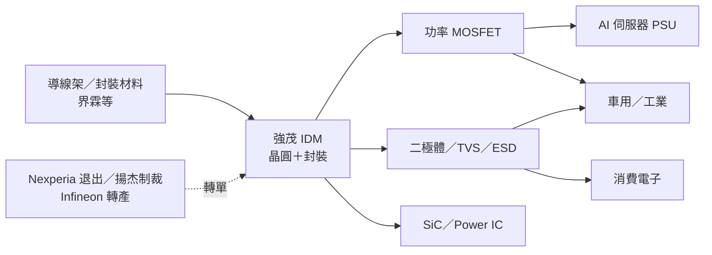

# 2481_強茂（市）

## 基本資料

強茂（Panjit International，2481.TW）是總部在台灣的功率半導體 IDM，自有晶圓與封裝產能，產品涵蓋功率分離式元件（二極體、MOSFET、SiC）、Power IC 與太陽能產品，終端應用包括工業、綠能、消費電子、車用、電腦、電源供應與通訊。來源：[[報告_Nomura_強茂2481_20260911]]（2026-09-11）。

**成長驅動**：2026 年的主軸是 AI 資料中心電源用功率元件與漲價。Nomura 預估 AI 資料中心營收占比由 1H26 的 11% 提高到 2H26 的 12–14%，車用占比也持續放大（見下方 Fig.3）。另一條線是供應鏈重組：Nexperia 退出國際市場、揚杰科技遭歐盟制裁、Infineon／onsemi 把產能轉向高毛利產品，訂單外溢到台系功率廠，強茂因在 TVS、二極體、小訊號 MOSFET 與 Nexperia 重疊度高而直接受惠。來源：[[memo_定錨_2026年中產業趨勢講座_4]]（2026-06）、[[memo_AI半導體周更_20260615a]]（2026-06-15）。

**財務概況**：2025 年營收 NT$130.9 億；2Q26 營收季增 16%，優於公司目標，毛利率 33.2% 創 19 季新高。Nomura 預估 2026F／2027F 營收 NT$162.7 億／199.7 億、毛利率 34.9%／37.3%。

**供應鏈位置**：上游為導線架等封裝材料（[[5285_界霖（市）]] 客戶名單列有 PanJit）；下游為電源供應器（PSU）、車用、工業與消費電子客戶。

## 核心技術／競爭優勢

- **IDM 垂直整合**：自有晶圓與封裝產能，在 IDM／晶圓代工短期擴產有限、交期拉長時，比純設計公司更能確保供貨並承接轉單。（[[memo_定錨_2026年中產業趨勢講座_4]]）
- **與 Nexperia 產品高度重疊**：TVS、二極體、小訊號 MOSFET 是 Nexperia 主力，客戶替代需求可直接轉到強茂，並藉 Nexperia 既有客戶切入伺服器用 MOSFET。（同上）
- **AI 電源曝險在台系同業中最高**：AI Semi 周更認為強茂「AI PSU 曝險最大」，是承接 Infineon、Nexperia 外溢訂單的最佳代理標的。（[[memo_AI半導體周更_20260622]]，2026-06-22；賣方觀點，信心中）
- **漲價轉嫁能力**：2026 年已多輪調漲，Nomura 預期 4Q26F 第三輪漲價，主要轉嫁晶圓製造與材料成本；毛利率由 2025 年 31.3% 往 37% 推進。（[[報告_Nomura_強茂2481_20260911]]）

## 產品與應用

| 產品／服務 | 應用 | 相關客戶／下游 |
|---|---|---|
| 功率 MOSFET（低壓／高壓／小訊號） | AI 伺服器電源、PSU、車用、工業 | 電源供應器廠、伺服器供應鏈（未具名） |
| 二極體（蕭特基、開關、整流、TVS/ESD） | 電源保護、消費電子、車用 | Nexperia 轉單客戶（未具名） |
| SiC 功率元件 | 綠能、車用、高壓電源 | 未揭露 |
| Power IC | 電源管理 | 未揭露 |
| 太陽能產品 | 綠能 | 未揭露 |

## 圖片 / 架構圖

![[報告_Nomura_強茂2481_20260911_001.png]]

> 左（Fig.3）：終端市場營收結構，紅色為車用、灰色為 AI 資料中心、淺色為其他。車用逐年放大，AI 資料中心自 2026F 起成為獨立一塊。右（Fig.4）：毛利率（紅）與營益率（灰）季度趨勢，2Q26 毛利率 33.2%，Nomura 預估 2027F 站上 37% 以上。來源：[[報告_Nomura_強茂2481_20260911]]，2026-09-11，含 Nomura 預估。

> 強茂的投資邏輯是「轉單＋漲價＋AI 電源」三者疊加：供給端國際 IDM 讓出市場，需求端 AI 電源拉升 MOSFET 用量。

## EPS 記錄

| 季度 | EPS（元） | YoY | 備註 |
|---|---:|---:|---|
| 1Q25 | 0.72 | — | 毛利率 30.3% |
| 2Q25 | 0.66 | — | 毛利率 30.7% |
| 3Q25 | 0.80 | — | 毛利率 31.3% |
| 4Q25 | 0.94 | — | 毛利率 32.7% |
| 1Q26 | 0.75 | +4% | 毛利率 32.7% |
| 2Q26 | 1.28 | +94% | 營收季增 16%；毛利率 33.2%，19 季新高 |

來源：[[報告_Nomura_強茂2481_20260911]] Fig.2（2026-09-11）。

## EPS 預估

| 年度 | Nomura（報告日：2026-09-11） | Nomura 前次（報告日：2026-06-04） | AI Semi 周更（報告日：2026-06-15） | 備註 |
|---|---:|---:|---:|---|
| 2026F | 5.42 | 5.29 | — | 內頁 Fig.1／2 為 5.49，見下方衝突說明 |
| 2027F | 8.55 | 7.79 | ~14 | AI Semi 為通路調查口徑，明顯高於 Nomura |
| 2028F | 9.93 | 8.88 | — | |

> [!warning] 資訊衝突
> Nomura 同一份報告首頁表 FY25／FY26F EPS 為 3.60／5.42，內頁 Fig.1／Fig.2 為 3.11–3.12／5.49，差異來自淨利口徑（首頁 1,375／2,071 百萬 vs 內頁 1,192／2,098 百萬）。2027F 兩處一致為 8.55。本頁預估以首頁表為準，季度實績以 Fig.2 為準。

## 目標價與評等

| 券商 | 報告發布日 | 評等 | 目標價 | 評價基礎 | 來源 |
|---|---|---|---|---|---|
| Nomura | 2026-09-11 | Buy | NT$214（前次 195） | 25x 2027F EPS 8.55；收盤 154.5，潛在上漲 38.5% | [[報告_Nomura_強茂2481_20260911]] |
| 統一投顧 | 2026-08-25（9 月推薦個股） | 推薦 | NT$205 | 推薦前日股價 134；停利 154／停損 114 | [[報告_統一_早報_20260922]] |
| AI Semi 周更 | 2026-06-15 | 偏好（台股推薦名單） | NT$280 | 20x 2027 EPS ~14 | [[memo_AI半導體周更_20260615a]] |

Nomura 目標價沿革：110（2026-03-10）→ 148（2026-05-11）→ 195（2026-06-04）→ 214（2026-09-11）。

## 時間軸

| 時間 | 事件 | 類型 | 重要性 | 備註 |
|---|---|---|---|---|
| 2026-08 | LV/HV MOSFET、部分蕭特基／開關二極體交期達 52 週（一年前約 20 週） | 供需 | ⭐⭐⭐ | Future Electronics 月報；價格同步上漲 |
| 2Q26 | 營收季增 16%、毛利率 33.2% 創 19 季新高 | 財報 | ⭐⭐⭐ | 已實現 |
| 2H26 | AI MOSFET 至少 5–10% 供給缺口；封裝成本 +5–10% | 供需 | ⭐⭐⭐ | [[memo_AI半導體周更_20260622]]，賣方通路調查 |
| 3Q26F／4Q26F | 營收季增 10%／5%，AI 資料中心占比 12–14% | 營運 | ⭐⭐ | Nomura 預估 |
| 4Q26F | 第三輪漲價 | 價格 | ⭐⭐ | Nomura 預估，轉嫁晶圓與材料成本 |
| 2H26–1H27F | 功率分離式元件供給持續吃緊 | 供需 | ⭐⭐ | 國際 IDM／晶圓代工近期擴產有限 |

→ 電源與 AI 電力設備節點詳見 [[時程_2026能源與AI電力設備]]

## 供應鏈位置

- **上游**：導線架與封裝材料，[[5285_界霖（市）]] 為功率導線架供應商（其客戶名單列有 PanJit）。導線架同業 [[2351_順德（市）]] 指 IDM 客戶下半年加單且價格有利，Nomura 將其作為產業吃緊佐證。
- **晶圓製造**：自有晶圓廠（IDM）。產業面上，高壓 MOSFET 代工以 [[5347_世界先進（市）]] 為主，但其不願擴充 8 吋舊製程、台積電也退出，外部產能緊縮有利有自有產能的 IDM。（[[memo_AI半導體周更_20260622]]）
- **下游**：AI 伺服器 PSU、車用、工業、消費電子。
- **相關技術**：[[技術_功率MOSFET]]、[[技術_800VDC供電架構]]
- **所屬供應鏈**：目前無對應供應鏈頁（功率半導體／AI 電源尚未建立獨立供應鏈頁）

## 相關公司

| 公司 | 關係 | 說明 |
|---|---|---|
| [[5285_界霖（市）]] | 上游供應商 | 功率導線架；界霖客戶名單列有 PanJit |
| [[3675_德微（市）]] | 競爭同業 | 台系功率 IDM，同樣承接 Nexperia 轉單；德微偏重 TVS／二極體並有母公司 Diodes 的客戶資源 |
| 台半（5425） | 競爭同業 | 尚無公司頁；與強茂同樣在 TVS、二極體、小訊號 MOSFET 和 Nexperia 重疊度高 |
| Nexperia、Infineon、onsemi | 國際競爭者／轉單來源 | 尚無公司頁；Nexperia 退出國際市場、Infineon 轉做 SiC 並退出 DrMOS，訂單外溢 |

> [!warning] 風險與注意事項
> - **需求回落**：Nomura 列出的下行風險包括總體經濟拖累車用與工業需求、供應鏈庫存去化慢於預期。
> - **價格競爭**：若全球需求轉弱，同業殺價會壓縮目前的漲價與毛利率擴張。
> - **轉單可持續性**：Nexperia／揚杰事件帶來的轉單屬地緣政治驅動，若限制鬆綁或客戶驗證完成第二來源，替代需求可能降溫。
> - **預估分歧大**：2027 年 EPS 賣方預估從 8.55（Nomura）到 ~14（AI Semi 周更）差距懸殊，市場預期可能過度樂觀。

## 來源

- [[報告_Nomura_強茂2481_20260911]] — Nomura 個股報告，2026-09-11
- [[報告_統一_早報_20260922]] — 統一投顧 9 月推薦個股，2026-09-22
- [[memo_定錨_2026年中產業趨勢講座_4]] — 定錨 2026 年中產業趨勢講座（Nexperia 轉單），2026-06
- [[memo_AI半導體周更_20260622]] — AI Semi 周更（Panjit update），2026-06-22
- [[memo_AI半導體周更_20260615a]] — AI Semi 周更（Power semi update），2026-06-15
- [[memo_AI半導體周更_20260615b]] — 同上更新版，2026-06-15
- [[memo_AI半導體硬體通路_20260704]] — AI 半導體硬體通路（台股推薦名單），2026-07-04
- [[memo_AI半導體硬體通路_20260711]] — 同上，2026-07-11
