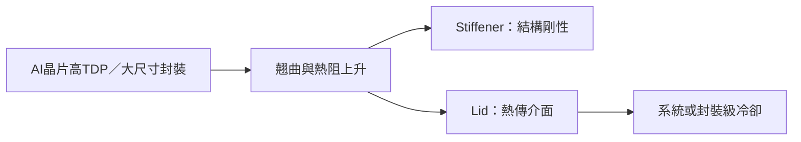

# 2486_一詮（市）

## 基本資料

一詮由 LED 導線架與精密金屬沖壓轉向 HPC／先進封裝散熱零組件，產品包含補強框（Stiffener）與金屬蓋板（Lid）。其成長取決於 AI 晶片封裝面積、TDP 與高階電鍍需求；以下財測為中信投顧 estimate。

## 核心技術／競爭優勢

- 精密金屬沖壓與表面電鍍經驗可對應大尺寸封裝的剛性、翹曲與散熱要求。
- Stiffener 用於抑制 CTE mismatch 引起的封裝翹曲；Lid 是晶片至散熱系統的熱傳介面。
- 公司正投入 MCL（封裝級微流道冷卻）開發與驗證，短期營收貢獻仍有限。

## 產品與應用

| 產品 | 應用 | 下游 |
|---|---|---|
| Stiffener／Lid | AI GPU、HPC 先進封裝 | [[NVDA.US(nvidia)]] 供應鏈（非直接客戶確認） |
| 精密電鍍與金屬加工 | 高功耗封裝散熱結構 | 先進封裝供應鏈 |

## 圖片 / 架構圖

圖：一詮產品位於晶片封裝的結構補強與熱傳介面層。

## EPS 預估

| 年度 | 中信投顧 EPS（報告日：2026-07-23） | 備註 |
|---|---:|---|
| 2026E | 3.04 | 券商 estimate |
| 2027E | 9.36 | 券商 estimate |

## 目標價與評等

| 券商 | 報告日 | 評等 | 目標價 | 來源 |
|---|---|---|---:|---|
| 中信投顧 | 2026-07-23 | 未評等 | — | [[報告_CTBC_一詮_20260723]] |

## 時間軸

| 時間 | 事件 | 類型 | 重要性 | 備註 |
|---|---|---|---|---|
| 2026–2027E | HPC 封裝散熱零組件放量 | 放量 | ⭐⭐⭐ | 券商 estimate；取決於專案與擴產 |
| 次世代 | MCL 產品驗證 | 技術下線 | ⭐⭐ | 公司布局，未形成量產承諾 |

→ [[時程_2026記憶體與AI催化劑]]

## 供應鏈位置

- 所屬供應鏈：[[供應鏈_AI伺服器散熱]]
- 下游需求：AI GPU／HPC 先進封裝；未確認特定直接客戶。

## 相關公司

| 公司 | 關係 | 說明 |
|---|---|---|
| [[NVDA.US(nvidia)]] | 終端需求 | AI 晶片尺寸與功耗提升帶動封裝散熱規格；非直接客戶確認。 |

> [!warning] 風險與注意事項
> - AI 晶片需求、客戶驗證或擴產若不如預期，可能影響放量。
> - MCL 仍處開發／驗證階段，不能視為已量產營收。

## 來源

- [[報告_CTBC_一詮_20260723]]（2026-07-23）
