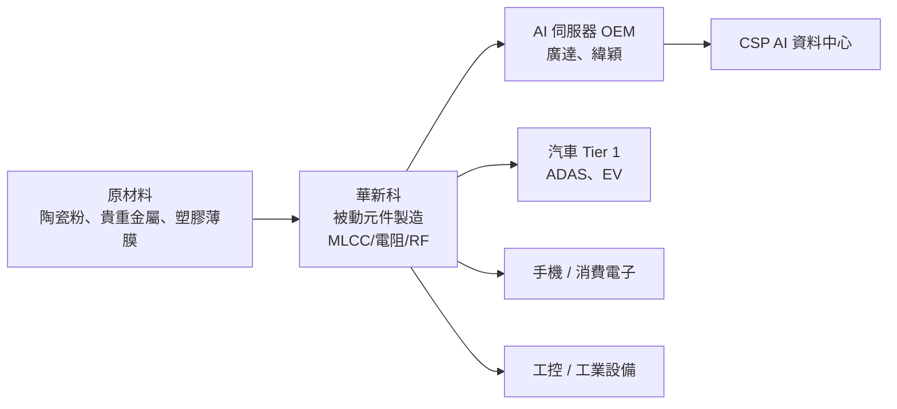

# 2492_華新科（市）

## 基本資料

華新科（2492.TW，Walsin Technology）為台灣主要被動元件製造商，產品線涵蓋 MLCC（積層陶瓷電容）、晶片電阻、RF 濾波器、安規電容、電感等，廣泛應用於消費電子、汽車、工控、通訊及 AI 伺服器等市場。

**主要產品組合**（2026年）：
- MLCC：約 46.4%
- 晶片電阻：約 22.2%
- RF 濾波器／連接：約 14.2%
- 安規電容：約 4%
- 電感及其他：約 13.3%

**營收驅動**：AI 相關被動元件需求預計 2025–2026 年增加約兩倍；電阻同樣約兩倍增長。目前產能約 80–90% 滿載，訂單充足。去年全年營收 364 億元，資本額 48 億元，員工約 324,492 人。

**產能規模（Vastpeak 2026-06-30）**：月產能 **500 億顆**（全品類 MLCC，台灣第二大）；BB ratio **1.2**、稼動率 80–90%、交期 **12–20 週**（接近業界警戒線 90 天）。

**銷售地區**：大陸約佔 46.5%（逐步降低），東南亞及歐洲比重上升。

**競爭定位**：台系被動元件廠，專注耐高溫、高壓及大容量電容，與日系電源廠（主導運算市場）互補，產品分佈均勻，無特定市場集中。

*來源：法說 2026-05-27（AlphaMemo.ai）。*

---

## 核心技術／競爭優勢

- **MLCC 製程技術與多元應用覆蓋**：MLCC 為核心產品（46%），持續材料與結構創新，推動新製程（高溫、高壓、大尺寸）；短靜電功能開發對應 AI 伺服器高功率需求
- **AI 需求的順風受益者**：AI 伺服器對電容、電阻需求量為一般伺服器數倍，每台 AI 伺服器耗用被動元件遠超傳統應用，且 AI 相關需求預計兩倍增長
- **NP0 Power MLCC 競爭者（新）**：華新科正積極進入 NP0 Power MLCC 領域，但目前溫升約 **10°C**（vs 禾伸堂/TDK 3–5°C），尚未達到 AI PSU 連續運作要求；持續提升中（Vastpeak 2026-06-30）
- **產能接近滿載帶來調價空間**：多條產線 80–90% 稼動率，客戶積極備貨，讓公司具備調漲價格（每季調價機制）的主動權，毛利率可望持續改善
- **多材料技術平台（陶瓷＋磁性＋薄膜）**：橫跨 MLCC、RF 濾波器、電感等多類被動元件，不同產品線互補，有助分散單一品項需求波動風險

---

## 產品與應用

| 產品 / 服務 | 應用 | 相關客戶 / 下游 |
|-------------|------|-----------------|
| MLCC（積層陶瓷電容） | AI 伺服器電源去耦、手機、汽車電子 | 伺服器 OEM、手機廠、車廠 |
| 晶片電阻 | 消費電子、汽車、工控 | 廣泛下游 |
| RF 濾波器 | 5G 通訊、WiFi、衛星 | 通訊模組廠、手機廠 |
| 安規電容 | 電源供應器、工業設備 | 工控廠、電源廠 |
| 電感 | 電源轉換、RF 應用 | 通訊設備廠 |

---

## 圖片 / 架構圖

> 華新科被動元件廣泛滲透各應用，AI 伺服器每台用量遠超傳統伺服器，是隱含 AI 成長受益標的。

---

## EPS 記錄

| 期間 | 數據 | 備註 |
|------|------|------|
| 2025 全年 | 營收 364 億元 | 年度總收入 |
| 2026Q1 | EPS 約 1.69 元 | 毛利約 17 億元（依法說推算） |
| 2026Q1 | 營收約 95 億元（季？） | YoY 約 +9.1% |

*注意：法說中數字可能混用季度與全年，「2026年預計95億」可能為季度數字，需與正式財報核對。*

---

## 時間軸（催化劑）

| 時間 | 事件 | 類型 | 重要性 | 備註 |
|------|------|------|--------|------|
| 2026 | AI 相關被動元件需求量預估兩倍成長 | 需求 | ⭐⭐⭐ | 電容、電阻雙增長 |
| 2026 | 產線 80–90% 滿載，展開調漲 | 定價 | ⭐⭐⭐ | 每季機動調價機制啟動 |
| 2026–2027 | 每年資本支出 5–10 億擴廠 | 產能 | ⭐⭐ | 持續擴充因應 AI 伺服器需求 |
| 2027 | 六甲廠新廠量產 | 產能 | ⭐⭐⭐ | 台灣南部新廠，提升台灣產能比重 |
| 進行中 | 大陸佔比逐步降低，東南亞/歐洲拓展 | 地域調整 | ⭐⭐ | 地緣政治風險分散 |
| 持續 | 新型電容（高溫/大尺寸/高壓/短靜電）開發 | 新產品 | ⭐⭐ | AI 伺服器電源需求驅動 |

---

## 供應鏈位置

- 上游：陶瓷粉體原料廠、貴重金屬供應商（日本被動元件材料廠商）
- 下游：伺服器 OEM/ODM、手機廠、車用 Tier 1、通訊設備廠
- 所屬供應鏈：[[供應鏈_被動元件]]

---

## 相關公司

| 公司 | 關係 | 說明 |
|------|------|------|
| 村田製作所（日系） | 同業 / 競爭 | 運算市場主要日系電源廠，主導高階 MLCC |
| TDK、太陽誘電 | 同業 | 日系被動元件龍頭，材料公司對台系廠調漲影響成本 |

---

> [!warning] 風險與注意事項
> - **原材料漲價壓力**：貴重金屬、石油及陶瓷材料成本同步上漲，日系材料廠已調漲，若轉嫁進度落後成本上升，毛利率有壓力
> - **中國市場集中（46.5%）**：客戶重心仍高度依賴中國，若中美貿易摩擦加劇或中國景氣下滑，業績受影響大；去化速度緩慢
> - **調價時機風險**：被動元件市場向來有周期性，供過於求時客戶積極砍單；目前雖滿載但若 AI 伺服器投資降速，累積庫存風險高
> - **日系廠商競爭優勢難以快速追趕**：運算市場（AI 伺服器高階 MLCC）主要由日系廠主導，台系廠突破高階市場需要製程持續升級

---

## 來源

- [[報告_Vastpeak_被動元件產業_20260630]]（Vastpeak，2026-06-30；月產能 500 億顆、BB 1.2、UTR 80-90%、交期 12-20 週、NP0 升溫 10°C、六甲廠 2027）
- [[活動_華新科法說_20260527]]
