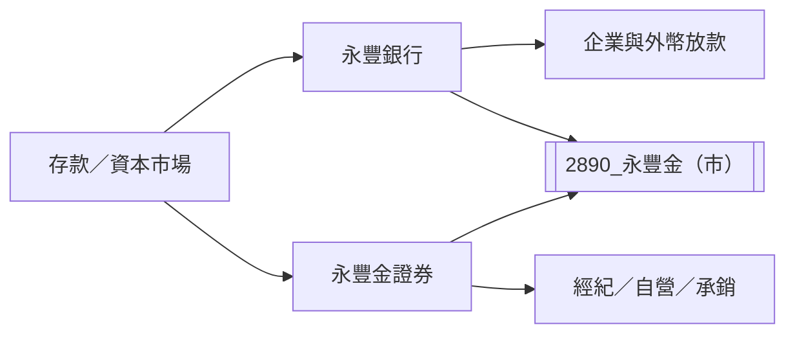

# 2890_永豐金（市）

## 基本資料

永豐金控旗下核心業務為永豐銀行與永豐金證券，收入來自利息、手續費、財富管理、自營及資本市場業務。凱基投顧指出 2026 年前七月稅後淨利約 NT$289.3 億元、年增 89%；2H26 仍需觀察利差與信用成本。

## 核心技術／競爭優勢

- 銀行、證券與財富管理的金控交叉銷售。
- 外幣放款與財管手續費可支撐非利息收入。
- 現金增資挹注證券、降低槓桿，改善資本配置彈性。

## 產品與應用

| 業務 | 應用 | 觀察點 |
|---|---|---|
| 銀行放款與存款 | 企業、外幣與個人金融 | 淨利差、放款成長、信用成本 |
| 證券經紀與自營 | 資本市場交易 | 市況與手續費收入 |
| 財富管理 | 基金、保險與高資產客戶 | 手續費成長 |

## 圖片 / 架構圖

圖說：永豐金以銀行與證券雙核心承接利息、手續費與資本市場需求。

## 目標價與評等

| 券商 | 報告發布日 | 評等 | 目標價 | 評價基礎 | 來源 |
|---|---|---|---:|---|---|
| 凱基投顧 | 2026-08-25 | 增加持股 | NT$44 | 2026–2027F PB 2.2x | [[2890 永豐金｜20260825｜凱基]] |

## 時間軸

| 時間 | 事件 | 類型 | 重要性 | 備註 |
|---|---|---|---|---|
| 2026-11 | 現金增資約 NT$200 億元完成 | 資本 | ⭐⭐⭐ | 凱基估 EPS 稀釋約 4–5% |
| 2H26 | 京城銀呆帳回收與永豐銀利差／信用成本變化 | 業績 | ⭐⭐ | 券商 estimate |

→ 跨公司比較詳見 [[時程_2026金融與資產管理催化劑]]

## 供應鏈位置

- 資金來源：存款、資本市場與金融同業。
- 下游：企業、個人與資本市場投資人。
- 所屬服務鏈：[[供應鏈_金融服務]]。

## 相關公司

related_companies 維持空集合；本報告未具名揭露需建立 wikilink 的客戶或供應商。

> [!warning] 風險與注意事項
> - 現金增資造成股本稀釋，且資金用途與證券業務擴張需觀察報酬率。
> - 利差、信用成本與資本市場成交量可能使獲利波動。

## 來源

- [[2890 永豐金｜20260825｜凱基]]（凱基投顧，2026-08-25）
