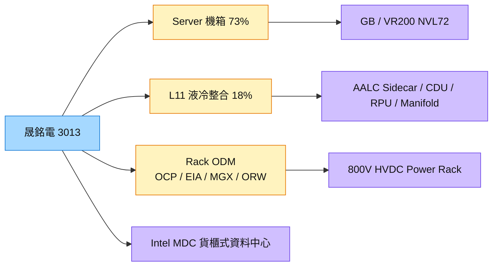

# 3013_晟銘電（市）

## 基本資料

晟銘電由伺服器機殼 OEM 延伸至機櫃 ODM 與 L11 液冷系統整合。2026 年 ODM 開發案約 80–90% 已是 Rack ODM；產品涵蓋 OCP、EIA、MGX 機櫃、800V HVDC Power Rack、ORv3 HPR、ORW 大型雙寬機櫃與自有 EIA UltimaRack，以及 AALC Sidecar、In-Rack CDU、RPU、Manifold。

- **營運：** 營收由 2022–2023 年約 65 億元，增至 2024 年 94 億元、2025 年 105 億元；2026 年 1–8 月約 79 億元（YoY +22%）。1H26 營收 61.48 億元、毛利率 21%（1H25 17%）、營益率 13%、EPS 2.78 元（1H25 1.38 元）。
- **產品組合（1–8 月）：** Server 73%、L11 液冷系統整合 18%、Tooling 6%、Desktop 3%；L11 占比自 4Q26 至 2027 年持續提升。
- **AI 平台：** 參與 GB200／GB300 與 VR200 NVL72 機箱、機櫃、Sidecar、RPU；VR200 自 4Q26 逐步量產；Rubin NVL8 與 Storage Chassis 已開模、1H27 推出；長期規劃 Vera Rubin Ultra 與 Kyber Chassis。
- **其他：** 負壓液冷系統已取得專利、1 名客戶 POC；加入 Intel 主導的貨櫃式模組化資料中心（MDC）計畫。

資料來源：[[活動_晟銘電3013_CallMemo_20261001]]（元大投顧 Call Memo，2026-10-01）

## 核心技術／競爭優勢

- **Rack ODM 與液冷整合：** 中國廠做機櫃結構、焊接、烤漆，中壢廠做液冷模組、管線、測漏與壓力測試後出貨美國。
- **Manifold 自製與 CT 檢測：** 投資兩台工業 CT（寧波、中壢）非破壞檢查焊道與氣孔，搭配超音波清洗與微粒檢測。
- **大型高精度機櫃：** Blind-mate 水路、電力、訊號連接，可承製 ORW 等超大型機櫃。
- **AALC Sidecar 適合既有機房改造：** 水對氣架構不需大改外部水路，全球大量既有資料中心需液冷改造。

## 產品與應用

| 產品 / 服務 | 應用 | 相關客戶 / 下游 |
|-------------|------|-----------------|
| AI 伺服器機箱（6U／8U／10U）、HPC Chassis | GB／VR NVL72、Yosemite V5／V6 | 經 ODM 供應 CSP；平台來自 [[NVDA.US(nvidia)]] |
| OCP／EIA／MGX 機櫃、800V HVDC Power Rack、ORv3 HPR | AI 資料中心 | CSP 與系統廠 |
| AALC Sidecar、In-Rack CDU、RPU、Manifold | L11 液冷整合 | 系統廠與 CSP |
| 貨櫃式模組化資料中心（MDC） | 邊緣與快速部署 | [[INTC.US(intel)]] 主導之生態系 |

## 圖片 / 架構圖

圖說：晟銘電由機箱代工延伸到整櫃設計與液冷系統整合，單案價值隨 VR200 與 Rack ODM 提升。

## EPS 記錄

| 期間 | EPS (元) | 備註 |
|------|---------|------|
| 1H26 | 2.78 | 毛利率 21%，1H25 EPS 1.38 元 |

## 時間軸

| 時間 | 事件 | 類型 | 重要性 | 備註 |
|------|------|------|--------|------|
| 4Q26 | VR200 相關產品逐步量產；L11 占比提升 | 放量 | ⭐⭐⭐ | [[活動_晟銘電3013_CallMemo_20261001]] |
| 2026 年底 | 東莞自動前處理與烤漆線完成（約 60 台機櫃／日） | 擴產 | ⭐⭐ | — |
| 1Q27 | 泰國二期投入機櫃生產 | 擴產 | ⭐⭐ | 烤漆線試產中 |
| 1H27 | Rubin NVL8、Storage Chassis 推出 | 新品 | ⭐⭐ | 已開模 |

→ 跨公司時程詳見 [[時程_2026-2027高速互連與分散式算力]]

## 供應鏈位置

- 上游：鋼材、銅材（Sidecar 與 RPU 銅用量高，報價可反映銅價）
- 下游：ODM 系統廠、CSP（Yosemite、Grand Teton、Zion 等平台）
- 所屬供應鏈：[[供應鏈_AI伺服器散熱]]

## 相關公司

| 公司 | 關係 | 說明 |
|------|------|------|
| [[NVDA.US(nvidia)]] | 平台 | GB／VR NVL72 機箱、機櫃與液冷件 |
| [[INTC.US(intel)]] | 合作計畫 | Intel 主導之貨櫃式模組化資料中心 MDC |

## 風險與注意事項

> [!warning] 風險與注意事項
> - **銅價與原料：** Sidecar、RPU 銅用量高。
> - **專案時程：** VR200 爬坡與 Kyber 等新機櫃規格變動影響出貨節奏。
> - **客戶經 ODM：** 終端客戶多透過 ODM，議價力受限。

## 來源

- [[活動_晟銘電3013_CallMemo_20261001]] — 元大投顧 Call Memo，2026-10-01

## 相關頁面

- [[技術_800VDC供電架構]]
