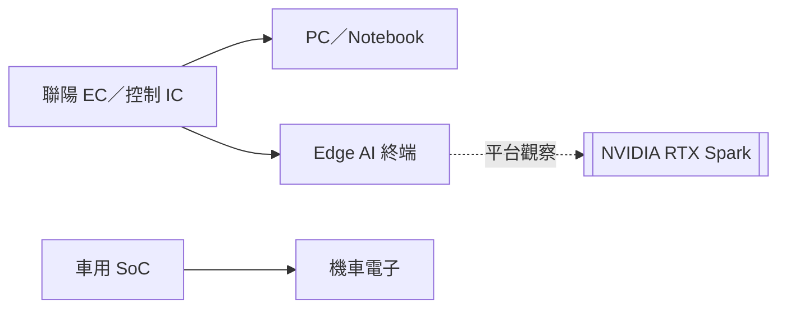

# 3014_聯陽（市）

## 基本資料

聯陽（ITE，3014.TW）為台灣上市 IC 設計公司，主要產品為筆電與 PC 周邊控制 IC；台灣證交所資料列其業務包含電腦周邊控制、資訊家電與液晶顯示相關 IC。[[memo_國泰證期_聯陽CallMemo_20260910]] 指 PC／notebook 約占營收 70%–80%，因此出貨循環與記憶體成本為短期營運主因；車用 SoC 與 Edge AI 平台為新增成長選項。

## 核心技術／競爭優勢

- **嵌入式控制器（EC）能力**：PC／notebook 的系統控制與周邊整合是既有營收主體。
- **車用 SoC 延伸**：來源稱印度機車客戶已使用該產品，2H26 可開始帶來部分營收；實際規模未揭露。
- **Edge AI 平台切入**：來源稱 EC 已進入美系 Agentic AI 運算平台，仍待平台銷量與公司營收驗證。

## 產品與應用

| 產品／服務 | 應用 | 相關客戶／下游 |
|---|---|---|
| PC／notebook 控制 IC | 筆電系統控制與周邊管理 | PC／notebook OEM；來源未具名 |
| 車用 SoC | 機車電子控制 | 印度機車廠；未具名 |
| EC | Edge AI 運算裝置 | 美系 Agentic AI 平台；來源未揭露平台與採購規模 |

## 圖片 / 架構圖

> 來源將 PC 控制 IC、車用 SoC 與 Edge AI 平台列為三條應用軸；NVIDIA RTX Spark 僅作來源提到的市場平台背景，非已證實的直接供應關係。來源：[[memo_國泰證期_聯陽CallMemo_20260910]]。

## EPS 記錄

| 期間 | EPS（元） | YoY | 來源 |
|---|---:|---:|---|
| 1H26 | 5.88 | +13% | [[memo_國泰證期_聯陽CallMemo_20260910]] |
| 2Q26 | 3.03 | 高於 1Q26 的 2.85 | [[memo_國泰證期_聯陽CallMemo_20260910]] |

## 時間軸（催化劑）

| 時間 | 事件 | 類型 | 重要性 | 備註 |
|---|---|---|---|---|
| 2026Q3 | 營收可能為全年高點 | 季度營運 | ⭐⭐⭐ | 公司／券商判斷；仍受 notebook 需求影響 |
| 2026H2 | 車用 SoC 開始有部分營收貢獻 | 新產品 | ⭐⭐ | 公司展望，未揭露客戶與金額 |
| 2026Q4 | 毛利率可能受車用 SoC DRAM 成本上升影響 | 成本／毛利 | ⭐⭐⭐ | DRAM 漲價與客戶分攤機制待驗證 |

## 供應鏈位置

- 位於 PC／notebook 與 Edge AI 終端的控制 IC 環節；相關技術見 [[技術_邊緣AI]]。
- [[NVDA.US(nvidia)]]：來源提及 RTX Spark 市場及其 Edge AI 背景；沒有揭露聯陽對 NVIDIA 的供貨、認證或訂單。

## 相關公司

| 公司 | 關係 | 說明 |
|---|---|---|
| [[NVDA.US(nvidia)]] | 平台生態觀察 | 券商 memo 提及 RTX Spark 與 Edge AI 市場，非直接供應關係證明 |

## 風險與注意事項

> [!warning]
> - PC／notebook 占比高，終端出貨下修會直接壓抑營收；各市調機構預估僅為來源轉述。
> - 車用 SoC 的 DRAM 成本可能壓縮毛利；客戶能否接受轉嫁未明。
> - Edge AI／RTX Spark 平台規模、公司內容價值與營收認列均未披露。

## 來源

- [[memo_國泰證期_聯陽CallMemo_20260910]] — 國泰證期研究部，2026-09-10。
- [台灣證券交易所公司資訊](https://wwwc.twse.com.tw/pdf/ch/3014_ch.pdf) — 3014 上市資訊與主要業務，2026-09-22 查閱。

## 相關頁面

- [[分析_聯陽PC循環車用SoC與EdgeAI_20260910]]
