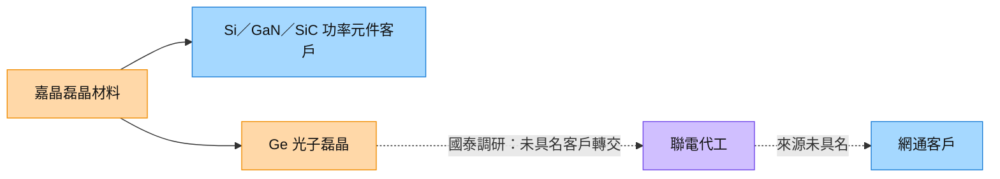

# 3016_嘉晶（市）

## 基本資料

嘉晶電子提供 Si、SiC、GaN 磊晶晶圓，位在半導體基板與元件製造之間，透過磊晶製程形成客戶所需的材料層。主要應用為功率元件、Bipolar 與感測器；工控、伺服器與車用中高壓需求，以及 [[技術_矽光子（SiPh）]] 的鍺磊晶，是國泰 2026-09-24 報告追蹤的成長來源。

上市身分由 [證交所個股資料](https://www.twse.com.tw/pdf/ch/3016_ch.pdf) 核對（上市日 2002-12-24）；產品範圍由 [嘉晶公司介紹](https://www.epi.episil.com/Default/Company_Profile/quick-facts) 核對。財務、產能、漲價及客戶流程依 [[報告_國泰_嘉晶_20260924]]，不能視為公司正式財測或訂單公告。

## 核心技術／競爭優勢

- **多材料磊晶能力**：Si、SiC、GaN 對應不同功率元件材料需求，提供客製化磊晶製程。
- **8 吋中高壓產品組合**：國泰調研指出小尺寸 Si 產能逐步轉往 8 吋；單價與毛利率改善須與實際稼動率一起驗證。
- **矽光子材料延伸**：來源描述 Ge 磊晶用於光偵測，Si 磊晶另用於光線轉向元件；機台調測與材料品質是從功率應用延伸至光子的門檻。

## 產品與應用

| 產品／服務 | 應用 | 相關客戶／下游 |
|---|---|---|
| Si 磊晶 | 中高壓功率元件、工控、車用與伺服器 | IDM／功率元件客戶未具名 |
| GaN／SiC 磊晶 | 化合物半導體功率應用 | 國泰稱 GaN 大客戶導入伺服器；未具名 |
| Ge 磊晶 | 矽光子光偵測元件 | 國泰稱首家客戶採購後交 [[2303_聯電（市）]] 代工，再交網通大廠；最終客戶未具名 |
| Si 光子磊晶 | 光線轉向元件 | 第二家客戶處前期驗證，2028 放量為券商可能情境 |

## 圖片 / 架構圖

![[報告_國泰_嘉晶_20260924_營收與毛利.png]]
圖說：國泰報告第 5 頁呈現 2023Q3–2026Q2 營收與毛利率；2026Q2 改善是觀察產品組合與稼動率的起點，不能直接證明矽光子訂單。

圖說：虛線代表國泰調研的間接供應流程，並非嘉晶與聯電已公告的直接交易。

## EPS 記錄

| 期間 | EPS（元） | 備註 |
|---|---:|---|
| 2025A | 0.07 | 國泰財務表轉述；fact／中信心 |
| 2026Q2A | 0.65 | 營收 13.09 億元、毛利率 23.45%；fact／中信心 |

## EPS 預估

| 年度 | 國泰 EPS（報告日：2026-09-24） | 營收估計（億元） | 毛利率估計 |
|---|---:|---:|---:|
| 2026E | 2.89 | 55.14 | 24.09% |
| 2027E | 4.68 | 71.97 | 27.65% |

以上為 estimate／中信心。2027E EPS 由前次 3.71 上修 26.15%；營收由 74.26 億下修至 71.97 億，獲利上修主因是組合與毛利率。來源第 2 頁毛利率／營益率差異欄與表內兩期值相減不一致，採兩期原值、不沿用差異欄。

## 目標價與評等

| 券商 | 報告發布日 | 評等 | 目標價 | 評價基礎 | 來源 |
|---|---|---|---:|---|---|
| 國泰證期 | 2026-09-24 | 買進（維持） | NT$188 | 40x 2027E EPS 4.68，四捨五入；estimate／中信心 | [[報告_國泰_嘉晶_20260924]] |

## 時間軸

| 時間 | 事件 | 類型 | 重要性 | 備註 |
|---|---|---|---|---|
| 2026Q3–Q4 | Si 漲價與產品轉往 8 吋 | 漲價／組合 | ⭐⭐⭐ | 國泰調研：Q3 +10–15%、全年約 +20%；GaN +5–10%；estimate／中信心 |
| 2026Q4 | 矽光子營收占季營收估 4.3% | 放量／驗證 | ⭐⭐⭐ | 全年占比估 2.3%，非公司指引 |
| 2027 | 矽光子擴至 3 台、年產能估 13,500 片 | 擴產／驗證 | ⭐⭐⭐ | 2026 年產能估 2,700 片；2027 營收占比保守估 8%、單價 US$1,500–1,700；estimate／中信心 |
| 2027Q4 | 新增約 20 台 Si 磊晶機台擴建完成 | 擴產 | ⭐⭐⭐ | 原調研 7–8 台，上修至約 20 台；新增月產能估 11–12 萬片，非總產能 |
| 2028（可能） | 第二家光子客戶放量 | 驗證／放量 | ⭐⭐ | 前期階段敘述有矛盾；estimate／低信心 |

跨公司追蹤：[[時程_2026Q3Q4_AI網通與硬體催化劑]]。

## 供應鏈位置

- 磊晶材料供應商，位於元件製造前段；光子材料流程見 [[供應鏈_AI光互聯]]。
- 國泰提到與漢民合作新增 GaN 6／8 吋共用機台；合作細節與設備型號未揭露，不推定供應商獨占地位。
- 矽光子流程涉及 [[2303_聯電（市）]] 代工，屬券商調研的間接供應線索。

## 相關公司

華南 2026-10-07 [[3707_漢磊（櫃）]] memo 同時提及嘉晶磊晶與集團功率元件布局，並使用「子公司」措辭；法律持股與合併範圍未由本批獨立確認，不據此合併兩家公司財務。來源：[[活動_華南投顧_漢磊3707_20261007]]，關係口徑信心低。

| 公司 | 關係 | 說明 |
|---|---|---|
| [[2303_聯電（市）]] | 下游代工流程 | 國泰稱首家矽光子客戶把嘉晶產品交聯電代工；未揭露直接交易及最終客戶，rumor／中低信心 |

## 風險與注意事項

> [!warning] 來源內部差異與量產邊界
> - 第 2 頁先稱第二客戶「工程階段」，後稱「前期實驗、尚未工程階段」；保留為前期驗證、具體階段待查，2028 放量不視為承諾。
> - 新增機台、月產能、光子年產能與單價均為國泰調研／測算，不能混為同一產品的產能口徑。
> - 原文 PIMC 等疑似錯字以中高壓功率元件描述，不據此創造產品或標籤。
> - 漲價、8 吋轉換、機台交付與客戶驗證若低於預期，會影響毛利率與 EPS；光子材料良率及設備共用限制仍待驗證。

## 來源

- [[報告_國泰_嘉晶_20260924]] — 國泰證期研究部，2026-09-24；券商財務轉述／estimate、客戶鏈待確認。
- [證交所嘉晶基本資料](https://www.twse.com.tw/pdf/ch/3016_ch.pdf) — 證交所，資料產製日 2026-05-12；掛牌與業務核對。
- [嘉晶公司介紹](https://www.epi.episil.com/Default/Company_Profile/quick-facts) — 公司官網，2026-10-03 查閱；產品範圍核對。

- [[活動_華南投顧_漢磊3707_20261007]]（2026-10-07）

## 相關頁面

- [[技術_矽光子（SiPh）]]
