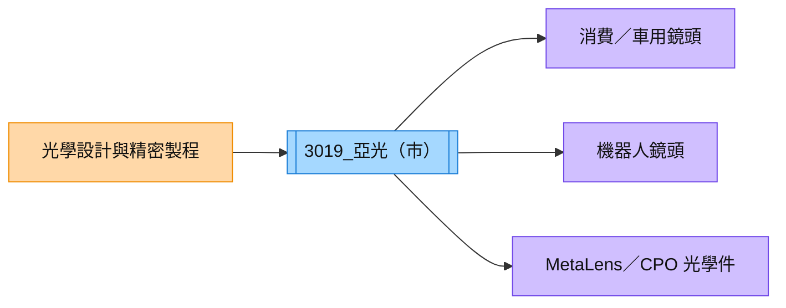

# 3019_亞光（市）

## 基本資料

亞光是光學鏡頭與影像元件製造商，產品延伸至手機、車用、無人機、機器人與 AR／CPO 相關光學零件。2Q26 營收約 NT$80.28 億元、毛利率 18.39%、EPS 1.93 元，創歷史同期營收新高。

## 核心技術／競爭優勢

- 鏡頭設計、精密光學與量產製程整合能力。
- 能把既有光學製造能力延伸至機器人、散熱與 MetaLens 等新應用。
- AR 與 CPO 用 MetaLens、CPO 稜鏡與準直鏡仍在送樣／試產階段，具潛在產品組合升級空間。

## 產品與應用

| 產品 | 應用 | 狀態 |
|---|---|---|
| 光學鏡頭 | 消費電子、車用與影像 | 既有業務 |
| 機器人鏡頭 | 日本與美國客戶 | 送樣，營收仍小 |
| MetaLens、CPO 稜鏡／準直鏡 | AR、CPO 光互連 | 送樣／試產，2027 可能貢獻營收 |

## 圖片 / 架構圖

圖說：亞光由既有精密光學製造延伸到機器人與 CPO 光學件，新產品量產與良率是後續關鍵。

## 券商觀點

CTBC（2026-08-19）以 2Q26 財報與法說問答為主，未給予正式評等；報告指出機器人鏡頭與 AR／CPO MetaLens 仍在送樣，CPO 稜鏡與準直鏡預期 2027 年可能開始貢獻營收，屬公司回覆與券商整理，信心水準中。

## 時間軸

| 時間 | 事件 | 類型 | 備註 |
|---|---|---|---|
| 2026H2 | 機器人、MetaLens、CPO 光學件送樣／試產 | 驗證 | 客戶與量產仍待確認 |
| 2027 | CPO 稜鏡與準直鏡可能貢獻營收 | 新業務 | 公司回覆，非確定訂單 |

> [!warning] 風險與注意事項
> - 新產品仍處送樣、試產，量產良率與客戶認證有不確定性。
> - 傳統鏡頭需求與毛利率仍受消費電子景氣影響。

## 來源

- [[亞光(3019,Note)-CTBC260819]] — CTBC，2026-08-19

## 相關頁面

- [[技術_人形機器人]]
- [[技術_CPO]]
- [[時程_2026記憶體與AI催化劑]]
