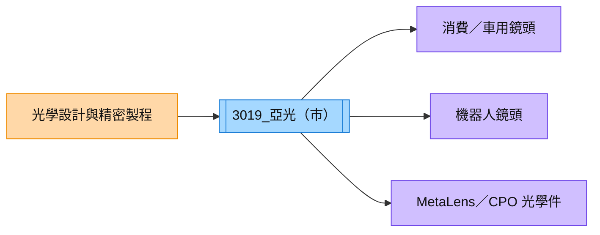

# 3019_亞光（市）

## 基本資料

亞光是光學鏡頭與影像元件製造商，產品延伸至手機、車用、無人機、機器人與 AR／CPO 相關光學零件。2Q26 營收約 NT$80.28 億元、毛利率 18.39%、EPS 1.93 元，創歷史同期營收新高。

## 核心技術／競爭優勢

- 鏡頭設計、精密光學與量產製程整合能力。
- 能把既有光學製造能力延伸至機器人、散熱與 MetaLens 等新應用。
- AR 與 CPO 用 MetaLens、CPO 稜鏡與準直鏡仍在送樣／試產階段，具潛在產品組合升級空間。

## 產品與應用

| 產品 | 應用 | 狀態 |
|---|---|---|
| 光學鏡頭 | 消費電子、車用與影像 | 既有業務 |
| 機器人鏡頭 | 日本與美國客戶 | 送樣，營收仍小 |
| MetaLens、CPO 稜鏡／準直鏡 | AR、CPO 光互連 | 送樣／試產，2027 可能貢獻營收 |

## 圖片 / 架構圖

```mermaid
flowchart LR
    DESIGN[光學設計與精密製程] --> AO[[3019_亞光（市）]]
    AO --> LENS[消費／車用鏡頭]
    AO --> ROBOT[機器人鏡頭]
    AO --> META[MetaLens／CPO 光學件]
    classDef input fill:#ffd8a8,stroke:#f08c00,color:#111;
    classDef company fill:#a5d8ff,stroke:#1c7ed6,color:#111;
    classDef output fill:#d0bfff,stroke:#7048e8,color:#111;
    class DESIGN input; class AO company; class LENS,ROBOT,META output;
```

圖說：亞光由既有精密光學製造延伸到機器人與 CPO 光學件，新產品量產與良率是後續關鍵。

## 券商觀點

CTBC（2026-08-19）以 2Q26 財報與法說問答為主，未給予正式評等；報告指出機器人鏡頭與 AR／CPO MetaLens 仍在送樣，CPO 稜鏡與準直鏡預期 2027 年可能開始貢獻營收，屬公司回覆與券商整理，信心水準中。

### 2026-08-18 法說補充（元大 Call Memo）

- **財務：** 2Q26 營收 80.28 億元（QoQ +29.3%、YoY +16.2%，同期新高）、毛利率 18.4%、營益率 10.1%、EPS 1.93 元；1H26 營收 142.38 億元、營業利益 12.89 億元（YoY +31.4%）、EPS 2.98 元（業外由匯兌利益轉損失）。公司無銀行借款，現金與金融資產 129.35 億元。
- **展望：** 2H26 與 1H26 營收約 5：5、毛利率相當；數位相機 2026 年出貨可望突破 400 萬台（2025 年 274 萬台），變焦鏡頭為主要門檻；車載鏡頭 2026 年出貨 YoY +10–20%、以 8M 為主；無人機約占營收 5%。
- **CPO／Metalens：** 切入點為 FAU 端與稜鏡；採矽材料、折射率約 3.4 的蝕刻式 Metalens，精度奈米級，可用被動對位取代主動對位；不採壓印（耐高溫與高寬比挑戰）。CPO Lens 已送樣日本、美國約 2–3 家客戶，管理層視 Metalens 為未來一年最值得投入的項目。
- **3D 液冷散熱：** 與美商 Frore Systems 共同開發，將蝕刻後 17／18 層超薄銅箔以真空燒結爐做邊緣燒結；菲律賓新廠旁另建約 12 米高、逾 1,000 平方米專用廠房，2026 年底完工、2027 年生產。
- **其他：** 人形機器人鏡頭多家客戶小量送樣；2026 年資本支出 8–10 億元（前次指引約 10.5 億元），主要為奈米壓印設備與菲律賓無塵室。
- 來源：[[活動_亞光3019_CallMemo_20260818]]（元大投顧，2026-08-18 法說），公司說法，信心中。

## 時間軸

| 時間 | 事件 | 類型 | 備註 |
|---|---|---|---|
| 2026H2 | 機器人、MetaLens、CPO 光學件送樣／試產 | 驗證 | 客戶與量產仍待確認 |
| 2027 | CPO 稜鏡與準直鏡可能貢獻營收 | 新業務 | 公司回覆，非確定訂單 |
| 2026 年底 | 菲律賓 3D 液冷散熱專用廠房完工，2027 年生產 | 擴產 | [[活動_亞光3019_CallMemo_20260818]] |
| 2026 | 數位相機出貨突破 400 萬台 | 放量 | 公司依訂單與客戶預測 |

→ 跨公司時程詳見 [[時程_2026-2027高速互連與分散式算力]]

> [!warning] 風險與注意事項
> - 新產品仍處送樣、試產，量產良率與客戶認證有不確定性。
> - 傳統鏡頭需求與毛利率仍受消費電子景氣影響。

## 來源

- [[亞光(3019,Note)-CTBC260819]] — CTBC，2026-08-19
- [[活動_亞光3019_CallMemo_20260818]] — 元大投顧法說 Call Memo，2026-08-18

## 相關頁面

- [[技術_人形機器人]]
- [[技術_CPO]]
- [[時程_2026記憶體與AI催化劑]]
