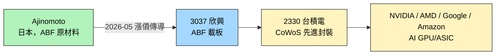

# 3037_欣興（市）

## 基本資料
欣興電子（Unimicron），台灣最大 IC 載板廠之一，與南電（[[8046_南電（市）]]）並列「台廠 ABF 雙雄」。主要產品為高階 ABF（Ajinomoto Build-up Film）載板，應用於 AI/HPC GPU、Server CPU、AI ASIC 等先進邏輯晶片封裝；同時生產 BT 載板（手機 SoC、儲存）與一般 HDI PCB。AI 端需求是 2026 年成長主軸，主要透過 [[2330_台積電（市）]] 的 CoWoS 先進封裝出貨至 [[NVDA.US(nvidia)]] 等 AI 晶片客戶。

主要資料來源：[[報告_MS_ABF產業_260508]]（Morgan Stanley Catalyst Event Reaction 短評，2026-05-08）。

## 核心技術／競爭優勢
- **大尺寸 FC-BGA 全球領先**：全球大尺寸 FC-BGA 基板份額 **~40%**（Ibiden ~30%）；南亞/景碩等量產上限 ~70×70mm，**無法進入前沿 AI 基板市場**
- **Nvidia 伺服器 ABF 主供**：據 acecamptech 2026-05 調研，欣興在 Nvidia 伺服器 ABF 份額達 **~65%**（Ibiden ~35%）；與此前統一投顧 2026-03 數據（欣興 10–20%）有明顯差異，見下方 `[!warning]`
- **CoWoS 受益最大**：台積電 CoWoS 2026 年底目標 **125,000–130,000 wpm**，每片對應一塊 FC-BGA 基板，欣興是最大受益者
- **CoPoS 延遲保護**：CoPoS 推遲至不早於 2030 年，ABF 基板產業鏈現有格局比市場預期至少延長**兩年**
- **ABF 載板量產規模**：先進封裝關鍵載板，全球供應商屈指可數，技術 / 資本 / 認證門檻高
- **成本轉嫁能力**：Ajinomoto 於 2026-05 啟動 per-customer 漲價後，MS 預期 ABF 載板廠能 100% 轉嫁至下游，AI 端可能進一步擠出 ASP 上行空間

## 產品與應用
| 產品 / 服務 | 應用 | 相關客戶 / 下游 |
|-------------|------|-----------------|
| ABF 載板（高階） | AI/HPC GPU、Server CPU 封裝 | [[2330_台積電（市）]] CoWoS → [[NVDA.US(nvidia)]] / AMD / Google / Amazon |
| BT 載板 | 手機 AP、儲存控制器 | 移動端 SoC 業者 |
| HDI PCB | 一般電子 | 多元終端 |

## 圖片 / 架構圖

`[待補來源圖]` 需官方 IR ABF 載板層疊截面圖或 AI 伺服器用 PCB 製程實拍佐證；上方為自製供應鏈示意圖。
## EPS 記錄
> 本次來源（[[報告_MS_ABF產業_260508]]）為 Catalyst Event Reaction 短評，未揭露 EPS 歷史數據。後續 ingest 法說 / 財報 / full update 報告時補。

| 季度 | EPS (元) | YoY | 備註 |
|------|----------|-----|------|
| — | — | — | 本次來源未揭露 |

## EPS 預估
> 本次來源未揭露券商 EPS 預估數字。

| 年度 | Morgan Stanley EPS（報告日：2026-05-08） | 備註 |
|------|------------------------------------------|------|
| 2026E | — | 本份為短評，未刷新數字模型 |

| 年度 | 統一投顧（2026-03-24） | 備註 |
|------|----------------------|------|
| 2025A | NT$（原始數值待核對）.4 | 實際值 |
| 2026E | NT$（原始數值待核對）.2 | 統一投顧中性版 |
| 2027E（中性） | NT$（原始數值待核對）.0 | ABF 漲幅 +3%/季假設 |
| 2027E（保守） | NT$（原始數值待核對）.8 | ABF 漲幅 +0%/季 |
| 2027E（樂觀） | NT$（原始數值待核對）.9 | ABF 漲幅 +5%/季 |

## 目標價與評等

| 券商 | 報告發布日 | 評等 | 目標價 | 評價基礎 | 來源 |
|------|------------|------|--------|----------|------|
| Citi Research | 2026-06-30 | Buy（維持） | NT$1,500（舊 NT$1,080） | — | [[報告_Citi_ABF載板BT_20260630]] |
| Morgan Stanley | 2026-05-08 | Overweight（維持） | 未揭露 | RI 模型：cost of equity 9.2%、medium-term growth 13%、terminal growth 3%、beta 1.0 | [[報告_MS_ABF產業_260508]] |

## 時間軸

| 時間 | 事件 | 類型 | 重要性 | 備註 |
|------|------|------|--------|------|
| 2026-06-30 | Citi Buy TP NT$1,500（舊 NT$1,080）；欣興 BT 年底削減 15% 產能、中期削減 40-50% | 評等/產能 | ⭐⭐⭐ | 3Q26 ABF ASP +15-20% QoQ |
| 2026-05 | TPCA/金屬中心：2026F CAPEX NT$340億（2025E NT$206億，+65% YoY）；2025E 收入 NT$761億（2024A NT$635億，+20% YoY） | 產能/財務 | ⭐⭐ | 見 [[報告_呂紹旭_玻璃載板FOPLP_20260508]] |
| 2026-05-07 | Ajinomoto 確認 ABF 開始 per-customer 漲價 | 漲價 | ⭐⭐⭐ | 觸發 MS 維持 OW |
| 2026-Q1 | TSMC 法說提 CoPoS 玻璃基板，「未來幾年內量產」 | 替代技術訊號 | ⭐⭐⭐ | 中期路線壓力，見 [[技術_玻璃基板]] |
| 2026-04 | Intel 玻璃基板 3DGS 動工，年產 ~7 萬基板 | 替代技術里程碑 | ⭐⭐ | 影響中期 ABF 載板需求曲線 |

| 時間 | 事件 | 類型 | 重要性 |
|------|------|------|--------|
| 2026-03-24 | 統一投顧發布 ABF 載板專題報告 | 研究報告 | ⭐⭐ |
| 2025-08-29 | Nittobo 宣布投入 150 億日圓擴充 T-glass 產能，預計 4Q26 開出 | 供需轉折 | ⭐⭐⭐ |
| 2026-Q2 | ABF 載板漲價擴大；AMD Venice 2026 Q2 Confirmed PO（26 層，欣興/Ibiden 主供）| 漲價/訂單 | ⭐⭐⭐ |
| 2026-06 | Google TPU / AWS Trainium 下單，ABF 需求再擴大 | 訂單 | ⭐⭐⭐ |
| 2026-Q4 | Nittobo T-glass 擴產 3 倍產能預計開出 | 供需 | ⭐⭐⭐ |
| 2026 H2 | 高端 FC-BGA 基板供應缺口可能超過 **40%** | 供需 | ⭐⭐⭐ |
| 2026–2027 | Intel Diamond Rapids 量產（2026 Q4 計劃）；NVIDIA GR150 測試（CoWoP 場景）| 客戶 | ⭐⭐ |
| 2027 | ABF 載板預估進入供需缺口 26% 格局；日東紡第二座窯爐重啟為關鍵催化劑 | 供需 | ⭐⭐⭐ |
| ≥2030 | CoPoS 量產最早時點（不早於 2030），ABF 載板格局比預期延長 ≥2 年 | 技術保護 | ⭐⭐⭐ |

| 時間 | 事件 | 類型 | 重要性 | 備註 |
|------|------|------|--------|------|
| 2026-02-22 | Morgan Stanley 首次升評至 OW（from EW），TP NT$（原始數值待核對） | 評等升級 | ⭐⭐⭐ | 四年來首次看多；AI ABF 上行週期論點首次完整建立 |

## 供應鏈位置
- **上游**：Ajinomoto（ABF 樹脂原材料，日本獨家供應）
- **下游**：[[2330_台積電（市）]]（先進封裝代工）→ [[NVDA.US(nvidia)]] / AMD / Google / Amazon AI 加速器
- **CoWoS 外溢承接者**：[[AMKR.US(amkor)]]、日月光（Rubin 部分外包）
- **所屬供應鏈**：[[供應鏈_先進封裝載板]]

## 相關公司

| 公司 | 關係 | 說明 |
|------|------|------|
| [[8046_南電（市）]] | 同業 / 同類產品 | 台廠 ABF 雙雄，MS 同步維持 OW |
| [[2330_台積電（市）]] | 下游製造 | CoWoS 載板需求主要來源 |
| [[NVDA.US(nvidia)]] | 終端客戶 | AI GPU 終端，Rubin 進度影響 ABF 需求節奏 |
| [[AMKR.US(amkor)]] | 下游製造 | OSAT，TSMC CoWoS 外溢承接者 |

> [!warning] 風險與注意事項（兩份來源並列）
> **短期觀點（Morgan Stanley，2026-05-08）**
> - 上行：ABF / Server 載板需求優於預期；CoWoP 等替代技術良率持續無解 → Uni 受惠延長
> - 下行：突發需求斷崖、技術變遷導向不需 ABF 載板的方案、競爭加劇、新產能爬坡良率問題
>
> **中期觀點（國金證券，2026-05-11）**
> - 玻璃基板 / TGV 正推進量產：Intel 2026-2030（亞利桑那州 >10 億美元）、Apple 2027 後（三星電機 T-glass）、TSMC「未來幾年內」CoPoS
> - 中期可能壓縮 ABF 載板成長空間
>
> 兩份來源觀察時點僅差 3 天，反映「短期 cash flow 強化 vs 中期路線替代」並存的時間結構，**不互相否定**。

| 公司 | 關係 | 說明 |
|------|------|------|
| Ibiden（日本，未建頁） | 主要競爭者 | 全球 ABF 載板龍頭，NV Rubin 主供應商 80-90% |
| Nittobo 日東紡（日本，未建頁） | 上游材料 | T-glass 獨家供應商，4Q26 擴產計畫 |

| 公司 | 關係 | 說明 |
|------|------|------|
| [[3189_景碩（市）]] | 同業/競爭 | 台廠 ABF 第三，統一投顧買進 TP NT$（原始數值待核對） |

| 公司 | 關係 | 說明 |
|------|------|------|
| [[AVGO.US(broadcom)]] | 下游（間接）| Broadcom ASIC 使用 ABF 載板，欣興為 Broadcom 台灣 ABF 供應鏈一環 |

---

## 來源
- [[報告_MS_ABF產業_260508]]（Morgan Stanley，2026-05-08，本頁主要來源；分析師 Howard Kao / Sharon Shih / Irene Yen）
- [[報告_Citi_ABF載板BT_20260630]]（Citi Research，2026-06-30；Buy TP NT$1,500（升自 NT$1,080）；BT 年底削 15% 產能、中期削 40-50%；2026F EPS NT$21.12、2027F NT$50.49）
- [[報告_其他_玻璃基板_20260511]]（國金證券「玻璃基板行業深度」，2026-05-11；分析師李陽 S1130524120003。用於中期路線並列）
- [[報告_呂紹旭_玻璃載板FOPLP_20260508]]（TPCA/金屬工業研究發展中心，2026-05-08；全球市占 15.8%；2025E 收入 NT$761億；2026F CAPEX NT$340億）

- [[報告_統一投顧_ABF載板專題_20260324]]（統一投顧，2026-03-24；ABF 載板供需分析、T-glass 缺料、欣興/南電/景碩投資建議）
- [[報告_福邦_PCB載板產業展望_20260401]]（福邦投顧，2026-03-19；2027-28 缺口 26%/46% 預估）

---

- [[memo_PCB市场调研_VR200_UltraRubin_OAM_mSAP_acecamptech_20260518]]
- [[memo_PCB覆铜板调研_北美芯片平台_Q布_acecamptech_20260511]]
- [[memo_PCB龙头专家_ABF_BT载板_正交背板_acecamptech_20260519]]

- [[memo_ABF载板日本龙头调研_AI驱动规格毛利双升_acecamptech_20260526]]（月產能 450千㎡、Nvidia 65% 份額、AMD Venice、Ibiden 比較）
- [[memo_ABF载板龙头调研_AI需求翻倍_2027缺货_acecamptech_20260511]]（2027 需求翻倍、缺口 50%、Google/AWS 下單時程）
- [[memo_ABF载板专家访谈总结_供需格局演变_材料瓶颈_acecamptech_20260518]]（T-glass 瓶頸、供給層級、CoPoS 延遲）
- [[memo_ABF需求被出货量模型低估_AI时代_acecamptech_20260526]]（正確需求方程、FC-BGA 40% 份額、CoWoS 節奏、2026H2 缺口 40%）
- [[memo_日本CCL龙头产品及供应链分析_acecamptech_20260427]]（T-glass 供應鏈：Nittobo→Resonac→欣興/Ibiden）
- [[報告_摩根士丹利_美國Hyperscalers_2026Q2_20260802]]（摩根士丹利，2026-08-02；compute／networking chip ABF 載板受惠）
## 相關頁面

- [[供應鏈_AI伺服器PCB]]
- [[7795_長廣（興）]]
- [[分析_2026-08_ABF_CCL與AI互連更新]]
- [[時程_2026Q3Q4_AI網通與硬體催化劑]]
- [[時程_2026記憶體與AI催化劑]]
- [[GOOGL.US(alphabet)]]
- [[分析_先進封裝與RDL]]
- [[4760_勤凱（市）]]
- [[5434_崇越（市）]]
- [[6664_群翊（市）]]
- [[技術_PCB]]
- [[技術_ABF載板]]
- [[INTC.US(intel)]]
- [[技術_CoWoS與先進封裝]]

---

## 券商評等與目標價

| 券商 | 報告日 | 評等 | 目標價 | 當時狀況 | 備註 |
|------|--------|------|--------|----------|------|
| 統一投顧 | 2026-03-24 | 買進 | NT$（原始數值待核對） | ABF漲價週期初期 | 中性版；樂觀版 TP NT$（原始數值待核對） |
| Morgan Stanley | 2026-05-08 | Overweight（維持） | 未揭露 | ABF 漲價確認 | 短評，未刷新數字模型 |
| Citi Research | 2026-06-30 | Buy（維持） | NT$1,500（舊 NT$1,080） | ABF 漲價 + BT 減產利好 | 2026F EPS NT$21.12、2027F NT$50.49 |

## 供需展望（2026-2028）

### ABF 載板供需缺口

根據統一投顧（2026-03-24）預估，全球 ABF 載板供需在 2025 年達到平衡，2026 年在 T-glass 缺料影響下轉為供不應求，2027-2028 年缺口持續擴大：

| 年度 | 供需狀況 | 福邦投顧缺口估計 |
|------|----------|------------------|
| 2024 | 供過於求 | — |
| 2025 | 供需平衡 | — |
| 2026 | 供不應求（開始） | 約 1% |
| 2027E | 缺口擴大 | 約 26% |
| 2028E | 缺口繼續擴大 | 約 46% |

資料來源：福邦投顧（2026-03-19 預估）

### T-glass 缺料是核心催化劑

- **Nittobo（日東紡）為 T-glass 獨家供應商**：宣布投入 150 億日圓擴產，預計 4Q26 產能開出，屆時達目前 3 倍
- **台玻、南亞（1303）**：T-glass 於 4Q25 陸續通過載板廠及 CCL 廠認證，但產能仍低
- **業界預估**：即使 Nittobo 4Q26 擴產完成，2027 年仍可能無法完全緩解短缺

### AI 晶片對 ABF 需求驅動

| 晶片 | 載板面積 | 層數 | ABF 對 T-glass 需求 |
|------|----------|------|---------------------|
| H100 | 50×50mm | 14 | T-glass 6 層 |
| Blackwell / GB300 | 平均 80×80mm | 16-18 | T-glass 12 層 |
| Rubin（2027） | 100×100mm | 18-22 | T-glass 18 層 |

### 欣興擴產計畫

| 年度 | 產能（萬顆，37×37mm/8L） | 重點廠房 | YoY |
|------|--------------------------|----------|-----|
| 2024 | 10,000 | — | — |
| 2025 | 11,200 | 光復一廠 | +12% |
| 2026 | 12,544 | 光復一、楊梅一 | +12% |
| 2027E | 14,802 | 光復二 | +18% |
| 2028E | 17,466 | 楊梅二 | +18% |

### 主要客戶供應地位

> [!warning] Nvidia ABF 份額數據衝突
> - **統一投顧（2026-03）**：GB200/GB300 Ibiden 80–90%、欣興 10–20%；VR200 Ibiden 90–95%、欣興 5–10%
> - **acecamptech memo（2026-05）**：Nvidia 伺服器 ABF 欣興 **~65%**、Ibiden ~35%；大尺寸 FC-BGA 全球欣興 ~40%、Ibiden ~30%
> 兩份來源差距懸殊，可能口徑（面積 vs 顆數）或時間點不同。暫並列，待法說數據核實。

- **GB200/GB300**：統一投顧估 Ibiden 80–90%、欣興 10–20%
- **VR200（Rubin）**：統一投顧估 Ibiden 90–95%、欣興 5–10%
- **EMIB-T（Intel HumuFish TPU v9）**：Ibiden + 欣興為主要供應商
- **AMD Venice**：26 層 ABF，**2026 Q2 Confirmed PO**（生產周期約 18 週）
- **Google TPU / AWS Trainium**：**2026 年 6 月**下單，需求大幅擴增

## 1.6T 光模塊 PCB / mSAP（補充，2026-06-29）

欣興除 ABF 載板外，**在 1.6T 光模塊 PCB（mSAP 工藝）領域同為全球領先廠商**，此業務與 IC 載板相輔相成（客戶重疊、工藝精度方向一致）。

### mSAP PCB 市場地位

| 指標 | 數值 | 說明 |
|------|------|------|
| 1.6T mSAP PCB 市場地位 | **台灣廠商領先** | 全球主要份額之一（與日本 Ibiden 並列） |
| 1.6T PCB 單片售價 | 208 元 → **420 元**（+100%）| 2025 年初至 2026 年中漲幅 |
| 800G PCB 單片售價 | 76 元 → **140 元**（+84%）| 同期比較 |
| mSAP 設備狀況 | 已排到 2027 年交付 | 限制產能爬坡速度 |

### 關鍵說明

- **mSAP（改良半加成工藝）** 可實現 20µm 線寬/間距，是 1.6T 光模塊 PCB 的核心工藝；欣興憑藉精密加工技術積累在此工藝具有競爭優勢
- 1.6T 光模塊 PCB 約 70% 採 mSAP，詳見 [[技術_mSAP]]
- 欣興的 mSAP 能力與 ABF 載板的超精細線路工藝能力同源，形成協同

### 時間軸補充（mSAP）

| 時間 | 事件 | 類型 | 重要性 |
|------|------|------|--------|
| 2025 | 1.6T 光模塊 PCB 規模量產，欣興取得大份額 | 市場 | ⭐⭐⭐ |
| 2026 | 1.6T PCB 售價翻倍（208→420元）；mSAP 設備訂單排到 2027 | 漲價/供需 | ⭐⭐⭐ |
| 2027 | Ultra Rubin OAM 52層 mSAP PCB 放量（欣興 vs 滬電競爭）| 新品類 | ⭐⭐⭐ |

### 2026-08 本批券商更新

- **2Q26 實績與毛利率**：[[報告_Daiwa_欣興_20260729]] 記錄營收 NT$42.9bn、EPS NT$8.53、毛利率 24.8%；Daiwa 將漲價、稼動率與良率改善列為毛利率擴張來源，並預期 3Q26 毛利率回到約 30%。
- **ABF 與新封裝**：Daiwa 認為欣興 2026–2028 年 capex 指引升至 NT$53.7bn，其中約 85% 用於 ABF 產能、僅約 1–2% 直接投入 EMIB-T；EMIB-T 首階段良率目標為 2H27 約 50%，屬公司管理層展望／券商整理，信心：中。
- **AI HDI 與 ASIC**：[[報告_JPMorgan_欣興_20260723]] 預期 3Q26 AI GPU server HDI 份額增加，並估未來 12–18 個月切入 ASIC AI server HDI；客戶與量產節奏仍待公司公告或後續驗證。

### 新增 EPS／目標價矩陣

| 券商 | 報告發布日 | 2026E EPS | 2027E EPS | 2028E EPS | 評等 | 期末目標價 | 屬性／信心 |
|------|------------|-----------|-----------|-----------|------|------------|------------|
| J.P. Morgan | 2026-07-23 | 19.01 | 41.77 | — | Overweight | NT$1,150（2026-12） | estimate，中 |
| Daiwa | 2026-07-29 | 20.954 | 44.949 | 74.415 | Buy (1) | NT$1,500 | estimate，中 |

> [!warning] 券商差異
> Daiwa 與 J.P. Morgan 均看好 2H26 毛利率與 ABF／HDI 需求，但對 2027 年 EPS 與評價倍數假設不同；EMIB-T、玻璃核心基板、CoWoP 與 KF2／YM2/3 擴產仍屬待驗證路線，不視為已確認訂單。

### 來源補充（2026-08 新增）

- [[報告_Daiwa_欣興_20260729]] — Daiwa，2026-07-29
- [[報告_JPMorgan_欣興_20260723]] — J.P. Morgan，2026-07-23

- [[ms 3037]] — Morgan Stanley，2026-07-28；2Q26 毛利率 24.8%、2026 capex 上調至 NT$53.7bn

### 2026-07-28 Morgan Stanley 更新

- 2Q26 毛利率 24.8%、營業利益 NT$6.651bn；Morgan Stanley 將改善歸因於 ABF／BT 漲價與稼動率上升。
- 2026 capex 上調至 NT$53.7bn，長交期設備採購增至 NT$31.7bn；屬公司資本配置揭露，對高階 ABF 擴產的實際貢獻仍需追蹤。
- [[報告_Citi_欣興_20260729]]：維持買進、目標價 NT$1,500；ABF 2Q26 銷售季增 22%，2026 年資本支出由 NT$340 億上調至 NT$540 億，並持續增加 ABF、HDI 與 mSAP 產能。
- [[報告_MorganStanley_欣興_20260729_MS]]：維持 OW、目標價 NT$1,465；AI 占 ABF mix 估逾 70%，EMIB-T 2027 年量產、初始良率目標 50%，2026 年資本支出 NT$537 億。
- [[報告_UBS_欣興_20260729]]：2Q26 EPS NT$8.45、毛利率 24.8%，高於 UBS／市場預估；2026E EPS NT$13.86，數字屬 UBS estimate，且非營業收益影響顯著。

### 2026-08-23 ABF／EMIB-T 更新

- [[260729_gs_unimicron]]：AI 相關 ABF／PCB 營收占比 1H26 約 60%，2H26 預期 ABF 超過 70%；EMIB-T 目標 2027 年開始出貨，屬公司展望／券商 estimate。
- [[daiwa 3037]]、[[gs 3037]]：2Q26 毛利率約 24.8%，2026 capex 上修至 NT$53.7bn；Daiwa 目標價 NT$1,000、Goldman Sachs NT$1,140，差異並列。
