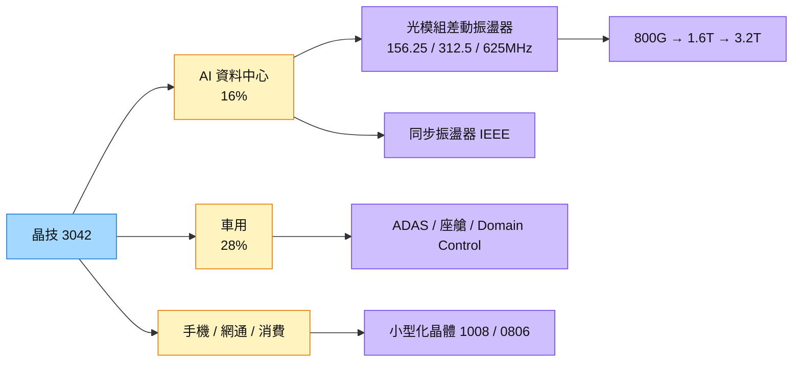

# 3042_晶技（市）

## 基本資料

晶技（TXC）是全球營業額第一的石英頻率元件廠，產品包含石英晶體（Crystal）、振盪器（XO、TCXO、OCXO、差動振盪器）等，提供系統運算、連接與同步所需的時脈。公司 2022 年起切入 AI 應用，2026 年轉型為「雙 A」引擎：車用與 AI。

- **營收結構（2026E vs 2025）：** 車用 28%（vs 26%）首度成為第一大應用；AI 16%（vs 11%）；手機 24%（vs 29%）；網通與 Computing 約 9%；消費約 14%。公司目標 2027 年 AI＋車用合計占比過半，車用占比再升至三成以上。
- **財務：** 2Q26 營收 36.99 億元（QoQ +10.8%）、毛利率 33.1%、EPS 1.64 元；1H26 營收 70.38 億元（YoY +7.7%）、EPS 2.96 元。7 月毛利率 36%（過去多為 32%），公司說明為 AI／車載比重提高，不是漲價。
- **光通訊：** 光模組用 156.25／312.5MHz 差動振盪器市占約 20%（主要玩家 4–5 家）；1.6T 規格「300 多 MHz」產品已通過客戶認證，明年擴產主力；625MHz 為 2–3 年後產品。
- **產能：** 台灣平鎮（高精準低抖動產品）、寧波 MGB／TTC（車用專廠）、重慶 CKG（小型化）、印尼 SUB（NCNT 第三地產能，年底取得 IATF 16949）。2026 年資本支出 10.78 億元，約 80% 投入 AI 相關產品。

資料來源：[[活動_晶技3042_法說與論壇Memo_20260819]]（國泰證期法說 Call Memo 2026-08-19；凱基論壇 AlphaMemo 2026-09-10）

## 核心技術／競爭優勢

- **全流程自主：** 石英從設計、製造、封裝、測試到供應鏈全程掌控；MEMS 業者多僅做設計、其餘委外。
- **高 Q 值低抖動：** 石英 AT-cut Q 值數萬到十幾萬，直接諧振、不需大幅倍頻，抖動與相位雜訊表現優於傳統 Si MEMS（詳見 [[技術_光模塊]]）。客戶抖動要求已由 50–70ps 降至 30ps 以下。
- **同步產品認證：** 已取得符合 IEEE 協定之同步振盪器客戶認證，非每家同業都能供應；高階 OCXO 與高精準 TCXO 為高單價、高毛利產品。
- **多廠區彈性：** 台灣、中國、日本、印尼四地皆可生產全產品線，任一廠區受限時他廠最快一個月、最慢 3–6 個月接手。

## 產品與應用

| 產品 / 服務 | 應用 | 相關客戶 / 下游 |
|-------------|------|-----------------|
| 高頻差動振盪器（156.25／312.5MHz，開發 625MHz） | 800G／1.6T／3.2T 光收發模組、資料中心交換器 | 光模組廠、CSP 生態系 |
| 車用晶體與振盪器、低 EMI 產品 | ADAS、智能座艙、Domain Control、雷達／LiDAR／相機 | 車用 IC 平台廠（reference design）、Tier 1 |
| OCXO／高精準 TCXO | 5G-A／6G 基地台、NTN、低軌衛星 | 電信設備商 |
| 小型化晶體（1008、0806） | 手機、穿戴、IoT、機器人 | 手機與消費品牌 |
| MEMS 頻率元件（與策略夥伴合作開發） | 手機、IoT | 投資加拿大 MEMS 公司（與 [[2454_聯發科（市）]] 合作） |

## 圖片 / 架構圖

圖說：晶技由手機主導轉向「AI＋車用」雙引擎；光模組速率升級帶動時脈頻點由 156.25MHz 升至 312.5MHz、625MHz，單價倍數提升。

## EPS 記錄

| 期間 | EPS (元) | 備註 |
|------|---------|------|
| 2Q26 | 1.64 | 毛利率 33.1%，費用率 16.2% |
| 1Q26 | 1.32 | 由 1H26 EPS 2.96 元回推 |
| 1H26 | 2.96 | 毛利率 32.74% |

## 時間軸

| 時間 | 事件 | 類型 | 重要性 | 備註 |
|------|------|------|--------|------|
| 2H26 | 毛利率可望優於上半年（規模、稼動率、組合） | 營運 | ⭐⭐ | 公司說法 |
| 2026 年底 | 印尼廠取得 IATF 16949 認證 | 擴產 | ⭐⭐ | 可供應全球 Tier 1 |
| 2027 | 1.6T 用 300 多 MHz 差動振盪器放量、擴產 | 放量 | ⭐⭐⭐ | [[活動_晶技3042_法說與論壇Memo_20260819]] |
| 2027 | 車用占比升至三成以上；AI＋車用合計過半 | 結構轉型 | ⭐⭐ | 公司目標 |
| 2028–2029 | 625MHz 產品（3.2T 世代） | 規格升級 | ⭐⭐ | 規格尚未定義 |

→ 跨公司時程詳見 [[時程_2026-2027高速互連與分散式算力]]

## 供應鏈位置

- 上游：石英晶棒、貴金屬與基礎材料（公司計劃性備料因應貴金屬上漲）
- 下游：光收發模組廠、車用 IC 平台與 Tier 1、手機與網通品牌
- 所屬供應鏈：[[供應鏈_AI光互聯]]（光模組時脈元件）、[[供應鏈_被動元件]]
- 技術背景：[[技術_光模塊]]

## 相關公司

| 公司 | 關係 | 說明 |
|------|------|------|
| [[3221_台嘉碩（櫃）]] | 同業 / 競爭 | 光模組差動振盪器同樣出貨中 |
| [[2454_聯發科（市）]] | 生態系夥伴 | 晶技投資之加拿大 MEMS 公司與聯發科合作 |

## 風險與注意事項

> [!warning] 風險與注意事項
> - **MEMS 替代：** 公司坦言明年部分手機晶體料已被 MEMS 取代；SiTime 在光通訊為解決方案供應商，與石英方案並存。
> - **單價說法易誤讀：** 管理層提到的「1：2–2.5：5–7」為 100 多／300 多／600 多 MHz 產品的倍數比，不是絕對單價；600 多 MHz 尚未量產。
> - **消費性與 3225 成熟品需求偏淡：** 高階產能緊、中低階需求弱，組合變化影響毛利率。
> - **AlphaMemo 為 AI 逐字稿：** 部分數字可能有轉錄誤差，引用時以法說簡報為準。

## 來源

- [[活動_晶技3042_法說與論壇Memo_20260819]] — 國泰證期法說 Call Memo（2026-08-19）＋凱基論壇 AlphaMemo（2026-09-10）
- [[memo_LINE投資人超商_產業消息與群友討論彙整_20260725-20261004]] — 群友石英／MEMS／BAW 技術討論（I017、I018）

- [[元大投顧 - 光通訊產業 20250824]]（2025-08-24）
