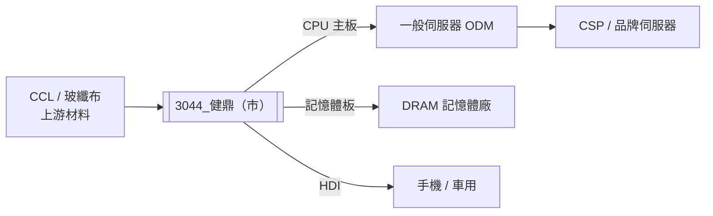

---
title: "3044_健鼎（市）"
ticker: "3044.TW"
market: TW
exchange: TWSE
sector: PCB 印刷電路板
tags:
  - 公司/健鼎
  - 供應鏈/AI伺服器PCB
  - 環節/PCB製造
  - 產業/AI伺服器
aliases:
  - Tripod
  - Tripod Technology
  - 健鼎科技
related_companies:
  - "[[2368_金像電（市）]]"
  - "[[4958_臻鼎（市）]]"
  - "[[活動_健鼎法說_20260603]]"
updated: 2026-07-01
image_status: "待補來源圖"
---

# 3044_健鼎（市）

## 基本資料

健鼎科技（Tripod Technology），全球 PCB 排名第 9（Prismark 2025），專注單/雙面及多層 PCB 製造，**不涉足 IC 載板或 PCB 組裝**。主力生產基地：台灣桃園平鎮（1998）、江蘇無錫（2003，六廠房，核心主力）、湖北仙桃（2013，三廠房，第三廠設備完成）、越南邊和及周德工業區（2H26 投產中）。主要應用：一般伺服器 CPU 主板、記憶體模組板（DRAM/RDIMM）、HDI、車用電子。
  
1Q26 銷售高出 Citi/consensus 預估 7%，主因 Memory/Server 需求強勁；1Q26 合併營收 **209 億元**（1Q25 約 170 億，+23% YoY），毛利率回升至 **25% 以上**（回升原因：1Q26 開始反映 CCL 漲價調整）。

財務體質：淨現金 200 億以上 + 70 億流動金融資產，幾乎不對外募資（歷史僅兩次）；EPS 連續 7-8 年超過票面價（NT$10）。

主要資料來源：[[報告_Citi_PCB_CCL_20260422]]（Citi，2026-04-22）；[[活動_健鼎法說_20260603]]（第一金，2026-06-03）。

## 核心技術／競爭優勢

- **一般伺服器 CPU 主板市占 30%+**：在 GCE 轉向 AI ASIC 後，訂單可能溢出至健鼎，作為備援供應商受益
- **穩健財務紀律，幾乎不稀釋股東**：歷史上僅兩次對外募資，淨現金 200 億以上，資本支出嚴格控制（需帶動營收且不犧牲毛利率）
- **保守東南亞擴張**：越南廠相對晚佈局（2H26 投產），避免良率爬坡風險；被 Citi 視為「被低估的優點」
- **高階 CCL 漲價成功轉嫁**：1Q26 及 2Q26 均已反映漲價，高階產品客戶接受度高，毛利率回升至 25%+
- **記憶體模組板多元客戶**：DRAM 模組板使用較多黃金，貴金屬漲價有滯後轉嫁，但 2026Q1 已調整

## 產品與應用

| 產品 / 服務 | 應用 | 相關客戶 / 下游 |
|-------------|------|-----------------|
| 一般伺服器 CPU 主板（多層 PCB） | Intel / AMD 平台伺服器 | ODM 伺服器廠、品牌伺服器 |
| 記憶體模組板（DRAM/RDIMM） | DDR4/DDR5 記憶體封裝 | 記憶體大廠 |
| HDI 板 | 手機、消費電子、車用 | 品牌手機廠 |
| AI 伺服器副板 | AI 伺服器配件、網卡等 | AI 伺服器 ODM |

## 圖片/架構圖

> 健鼎專注 PCB 製造，不涉足 IC 載板或組裝；在一般伺服器 CPU 主板市占 30%+，AI ASIC 主板市場目前仍以金像電為主。

## EPS 記錄

| 季度 / 年度 | EPS / 指標 | 備註 |
|------------|-----------|------|
| 2025A EPS | ~19.45 元 | 原估 ~20 元，4Q25 貴金屬漲價壓毛利，略低於預期 |
| 1Q26 合併營收 | 209 億元 | +23% YoY（1Q25 170 億）；超 Citi 估 7% |
| 1Q26 毛利率 | 25%+ | 回升，漲價調整已反映 |

## EPS 預估

| 年度 | Citi（2026-04-22） | 備註 |
|------|------------------|------|
| 2025A | NT\$19.45 | 法說確認 ~19.45 元 |
| 2026E | NT\$21.40 | 1Q26 超預期 7%，上調 6% |
| 2027E | NT\$23.47 | — |
| 2028E | NT\$26.43 | — |

> [!note] 備註
> 法說提及 2026E EPS 相關數字（AI 轉錄，需以原始音檔確認），上表數值以 Citi 4 月報告為主。健鼎 EPS 連續七至八年超過股本（NT$10），財務穩健。

## 目標價與評等

| 券商 | 報告日 | 評等 | 目標價 | 評價基礎 | 來源 |
|------|--------|------|--------|----------|------|
| Citi | 2026-04-22 | Buy | NT\ | DCF（WACC 9.6%，長期成長 2%） | [[報告_Citi_PCB_CCL_20260422]] |

> Citi 開立 30 天 Upside Catalyst Watch（2026-04-22），預期 1Q26 法說（5/8）正式數字進一步超預期。

## 時間軸

| 時間 | 事件 | 類型 | 重要性 | 備註 |
|------|------|------|--------|------|
| 2026-06-03 | 健鼎法說：1Q26 營收 209 億（+23% YoY），GM 25%+；2025A EPS ~19.45 元 | 法說 | ⭐⭐ | CCL 漲價已反映；越南廠 2H26 投產 |
| 2026-H2 | 越南周德工業區廠投產 | 擴產 | ⭐⭐ | 東南亞產能布局，分散地緣風險 |
| 2026 全年 | 資本支出 >100 億元（主要越南廠 + 湖北三廠設備） | 擴產 | ⭐⭐⭐ | 2025 全年 58 億，2026 大幅提升 |
| 2026-Q1已完成 | 湖北三廠設備安裝完成，產能已具備 | 擴產 | ⭐⭐ | 第四廠隨時可擴 |

## 供應鏈位置

- **上游材料**：CCL（覆銅板）廠、玻纖布、銅箔、貴金屬（金線，記憶體板用量多）
- **下游**：一般伺服器 ODM（CPU 主板）、記憶體大廠（DRAM 模組板）、AI 伺服器（副板、網卡）
- **競爭者**：[[2368_金像電（市）]]（AI ASIC 主板 Tier 1）、[[4958_臻鼎（市）]]（FPCB+PCB）、勝宏科技（中國系，泰國擴張快速）
- **所屬供應鏈**：[[供應鏈_AI伺服器PCB]]

## 相關公司

| 公司 | 關係 | 說明 |
|------|------|------|
| [[2368_金像電（市）]] | 競爭者 | AI ASIC 主板市場直接競爭者，技術規格較高 |
| [[4958_臻鼎（市）]] | 競爭者 | FPCB + PCB 複合廠，客戶重疊 |

> [!warning] 風險與注意事項
> - **客戶集中於 Server/Memory**：AI GPU/ASIC 主板市場目前以金像電為 Tier 1，健鼎以一般伺服器為主；若 CPU 伺服器需求長期被 AI ASIC 替代，健鼎的核心市場將受壓
> - **貴金屬價格波動**：記憶體模組板黃金用量高，金價上漲時毛利率有滯後轉嫁風險（4Q25 已發生）
> - **越南廠爬坡風險**：東南亞廠因語言/文化管理難度高，投產初期存在良率爬坡期
> - **資本支出急升**：2026 年 capex >100 億（vs 2025 年 58 億），若營收成長跟不上，折舊攤銷將侵蝕利潤

## 來源

- [[報告_Citi_PCB_CCL_20260422]]（Citi，2026-04-22；健鼎 1Q26 超預期、CPU 需求分析）
- [[活動_健鼎法說_20260603]]（第一金，2026-06-03；1Q26 財務、越南廠進度、CCL 漲價轉嫁、財務體質）
