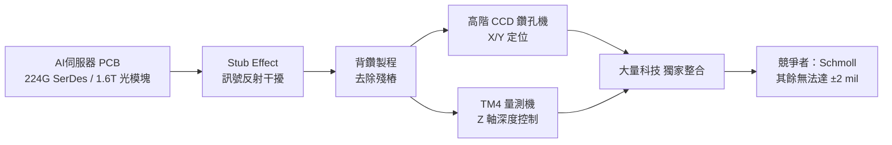

# 3167_大量科技（市）

## 基本資料

成立於 1980 年，總部位於桃園市八德區，前身為大量工業，2000 年更名為大量科技。PCB 設備與 CNC 彫銑機械製造商，兼具半導體產品檢測設備業務。2004 年登錄興櫃，2013 年轉上市。

核心競爭優勢在於**自主開發控制器**：全球能自製 PCB 鑽孔機控制器的廠商，除歐洲、日本外，台灣僅大量，中國同業多依賴外購。高階背鑽領域主要競爭者為德國 Schmoll。

## 核心技術／競爭優勢

- **CCD 高階背鑽機**：整合 CCD 視覺量測與深度控制，機台須先「看」內層漲縮位置建立靶位再鑽孔，解決 PCB 壓合變形造成的鑽偏問題。精度達 ±2 mil，為 NVIDIA Rubin 世代指定規格。
- **TM 系列量測機（TM4）**：Thickness Metrology，透過 z 軸量測內層孔洞深度並即時回饋至背鑽系統。TM4 為四軸新世代，1 台可支援 8 台背鑽機，大幅提升板廠稼動率。CCD 背鑽機 + TM4 量測機捆綁銷售，形成完整精度解決方案。
- **深度控制**：位移精度 D+4（優於業界 D+6），CPK > 1.67，業界唯一能量產殘留銅厚趨近 0 mil 的廠商。多國專利（台灣 I768701、中國 6252475、美國）。
- **半導體設備**：CMP 監控、Step-height 量測、Wafer 邊緣量測、FOPLP 翹曲量測、AOI 等。已切入 TSMC、日月光、力成、京元電子等先進封裝供應鏈。

## 產品與應用

| 產品 / 服務 | 應用 | 單價 / 毛利 |
|-------------|------|------------|
| 一般 CNC 鑽孔機 | PCB 通孔 | 約 TWD 200 萬，毛利 20–30% |
| 高階 CCD 背鑽機 | AI 伺服器、光模塊 PCB 背鑽 | USD 300K+（約 3X 一般機），毛利 50%+ |
| TM4 量測機 | 背鑽深度精度量測 | 捆綁 CCD 銷售 |
| 玻璃邊緣塗佈機（HCoater） | 玻璃基板邊緣處理 | 佔比 5%，毛利優於背鑽 |
| 半導體量測 / AOI | CoWoS / FOPLP 先進封裝 | 百萬至千萬級，毛利 35%+ |

## 圖片 / 架構圖

`[待補來源圖]` 需官方 IR 背鑽機或 CCD 鑽孔設備產品圖佐證；上方為自製背鑽製程流程示意圖。
## 財務摘要

| 年度 | 營收 | 毛利率 | 備註 |
|------|------|--------|------|
| 2024 | ~22.5 億 | — | 庫存去化後反彈 |
| 2025 | 50.77 億 | 39% | 前 11 月累計 45.18 億，年增 >100% |

- 2025H1 EPS：3.01 元；2025/1–7 月累計 EPS：3.81 元
- 2025Q2 EPS：1.99 元，毛利率 38.86%
- 交貨期從 2 個月拉長至 7 個月（2024 年需求爆發）

> [!info] 來源日期
> 財務數據來自 2025Q2 法說會（2025-08-11）及 2025 年 12 月優分析報導，EPS 為前期數據，非 2026 年預測。

## EPS 預估（memo，非官方）

| 指標 | 來源估算（2026-05-24 memo）|
|------|--------------------------|
| 2025E EPS | 較 2024 約 3X（memo 估）|
| 2026E EPS | 較 2025 再 2X（memo 估）|

> [!warning] 注意
> 上述 EPS 倍數估算來自 2026-05-24 社群 memo，非正式券商報告；實際結果需查閱最新財報與法說。

## 產能與訂單

- 月產能約 300 台（2025 年底擴至 300 台，南京廠 2025Q4 投產，目標 +20%）
- 2025 年底在手訂單 > TWD 30 億，訂單能見度延伸至 2026H2
- 高階 CCD 背鑽機台能見度達 2026H1（2025-07 公告）
- TM4 四軸新機型：2026Q1 上海展發表，2026H2 全面放量

## 市場格局

- CCD 背鑽高精度（±2 mil）：大量 + Schmoll（德），中國大族用電測方案精度較弱
- 一般鑽孔機：中國廠月出千台，大量走差異化高階路線
- 光模塊成型機：大量全球市占率最高
- AI 伺服器帶動通孔製程也需 CCD（TAM 大幅擴增，通孔台數 > 背鑽台數）

## 時間軸

| 時間 | 事件 | 類型 | 重要性 |
|------|------|------|--------|
| 2025-05 | TM4 開始出貨 | 放量 | ⭐⭐⭐ |
| 2025Q4 | 南京廠投產，月產能 +20% | 產能 | ⭐⭐ |
| 2026Q1 | TM4 上海展正式發表 | 里程碑 | ⭐⭐ |
| 2026H2 | TM4 全面放量 | 放量 | ⭐⭐⭐ |
| 2027 | TM4 帶動再成長高峰（預估）| 放量 | ⭐⭐⭐ |

## 供應鏈位置

大量科技為 PCB 設備製造商，處於 PCB 設備上游，下游為 PCB 廠（AI 伺服器板、光模塊板）。

- 設備競爭者（PCB 高階）：[[Schmoll（未）]]（德國）
- 半導體設備客戶：[[2330_台積電（市）]]、[[3711_日月光投控（市）]]

## 相關公司

| 公司 | 關係 | 說明 |
|------|------|------|
| [[Schmoll（未）]] | 競爭者 | 高階 CCD 背鑽唯二玩家 |
| [[2330_台積電（市）]] | 半導體設備客戶 | CMP、Step-height、CoWoS 量測 |
| [[3711_日月光投控（市）]] | 半導體設備客戶 | 先進封裝 AOI 量測 |

## 來源
- [[memo_大量科技背鑽CCD_TM4_20260524]]
- 數位時代專訪 2026-01-15
- 鉅亨網法說會報導 2025-08-11
- 富果直送法說備忘錄 2025-08-11 / 2025-12-08
- Dcard 法說整理 2026-03-13

## 相關頁面

- [[技術_PCB]]
- [[技術_背鑽]]
