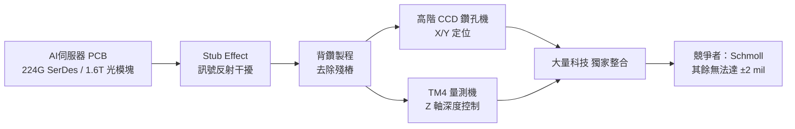

# 3167_大量科技（市）

## 基本資料

成立於 1980 年，總部位於桃園市八德區，前身為大量工業，2000 年更名為大量科技。PCB 設備與 CNC 彫銑機械製造商，兼具半導體產品檢測設備業務。2004 年登錄興櫃，2013 年轉上市。

核心競爭優勢在於**自主開發控制器**：全球能自製 PCB 鑽孔機控制器的廠商，除歐洲、日本外，台灣僅大量，中國同業多依賴外購。高階背鑽領域主要競爭者為德國 Schmoll。

## 核心技術／競爭優勢

- **CCD 高階背鑽機**：整合 CCD 視覺量測與深度控制，機台須先「看」內層漲縮位置建立靶位再鑽孔，解決 PCB 壓合變形造成的鑽偏問題。精度達 ±2 mil，為 NVIDIA Rubin 世代指定規格。
- **TM 系列量測機（TM4）**：Thickness Metrology，透過 z 軸量測內層孔洞深度並即時回饋至背鑽系統。TM4 為四軸新世代，1 台可支援 8 台背鑽機，大幅提升板廠稼動率。CCD 背鑽機 + TM4 量測機捆綁銷售，形成完整精度解決方案。
- **深度控制**：位移精度 D+4（優於業界 D+6），CPK > 1.67，業界唯一能量產殘留銅厚趨近 0 mil 的廠商。多國專利（台灣 I768701、中國 6252475、美國）。
- **半導體設備**：CMP 監控、Step-height 量測、Wafer 邊緣量測、FOPLP 翹曲量測、AOI 等。已切入 TSMC、日月光、力成、京元電子等先進封裝供應鏈。

## 產品與應用

| 產品 / 服務 | 應用 | 單價 / 毛利 |
|-------------|------|------------|
| 一般 CNC 鑽孔機 | PCB 通孔 | 約 TWD 200 萬，毛利 20–30% |
| 高階 CCD 背鑽機 | AI 伺服器、光模塊 PCB 背鑽 | USD 300K+（約 3X 一般機），毛利 50%+ |
| TM4 量測機 | 背鑽深度精度量測 | 捆綁 CCD 銷售 |
| 玻璃邊緣塗佈機（HCoater） | 玻璃基板邊緣處理 | 佔比 5%，毛利優於背鑽 |
| 半導體量測 / AOI | CoWoS / FOPLP 先進封裝 | 百萬至千萬級，毛利 35%+ |

## 圖片 / 架構圖

```mermaid
flowchart LR
    A[AI伺服器 PCB\n224G SerDes / 1.6T 光模塊] --> B[Stub Effect\n訊號反射干擾]
    B --> C[背鑽製程\n去除殘樁]
    C --> D[高階 CCD 鑽孔機\nX/Y 定位]
    C --> E[TM4 量測機\nZ 軸深度控制]
    D --> F[大量科技 獨家整合]
    E --> F
    F --> G[競爭者：Schmoll\n其餘無法達 ±2 mil]
```

![[報告_統一_大量_20260922_003.png]]

圖說：統一投顧估 25–28 年在 Rack 數、PCB 面積、板層數、機鑽孔數、鑽孔時間與背鑽滲透率同步提升下，背鑽需求倍數成長，機鑽設備成為板廠擴產瓶頸；即使 26 年背鑽供應商滿載擴產，到 28 年仍將出現數倍缺口。（來源：[[報告_統一_大量_20260922]]，2026-09-22）

## EPS 記錄

| 年度 | 營收 | 毛利率 | 備註 |
|------|------|--------|------|
| 2024 | ~22.5 億 | — | 庫存去化後反彈 |
| 2025 | 50.77 億 | 39% | 前 11 月累計 45.18 億，年增 >100% |

- 2025H1 EPS：3.01 元；2025/1–7 月累計 EPS：3.81 元
- 2025Q2 EPS：1.99 元，毛利率 38.86%
- 交貨期從 2 個月拉長至 7 個月（2024 年需求爆發）

> [!info] 來源日期
> 財務數據來自 2025Q2 法說會（2025-08-11）及 2025 年 12 月優分析報導，EPS 為前期數據，非 2026 年預測。

## EPS 預估

| 年度 | 統一投顧 EPS（報告日：2026-09-22） | 備註 |
|------|------------------------------------|------|
| 2025E | 8.11 | 統一整理 |
| 2026E | 28.24 | 高階設備出貨上修至 ~1,400 台；營收 125 億（+146% YoY） |
| 2027E | 70.04 | 出貨上修至 ~2,400 台；營收 229 億（+83% YoY） |

> 統一 2026-09-22 大幅上修：26-27 高階設備出貨由原估 1,000–1,500 台 → 1,400–2,400 台；EPS 由原估 27／43 元 → 28／70 元；2Q26 單季 EPS 6.10（優於預期）。
> [!note] 早期社群 memo（2026-05-24）以倍數估算 2025/2026E EPS，已由統一投顧正式報告取代。

## 目標價與評等

| 券商 | 報告發布日 | 評等 | 目標價 | 評價基礎 | 來源 |
|------|------------|------|--------|----------|------|
| 統一投顧 | 2026-09-22 | 強力買進（維持） | NT$1,540（原 NT$1,220） | 22x 2027E EPS 70.04 | [[報告_統一_大量_20260922]] |

## 產能與訂單

- 月產能約 300 台（2025 年底擴至 300 台，南京廠 2025Q4 投產，目標 +20%）
- 2025 年底在手訂單 > TWD 30 億，訂單能見度延伸至 2026H2
- 高階 CCD 背鑽機台能見度達 2026H1（2025-07 公告）
- TM4 四軸新機型：2026Q1 上海展發表，2026H2 全面放量

## 市場格局

- CCD 背鑽高精度（±2 mil）：大量 + Schmoll（德），中國大族用電測方案精度較弱
- 一般鑽孔機：中國廠月出千台，大量走差異化高階路線
- 光模塊成型機：大量全球市占率最高
- AI 伺服器帶動通孔製程也需 CCD（TAM 大幅擴增，通孔台數 > 背鑽台數）

## 時間軸

| 時間 | 事件 | 類型 | 重要性 |
|------|------|------|--------|
| 2025-05 | TM4 開始出貨 | 放量 | ⭐⭐⭐ |
| 2025Q4 | 南京廠投產，月產能 +20% | 產能 | ⭐⭐ |
| 2026Q1 | TM4 上海展正式發表 | 里程碑 | ⭐⭐ |
| 2026H2 | TM4 全面放量 | 放量 | ⭐⭐⭐ |
| 2026Q2 | 2Q26 EPS 6.10（優於預期），淨利率由 4 月 21% 升至 6 月 33% | 財報 | ⭐⭐⭐ |
| 2026 | 總月產能達 ~400 台滿載（200 高階背鑽 + 200 標準 + 50 外包），全年出貨估 >1,000 台 | 產能 | ⭐⭐⭐ |
| 2026H2 | TM4 四軸機出貨，拉貨比由 8:1 提升至 5:1（背鑽:TM4） | 放量 | ⭐⭐⭐ |
| 2026-08-01 | 半導體事業分割為 100% 子公司「大量先進智能」，為上市櫃預作準備 | 公司事件 | ⭐⭐ |
| 2027 | 高階設備出貨估 >2,000 台；外包產能由 80 擴至最高 150 台 | 放量 | ⭐⭐⭐ |
| 2027Q1 | CPO Inspection Sorting Machine 有望出現明確訂單 | 驗證 | ⭐⭐ |
| 2027 | TM4 帶動再成長高峰（預估）| 放量 | ⭐⭐⭐ |

## 供應鏈位置

大量科技為 PCB 設備製造商，處於 PCB 設備上游，下游為 PCB 廠（AI 伺服器板、光模塊板）。

- 設備競爭者（PCB 高階）：Schmoll（未）（德國）
- 半導體設備客戶：[[2330_台積電（市）]]、[[3711_日月光投控（市）]]

## 相關公司

| 公司 | 關係 | 說明 |
|------|------|------|
| Schmoll（未） | 競爭者 | 高階 CCD 背鑽唯二玩家 |
| [[2330_台積電（市）]] | 半導體設備客戶 | CMP、Step-height、CoWoS 量測 |
| [[3711_日月光投控（市）]] | 半導體設備客戶 | 先進封裝 AOI 量測 |

## 來源
- [[memo_大量科技背鑽CCD_TM4_20260524]]
- 數位時代專訪 2026-01-15
- 鉅亨網法說會報導 2025-08-11
- 富果直送法說備忘錄 2025-08-11 / 2025-12-08
- Dcard 法說整理 2026-03-13

- [[memo_大量聯鈞_2Q26法說_20260818]]（2026-08-18）

## 相關頁面

- [[供應鏈_AI伺服器PCB]]
- [[技術_背鑽]]
- [[技術_PCB]]
- [[分析_大量與聯鈞_2Q26法說_20260818]]
- [[技術_CPO]]
- [[時程_2026Q3Q4_AI網通與硬體催化劑]]
- [[時程_2026記憶體與AI催化劑]]
- [[技術_背鑽]]

### 2026-08-18 2Q26 法說整理

- 使用者轉述月產能由 300 台提升至 400 台，高階與標準設備各 200 台，4Q26 另可能外包 50 台標準型；屬公司展望，待法說原始資料核對。
- 高階 CCD 成型／鑽孔設備開始切入 CPO 與 1.6T 光模組市場；TM4 每台可能帶動 5–6 台高階鑽孔機，延伸既有 224G SerDes 背鑽需求。
- 高階 CCD ASP 約為標準型 2 倍、TM4 超過 3 倍，2026 高階產品占比目標 60%；設備 mix 比單純台數更值得追蹤。
- 半導體設備業務規劃申請上櫃，長期營收占比約 5–8%；屬公司規劃，非已完成掛牌。

來源：[[memo_大量聯鈞_2Q26法說_20260818]]（使用者提供法說整理，2026-08-18）。

### 2026-09-22 統一：機鑽與量測需求提升，產能滿載

- 統一維持強力買進、目標價由 NT$1,220 上修至 NT$1,540（22x 2027E EPS 70.04）；2Q26 營收 28.6 億（+47% QoQ、+125% YoY）、毛利率 44.2%、EPS 6.10（皆優於預期），淨利率由 4 月 21% 升至 6 月 33%。
- **結構性擴張（統一供應鏈觀察）**：25–27 年 NV AI Server 機櫃出貨由 2.5 萬櫃 → 8 萬櫃（CAGR +79%），PCB 由 GB300 22–24 層 → VR 26–44 層 → Rubin Ultra 26–78 層；SerDes 由 112G→224G，殘銅精度要求由 ±3mil→±2mil，推升 CCD 背鑽與 TM 量測滲透率。
- **TM 量測護城河**：TM 只能與大量高階背鑽機搭配，同業無法兼容；拉貨比由 8:1 提升至 5:1（背鑽:TM4），並反向提升高階背鑽市占。合約負債由 25 年底 7.5 億升至 2Q26 15 億，在手訂單估 >75 億（超過 25 年全年營收）。
- **產能與半導體**：總月產能 ~400 台滿載（200 高階 + 200 標準 + 50 外包），2026 出貨估 >1,000 台、2027 >2,000 台；半導體事業（CoWoS/FOPLP/SoIC/CPO 量測）2026-08-01 分割為子公司「大量先進智能」，26-27 翻倍成長、營收占比 5–10%。
- 上修後預估 26/27 年營收 125／229 億（+146%／+83% YoY）、EPS 28／70 元。來源：[[報告_統一_大量_20260922]]（統一投顧，2026-09-22；信心中）。

## 來源（券商報告）

- [[報告_統一_大量_20260922]]（統一投顧，2026-09-22；強力買進、TP NT$1,540、機鑽結構性擴張、TM4、半導體切入、EPS 28/70）
