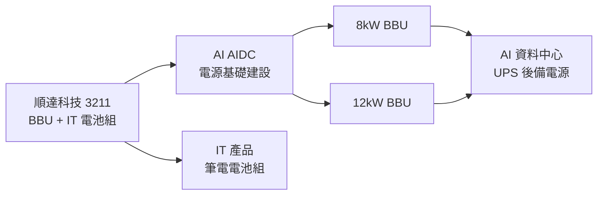

# 3211_順達科技（櫃）

## 基本資料

順達科技（Dynapack International，3211.TWO）是全球主要 **BBU（Battery Backup Unit，電池備援模組）** 供應商，核心業務為 AI 資料中心電源基礎設施。公司同時生產 IT 產品（筆電電池組），但 BBU 業務為主要成長引擎。

主要資料來源：[[報告_Citi_順達3211_2Q26_20260719]]（Citi Research，2026-07-19）。
補充來源：[[報告_Citi_順達3211_20260720]]（Citi Research，2026-07-20）。

## 核心技術／競爭優勢

- **BBU pack 與 BMS 整合**：負責電池 pack、BMS、熱設計、安全保護與 rack 電源系統通訊，並非單純組裝。
- **PSU 夥伴模式**：透過電源廠整合 power shelf、DC/DC converter 與 BBU，間接接觸多家 CSP；公司明確表示不與電源客戶競爭終端訂單。
- **高功率與高壓路線**：量產規格由 3／5.5kW 升至 8／12kW，並開發 400V／800V HVDC；公司 2025-07 表示最晚 2027 年進入高壓產品量產。
- **台灣／泰國雙基地**：Non-IT 產品以台灣與泰國生產，降低單一地區風險並配合歐美客戶需求。

## 產品與應用

| 產品 / 服務 | 應用 | 相關客戶 / 下游 |
|---|---|---|
| 3／5.5／8／12kW BBU pack | AI rack、power rack 短時備援 | PSU 系統整合商、[[2308_台達電（市）]] |
| 400V／800V HVDC BBU | sidecar／高壓 DC bus 備援 | [[技術_800VDC供電架構]] |
| IT 電池組 | 筆電、平板 | 國際品牌廠 |
| ESS／LEV 電池模組 | 商用儲能、輕型載具 | 歐美客戶 |

## 圖解

![[報告_Citi_順達3211_2Q26_20260719_001.png]]
*圖（Citi Research，2026-07-19）：2Q26 財報與 Citi/Bloomberg 預估對比——EPS NT$1.35 較 Citi 估 NT$2.37 / Bloomberg 一致估 NT$2.90 均大幅未達，主因 IT 業務占比偏高與 BBU 出貨延後。*

![[報告_Citi_順達AIDC_BBU成長週期_20260707_015.png]]

*圖（Citi Research，2026-07-07）：BBU 供應鏈分為電芯、模組與 PSU／電源系統整合三層；順達位於中游模組層，透過 PSU 夥伴接觸 CSP。*

## 核心業務

### BBU（Battery Backup Unit）
BBU 為 AI 資料中心的電源後備模組，在主電源中斷時提供緊急供電，保護 GPU Cluster 運算連續性。順達的 BBU 正從傳統規格升級至 **8kW 和 12kW 高功率版本**，以配合 AI 資料中心單機架用電持續攀升的趨勢。

- 結構性成長驅動：AI 資料中心佈建加速 + BBU 滲透率提升 + 高功率產品漲價
- 業務特點：產品客製化程度高，安全規格嚴格，競爭相對溫和
- Citi 估每 rack BBU content 由 GB300 NVL72 的 US$15–16k，升至 Rubin 的 US$17–18k、Rubin Ultra 的 US$33–34k（estimate，2026-07-07，信心：中）。
- Citi 估 BBU 滲透率由 2025 年 40–45%、2026 年 60–65% 升至 2027 年逾 85%（estimate，信心：中）；實際採用仍取決於 CSP 架構。

### 2Q26 業績（含季度分析）

- **營收**：NT$3.5bn（+7% YoY），符合預期
- **EPS**：NT$1.35（低於 Citi 估 NT$2.37 / Bloomberg 一致估 NT$2.90）
- **OPM**：6.5%（低於預期）
- **Miss 原因**：
  1. IT 產品佔比偏高（毛利率結構低），拉低整體利潤率
  2. 部分 BBU 出貨延至 Q3（時間性差異，非需求問題）

Citi 將 2Q26 視為「最後一個負面季度」，預期 3Q26 BBU 回升帶動盈利大幅反彈。

## 券商觀點

### Citi Research — Buy，TP NT$800（2026-07-19）

- **評等**：Buy，目標價 NT$800（+107.5% upside，基準價 NT$385.50）
- **估值**：32× 2027E EPS NT$25；選用 2027E 反映 BBU 產能擴充後真實獲利能力
- **PEG**：0.5×（EPS CAGR 66%，2025-2027E）
- **風險評級**：Citi 量化模型 High Risk，但分析師認為評定過嚴（強勁成長 + 淨現金 + 行業障礙）

## EPS 記錄

| 年度 | 淨利（NT$M） | EPS（NT$） | EPS 成長 | P/E | ROE |
|------|-----------|-----------|---------|-----|-----|
| 2024A | 2,673 | 17.59 | +236% | 21.9× | 28.0% |
| 2025A | 1,382 | 9.05 | -49% | 42.6× | 13.4% |
| 2026E | 2,293 | **15.00** | +66% | 25.7× | 24.4% |
| 2027E | 3,822 | **25.00** | +67% | 15.4× | 41.4% |
| 2028E | 5,710 | **37.35** | +49% | 10.3× | 56.1% |

市值：NT$59,485M（US$1,862M）（2026-07-17 收盤）

| 季度 / 年度 | EPS（元） | YoY | 備註 |
|---|---:|---:|---|
| 2024A | 17.59 | +236% | 本業約 5.08 元，含不動產處分等業外收益 |
| 2025A | 9.05 | -49% | IT 衰退、業外基期下降 |
| 2026Q2 | 1.35 | — | IT mix 偏高、部分 BBU 延至 Q3 |

## EPS 預估

| 年度 | Citi EPS（報告日：2026-07-07／07-19） | 備註 |
|---|---:|---|
| 2026E | 15.00 | 報告間未調整；2Q miss 視為時點差 |
| 2027E | 25.00 | BBU 擴產後獲利基礎 |
| 2028E | 37.35 | BBU mix 與營運槓桿 |

## 目標價與評等

| 券商 | 報告發布日 | 評等 | 目標價 | 評價基礎 | 來源 |
|---|---|---|---:|---|---|
| Citi | 2026-07-07 | Buy | NT$800 | 32× 2027E EPS 25 元 | [[報告_Citi_順達AIDC_BBU成長週期_20260707]] |
| Citi | 2026-07-19 | Buy | NT$800 | 2Q miss 後維持估值 | [[報告_Citi_順達3211_2Q26_20260719]] |
| Citi | 2026-07-20 | Buy | NT$800 | 3Q BBU 回補、2027E EPS 25 元 | [[報告_Citi_順達3211_20260720]] |

## 催化劑 / 關鍵指標

- 3Q26 BBU 出貨量恢復（回補 2Q 延遲）
- 8kW / 12kW 高功率 BBU 新客戶認證進展
- BBU 在 AI AIDC capex 的滲透率軌跡
- IT 業務佔比趨勢（高→低為正面）

## 時間軸

| 時間 | 事件 | 類型 | 重要性 | 備註 |
|---|---|---|---|---|
| 2026Q3 | 2Q 延後 BBU 出貨回補 | 放量 | ⭐⭐⭐ | Citi 預期營收與毛利率明顯回升 |
| 2026H2 | 8kW BBU 放量、新客戶認證 | 規格升級 | ⭐⭐⭐ | 來源含 2025-07 公司電話會議 |
| 2026–2027 | 400V／800V HVDC BBU 量產窗口 | 技術下線 | ⭐⭐⭐ | 公司表示 2027 年最晚；仍待客戶 qualification |
| 2027 | Power shelf 與高功率 BBU 放量 | 放量 | ⭐⭐ | 連結 [[時程_2026記憶體與AI催化劑]] |

## 風險與注意事項

1. BBU 在 AIDC 採用速度低於預期
2. 電源模組（PSU）新客戶認證延遲
3. 大型電池廠或電源廠商競爭進入
4. 安全認證與可靠性問題

## 相關公司

| 公司 | 關係 | 說明 |
|------|------|------|
| [[2308_台達電（市）]] | 間接競爭／同業 | PSU + 電源模組大廠 |
| [[6781_AES-KY（市）]] | BBU 同業 | Citi 以 AES 毛利率改善作為順達獲利改善的 read-across |

## 供應鏈位置

- 上游：日本／韓國高功率圓柱電芯供應商。
- 中游：順達負責 BBU pack、BMS、熱與安全設計。
- 下游：PSU／power shelf 系統商整合後交付 CSP；詳見 [[技術_800VDC供電架構]]。
- 所屬主線：[[供應鏈_AI伺服器散熱]]（同一 rack 基礎設施投資週期；電源與散熱並行）。

## 來源

- [[活動_順達法說_20250305]]（順達法說，2025-03-05；產品組合、BBU 客戶模式、股利與產能）
- [[活動_順達2Q25電話會議_20250725]]（順達電話會議，2025-07-25；5.5／8kW、400／800V HVDC 與台泰產能）
- [[報告_Citi_順達AIDC_BBU成長週期_20260707]]（Citi Research，2026-07-07；BBU 滲透率、content、EPS 與首次覆蓋）
- [[報告_Citi_順達3211_2Q26_20260719]]（Citi Research，Buy TP NT$800，2026-07-19）
- [[報告_Citi_順達3211_20260720]]（Citi Research，Buy TP NT$800，2026-07-20）
- [[260729_citi_dynapack]]（Citi Research，2Q26 call takeaways，2026-07-29）
- [[260805_citi_dynapack]]（Citi Research，7 月 BBU 銷售，2026-08-05）

- [[260827_citi_dynapack]]（Citi Research，2026-08-27）：預估 8 月 BBU 銷售 NT$800–900 百萬元、月增約 50%，集團營收 NT$15.5–16.0 億元；8kW／12kW BBU 可能提前至 4Q26 初出貨。Buy、目標價 NT$800、90D Catalyst Watch Upside（estimate，信心：中）。

## 相關頁面

- [[分析_AI資料中心供電與電熱整合]]
- [[時程_2026能源與AI電力設備]]
- [[技術_800VDC供電架構]]
- [[供應鏈_AI伺服器散熱]]

### 2026-08 BBU 更新

- Citi 2026-07-29 指出，BBU pull-in 於 7 月中恢復，3Q／4Q 預期逐季成長；4Q26 將開始出貨 8kW／12kW BBU，另有一個 CSP 客戶預計開始出貨，屬管理層展望，信心：中。
- Citi 2026-08-05 估計 7 月 BBU 銷售約 NT$600M，約為 6 月三倍；此為券商估計，非公司單獨揭露數字。2026E capex 上調至 NT$1bn，BBU 產能利用率 2027 年目標 80%。
- 需追蹤 2027 年 25kW BBU、HVDC BBU 客戶驗證，以及台灣／泰國擴產是否帶來利用率與毛利率同步提升。

- Citi 最新供應鏈查核將 8kW／12kW 首批出貨由 4Q26 後段提前至 4Q26 初，形成第二段成長催化劑；仍須以公司公告與實際出貨驗證。
