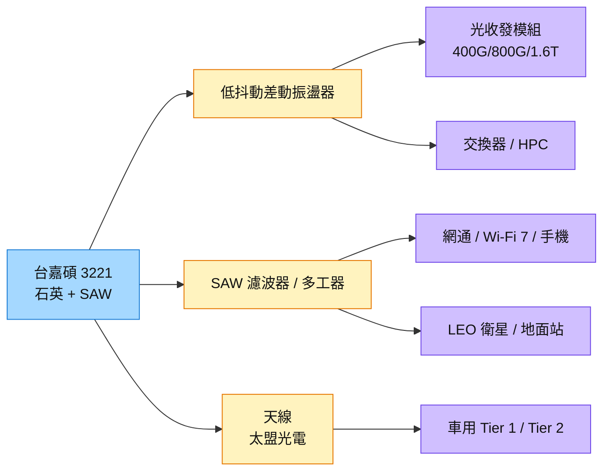

# 3221_台嘉碩（櫃）

## 基本資料

台嘉碩（TAI-SAW）以石英與 SAW（表面聲波）技術生產頻率元件、濾波器、雙工器／多工器與天線，應用涵蓋網通、車用、手機／手持 IoT、低軌衛星（LEO）、國防與醫療感測。2Q26 營收 6.59 億元（QoQ +20.6%、YoY +18.1%），毛利率約 26%；1H26 營收 12.06 億元、EPS 0.82 元。

2Q26 應用組合為網通 38%、車用 28%、手機及手持 IoT 19%、其他 14%；網通占比上升主要來自 AI、Wi-Fi 7 與 LEO 衛星網路。成長驅動為三條線：

- **AI／光通訊低抖動頻率元件：** 156.25MHz、312.5MHz 差動振盪器已出貨，625MHz 送樣驗證；400G／800G 為主力，1.6T 已進入客戶測試與 IC 端設計導入。光通訊目前約占營收 5%，明年 AI 資料傳輸占比估 5%–10%。
- **LEO 衛星與地面站：** 目前占營收不到 10%，客戶預估 3Q26、4Q26 逐步提升，2027 年進入放量，目標 LEO 占比 10%–15%。
- **國防與無人載具：** 國防占比約 5%–7%，產品為客製化天線、濾波器及高階振盪器。

資料來源：[[活動_台嘉碩3221_CallMemo_20260806]]（國泰證期 Call Memo，2026-08-06）

## 核心技術／競爭優勢

- **石英＋SAW 自有技術：** 公司認為在 625MHz 以上低抖動、低相位雜訊差動振盪器上，自有石英與 SAW 技術在效能與成本上具競爭力；對手為 SiTime（MEMS，IC 整合優勢）與 Epson（石英方案領先）。
- **品項廣、客戶黏著度高：** 產品近一萬項、客戶逾千家，台灣同類濾波器廠不多；客戶多支付 NRE 委託設計，報價調整容易被接受。
- **整合銷售：** 子公司太盟光電天線已導入部分車用 Tier 1／Tier 2，未來將濾波器、天線與前端設計綁定銷售。
- **雙供應鏈：** 因應 China+1 與去耦合要求，無錫廠支援中國需求，菲律賓等非中國、非台灣產地供應其他市場。

## 產品與應用

| 產品 / 服務 | 應用 | 相關客戶 / 下游 |
|-------------|------|-----------------|
| 低抖動差動振盪器（156.25／312.5／625MHz） | 400G／800G／1.6T 光收發模組、交換器、HPC | 台灣與中國光模組廠；已取得約 5–6 家 IC、伺服器與 ASIC 客戶認證 |
| SAW 濾波器、雙工器、多工器 | 網通、Wi-Fi 7、手機 | 網通與手機客戶 |
| 衛星濾波器、天線 | LEO 衛星、地面站、NTN 基地台 | 衛星發射、衛星設備與地面站客戶（NDA） |
| 車用頻率元件與天線 | T-Box、ADAS、TPMS、導航、充電樁 | 車用 Tier 1／Tier 2 |
| 國防客製化元件 | 無人載具、國防通訊 | 各國國防供應鏈 |

## 圖片 / 架構圖

圖說：台嘉碩由石英與 SAW 兩條技術平台，分別切入光通訊時脈（差動振盪器）與射頻前端（濾波器／天線）；AI 光通訊與 LEO 是 2026–2027 年的兩個新增量。

## EPS 記錄

| 期間 | EPS (元) | 備註 |
|------|---------|------|
| 1H26 | 0.82 | 毛利率 24.05%（YoY +4.09ppt），營益率 6.47% |

## 時間軸

| 時間 | 事件 | 類型 | 重要性 | 備註 |
|------|------|------|--------|------|
| 3Q26 | 營收預期優於 2Q26；625MHz 差動振盪器客戶驗證 | 營運 | ⭐⭐ | [[活動_台嘉碩3221_CallMemo_20260806]] |
| 3Q26–4Q26 | LEO 營收占比逐步提升 | 放量 | ⭐⭐ | 依客戶預測 |
| 2027 | LEO 進入放量年，目標占比 10%–15% | 放量 | ⭐⭐⭐ | 公司說法 |
| 2027 | 1.6T 光模組時脈元件導入量產 | 規格升級 | ⭐⭐ | 1.6T 需更低抖動差動振盪器 |

→ 跨公司時程詳見 [[時程_2026-2027高速互連與分散式算力]]

## 供應鏈位置

- 上游：晶圓、鉭、LTCC 材料（2Q、3Q26 已適度調漲售價反映成本）
- 下游：光收發模組廠、交換器與伺服器 IC 客戶、車用 Tier 1、衛星與國防客戶
- 所屬供應鏈：[[供應鏈_AI光互聯]]（光模組時脈元件）
- 技術背景：[[技術_光模塊]]

## 相關公司

| 公司 | 關係 | 說明 |
|------|------|------|
| [[3042_晶技（市）]] | 同業 / 競爭 | 同為石英頻率元件廠，光模組 156.25／312.5MHz 差動振盪器直接競爭 |

## 風險與注意事項

> [!warning] 風險與注意事項
> - **消費性需求疲弱：** 手機與 IoT 占比仍近兩成，受消費需求影響。
> - **光通訊占比仍低：** 光通訊目前約 5%，1.6T 認證時程與 625MHz 規格落地速度影響成長幅度。
> - **競爭：** SiTime MEMS 方案在 IC 整合與可程式化上有優勢，Epson 在石英高階方案領先。
> - **材料成本：** 晶圓、鉭、LTCC 持續漲價，轉嫁幅度因應用而異。

## 來源

- [[活動_台嘉碩3221_CallMemo_20260806]] — 國泰證期 Call Memo，2026-08-06
