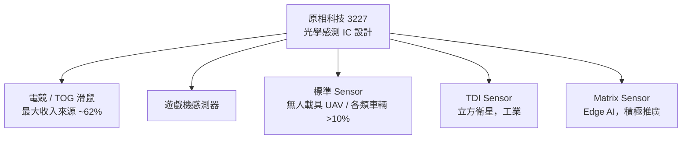

# 3227_原相科技（市）

## 基本資料

原相科技（3227 TT，PixArt Imaging）是台灣 IC 設計公司，核心產品為光學感測晶片（Optical Finger Navigation Sensor）。主要應用涵蓋電競滑鼠、TOG（雙面光學感測）滑鼠、遊戲機感測器、標準 Sensor（含無人載具 / UAV）、衛星用 TDI Sensor、Edge AI Matrix Sensor。

主要資料來源：[[活動_原相科技3227_Memo_20260811]]（法人/通路 Call Memo，2026-08-11）。

## 圖解

## 產品線

| 產品 | 應用 | 2Q26 占比 | 趨勢 |
|------|------|----------|------|
| 電競滑鼠 Sensor | Gaming mice | ~62%（含 TOG） | 結構優化，ASP 提升 |
| TOG 滑鼠 | 進階雙面感測 | 含上述 | 佔比持續升高 |
| 遊戲機 Sensor | Console | — | 2Q26 成長較快 |
| 標準 Sensor（無人載具） | UAV / 各類車輛 | >10%（穩定） | 毛利率低於公司平均 |
| TDI Sensor | 立方衛星、工業 | 低 | 2Q26 起小量出貨 |
| Matrix Sensor | Edge AI | 初期 | 積極推廣中 |

## 2Q26 財務結果

| 指標 | 數值 | QoQ | YoY |
|------|------|-----|-----|
| 營收 | NT$25.38 億 | +14.9% | +11.3% |
| 稅後淨利 | NT$5.10 億 | +30.8% | — |
| EPS | NT$3.36 | — | — |
| 毛利率 | 58.2% | -1.3ppt | — |
| 現金 | NT$69.42 億 | — | — |
| 股東權益 | NT$151.62 億 | — | — |

**毛利率下滑原因**：標準 Sensor 佔比提升（毛利率低於公司平均）＋晶圓/封裝成本上升。
**YoY 淨利大增原因**：去年同期因台幣急升產生約 NT$2.5B 兌換損失，基期偏低。

## 3Q26 展望

- 電競需求維持強勁
- 標準 Sensor 受無人載具帶動持續成長
- 一般滑鼠及遊戲機略轉弱
- 整體營收預估與 2Q26 相當
- 毛利率及營業淨利率預計持平

## 券商預估與評等

| 券商 | 報告發布日 | 評等 | 目標價 | 2026E EPS | 2027E EPS | 來源 |
|------|------------|------|--------|-----------|-----------|------|
| 中信投顧 | 2026-09-02 | 中立 | NT$206 | NT$11.80 | NT$12.86 | [[報告_CTBC_原相_20260902]] |

> 上列 EPS 與目標價均為券商 estimate／valuation；中信將目標價由 NT$248 下調至 NT$206，理由包含 3Q26 展望平穩與 Edge AI 產品貢獻仍有限。

## 成本壓力與因應

- 晶圓廠產能吃緊，原材料及貴金屬價格上漲推升封裝成本
- 因應方式：1、2 吋晶圓布局分散 + 排程效率提升 + 尋找替代供應源
- 正依產品別與客戶協商成本轉嫁

## 關鍵觀察

| 項目 | 觀察點 |
|------|--------|
| 標準 Sensor 獨立接單 | 若銷售規模穩定達一定水準將評估獨立接單 |
| TDI Sensor | 2Q26 起小量出貨予立方衛星客戶；看好工業應用 |
| Edge AI Matrix Sensor | 積極推廣中，變現時程待觀察 |
| 車用 Sensor | 除標準 Sensor 小量外，OFM / Gesture 已用於車艙，佔比仍低 |
| 庫藏股 | 目前無計劃，但持續關注股價 |

## 供應鏈位置

- **製程節點**：1µm / 2µm 節點晶圓（光學感測器用成熟製程）
- **主要晶圓廠**：未公開（成熟製程，台灣廠為主）
- **封裝**：委外

## 來源

- [[活動_原相科技3227_Memo_20260811]] — 法人/通路 Call Memo，2026-08-11
- [[報告_CTBC_原相_20260902]] — 中信投顧，2026-09-02

## 相關頁面

- 供應鏈_無人載具
- 技術_Edge AI感測
