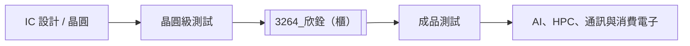

# 3264_欣銓（櫃）

## 基本資料

欣銓（Ardentec）是台灣半導體測試服務商，涵蓋晶圓級測試、成品測試與高階邏輯／記憶體測試，服務 AI、HPC、通訊與消費性半導體客戶。CTBC 2026-07-27 報告指出，2Q26 營收約 45.3 億元、毛利率 40.2%，並關注湖口新廠擴產。

## 核心技術／競爭優勢

- 晶圓級測試與成品測試整合，能支援多階段測試流程。
- AI／HPC 測試需求提高測試時間與設備內容值，推升高階測試的價值量。
- 湖口新廠與無塵室擴建提供後續產能，惟量產節奏仍取決於客戶導入。

## 產品與應用

| 產品 / 服務 | 應用 | 相關客戶 / 下游 |
|---|---|---|
| 晶圓級測試 | AI、HPC、邏輯晶片 | IC 設計公司 |
| 成品測試 | 先進封裝後測試 | 半導體製造與系統供應鏈 |
| Micro-LED 測試布局 | 顯示與新型光電元件 | 報告未具名 |

## 圖片 / 架構圖

## EPS 預估

| 年度 | CTBC EPS（報告日：2026-07-27） | 備註 |
|---|---:|---|
| 2026E | 9.8 元 | estimate |
| 2027E | 14.0 元 | estimate；新廠與高階測試需求 |

## 目標價與評等

| 券商 | 報告發布日 | 評等 | 目標價 | 評價基礎 | 來源 |
|---|---|---|---:|---|---|
| 中信 | 2026-07-27 | 買進 | NT$350 | 25x 2027E EPS | [[欣銓(3264,B_買進)-CTBC260727]] |

## 時間軸

| 時間 | 事件 | 類型 | 重要性 | 備註 |
|---|---|---|---|---|
| 2026Q3 | 湖口新廠一期擴充與晶圓客戶營收觀察 | 放量 | ⭐⭐⭐ | 券商 estimate |
| 2027 | 新廠產能與矽光子客戶合作深化 | 驗證 / 放量 | ⭐⭐ | 客戶導入仍有不確定性 |

## 供應鏈位置

- 上游：晶圓與 IC 設計供應鏈。
- 下游：AI、HPC、通訊與消費電子晶片客戶。
- 所屬環節：晶圓級測試、成品測試。

## 相關公司

目前來源未具名揭露可確定建立 wikilink 的客戶或供應商，`related_companies` 維持空白。

> [!warning] 風險與注意事項
> - 高階測試需求若遞延，新廠折舊可能先行壓縮毛利率。
> - 客戶集中與 AI／HPC 需求波動會影響產能利用率。

## 來源

- [[欣銓(3264,B_買進)-CTBC260727]]（中信，2026-07-27）

## 相關頁面

- [[時程_2026記憶體與AI催化劑]]
