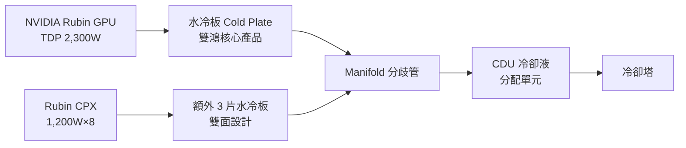

# 3324_雙鴻（市）

## 基本資料

雙鴻科技（3324 TT）成立於 1998 年，是台灣前二大筆電散熱模組廠，近年積極轉型為 AI 伺服器液冷解決方案供應商。主要產品：散熱器/散熱模組（NB/DT/VGA/Server）、水冷板（Cold Plate）、Manifold（分歧管）、CDU（冷卻液分配單元）、VC Lid。

2Q25 產品組合：Server 45%（液冷 23% + 氣冷 22%）、NB 31%、VGA 21%、Others 3%。

成長驅動：GB300/Vera Rubin AI 伺服器水冷板需求增加（Rubin CPX 全水冷）、每機櫃水冷用量提升（QD 從 6+2 增至 10+2）、泰國二廠 2026H1 開出。

主要客戶品牌：Apple、Dell、Samsung、HP、宏碁、華碩、聯想；代工廠：廣達、仁寶、[[3231_緯創（市）]]、英業達。

資料來源：[[報告_中信_雙鴻3324_20250917]]（2025-09-17，中信投顧，鄭子凡）

## 核心技術 / 競爭優勢

- **水冷板技術規模**：月產能約 30 萬片水冷板，Rack Manifold 4,000 套；泰國廠為非中國產能，符合地緣政治分散需求
- **液冷比重快速提升**：從 4Q24 低點 8% 回升至 2Q25 的 23%，3Q25 望升至 34%，4Q25 逼近 40%
- **VC Lid + MCL 技術佈局**：VC Lid 送樣中；MCL 1H25 開始研發；中期 MCL 若採用可推升 ASP，但目前水冷板仍為主力
- **CDU 自製**：台灣廠專責生產 CDU，月產能 500–1,000 台，隨新案導入成長
- **QD 自設計**：GB300 QD 由雙鴻自行設計、委外生產，強化系統整合能力

## 產品與應用

| 產品 / 服務 | 應用 | 相關客戶 / 下游 |
|-------------|------|-----------------|
| AI 伺服器水冷板（Compute/Switch Tray） | GB300/Rubin GPU 伺服器液冷 | ODM 廠（廣達/仁寶/[[3231_緯創（市）]]/英業達）|
| Rubin CPX 水冷板（3片額外，雙面散熱） | AI 推理加速器液冷 | [[NVDA.US(nvidia)]] 生態系 |
| CDU（冷卻液分配單元） | 機架級液冷系統 | 資料中心建設商 |
| NB / DT 散熱模組 | 筆電/桌電散熱 | Apple、Dell、Samsung 等 |
| VC Lid | GPU 均熱蓋板（Rubin 世代） | [[NVDA.US(nvidia)]] 封裝供應鏈 |

## 圖片 / 架構圖

`[待補來源圖]` 需官方 IR 或型錄熱管散熱模組產品實拍佐證；上方為自製散熱架構示意圖。

> Rubin CPX 架構讓水冷板用量從 GB300 的 6+2 增至 10+2，大幅提升雙鴻單機櫃受惠程度。

## EPS 記錄

| 季度 | EPS (元) | YoY | 備註 |
|------|---------|-----|------|
| 1Q25 | 5.54 | +29.2% | |
| 2Q25 | 1.75 | -75.0% | 認列 4.4 億匯損，非業務因素 |
| 3Q25(F) | 7.83 | +81.5% | GB300 + S客戶回溫 |
| 4Q25(F) | 9.16 | +81.1% | 液冷比重逼近 40% |

## EPS 預估

| 年度 | 中信投顧 EPS（報告日：2025-09-17） | 備註 |
|------|-----------------------------------|------|
| 2025F | 24.28 | +17.6% YoY（匯損壓抑 2Q25） |
| 2026F | 45.00 | +85.3% YoY（水冷放量 + 新廠）|

## 目標價與評等

| 券商 | 報告發布日 | 評等 | 目標價 | 評價基礎 | 來源 |
|------|------------|------|--------|----------|------|
| 中信投顧 | 2025-09-17 | 買進（首次） | 990 元 | 22x 2026F EPS | [[報告_中信_雙鴻3324_20250917]] |
| 凱基投顧 | 2026-06-16 | 增加持股 | 1,450 元 | — | [[凱基-電子硬體產業-20260616]] |

凱基 2026F EPS：59.27 元（YoY +109.7%）；2027F EPS：81.87 元

## 時間軸（催化劑）

| 時間 | 事件 | 類型 | 重要性 | 備註 |
|------|------|------|--------|------|
| 2025Q3 | GB300 水冷板出貨至 ODM 廠，S 客戶回溫 | 放量 | ⭐⭐⭐ | 液冷比重升至 34% |
| 2025Q4 | 液冷出貨比重逼近 40% | 放量 | ⭐⭐⭐ | |
| 2026H1 | 泰國二廠開出產能 | 擴產 | ⭐⭐ | 分散地緣風險 + 增量 |
| 2026-06（Computex） | **展示 Water-to-Water in-row CDU**（解熱 2MW、可支援 10+ IT 機櫃）及 Sidecar 液冷解決方案；業界已全面備妥 200kW+ 機架需求 | 里程碑 | ⭐⭐⭐ | 雙鴻 in-row CDU 已可支援 AI 機櫃全面轉液冷 |
| 2026 | Rubin CPX 系統量產 | 放量 | ⭐⭐⭐ | QD 10+2，水冷用量大增 |
| 2H26 | MCL（Micro-Channel Lid）潛在導入評估 | 技術升級 | ⭐⭐ | 若採用 ASP 大幅提升，但時程存疑 |

## 供應鏈位置

- 上游：銅管、鋁板、冷媒材料廠商
- 下游：[[3231_緯創（市）]]、廣達、仁寶、英業達（AI 伺服器 ODM）
- 品牌客戶：Apple、Dell、HP 等（NB/DT 段）
- 競爭對手：奇鋐、建準等台灣散熱廠
- 所屬供應鏈：[[供應鏈_AI伺服器散熱]]

## 相關公司

| 公司 | 關係 | 說明 |
|------|------|------|
| [[NVDA.US(nvidia)]] | 終端需求來源 | GB300/Rubin GPU 水冷板需求驅動方 |
| [[3231_緯創（市）]] | 直接客戶 / 系統代工 | AI 伺服器 ODM，採購雙鴻水冷板 |

> [!warning] 風險與注意事項
> - **MCL 不確定性**：市場擔憂 MCL 於 2H26 導入，短期壓制估值；但中信評估 MCL 量產門檻仍高，水冷板短期主流地位不變
> - **S 客戶平台轉換依賴**：主要美系 S 客戶平台切換期間曾大幅拉低液冷比重，2H26 若再有平台轉換將重演
> - **地緣政治**：四個中國廠產能面臨關稅與供應鏈重組壓力
> - **匯率**：台幣升值產生巨額匯損（2Q25 達 4.4 億），財務波動較大

## 來源

- [[報告_中信_雙鴻3324_20250917]]（2025-09-17，中信投顧，鄭子凡）
- [[凱基-電子硬體產業-20260616]]（2026-06-16，凱基投顧；Computex in-row CDU 2MW 展示）
