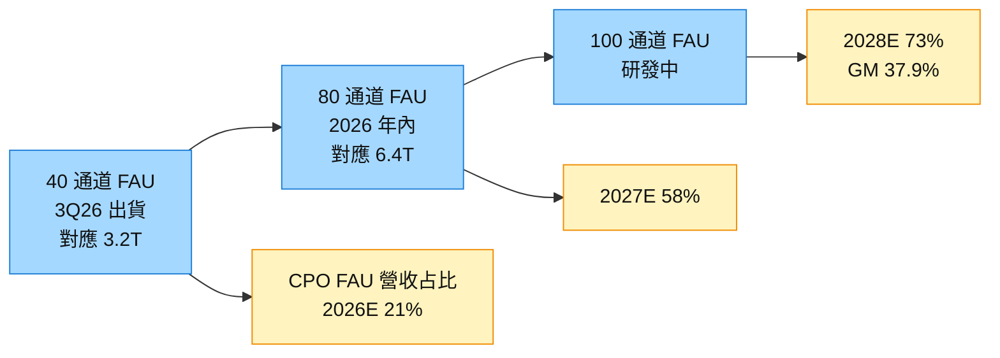

# 3363_上詮（櫃）

## 基本資料

上詮（FOCI）是台灣光纖被動元件與光纖模組廠，營收以光纖跳接線（約 77%）、其他光纖被動元件與光纖耦合產品為主。在 CPO 題材中的角色是 **FAU（Fiber Attach Unit）/ 光纖耦合**供應商之一。供應鏈位置：CPO 光引擎的光纖耦合被動件。掛牌：TPEX 上櫃（櫃）。資料來源：SemiAnalysis CPO Book（2026-01-02）。

## 核心技術／競爭優勢

- 光纖被動元件與光纖耦合：FAU 負責把光纖與光引擎精準耦合，是 CPO 光性能的關鍵被動件。
- SemiAnalysis 指 FOCI 可能較聚焦 Nvidia 的 scale-up CPO 方案；亦具 MT ferrule 自製（多為自家 FAU/shuffle box 垂直整合用）。

## 產品與應用

| 產品 / 服務 | 應用 | 相關客戶 / 下游 |
|-------------|------|-----------------|
| 光纖跳接線 / 被動元件 | 光通訊 | 光模組 / 系統廠 |
| FAU / 光纖耦合 | CPO 光引擎耦合 | CPO 系統（含 Nvidia scale-up） |
| MT ferrule（自製） | FAU / shuffle box | 垂直整合自用 |

## 供應鏈位置

- 下游：CPO 系統 / [[NVDA.US(nvidia)]]（scale-up CPO 方向）
- 所屬供應鏈：[[供應鏈_CPO]]（FAU / 光纖耦合環節）
- 同環節（未建頁）：TFC Optical（300394.SH，Q3450 FAU 主供）、Senko（9069.JP，SEAT 可拆式 FAU）、Sumitomo、AFR

## 相關公司

| 公司 | 關係 | 說明 |
|------|------|------|
| [[NVDA.US(nvidia)]] | 下游 | CPO（scale-up 方向）FAU 需求 |

## EPS 記錄

| 年度 | EPS（NT$）| 備註 |
|------|----------|------|
| 2026F | **27.34**（+1,245% YoY）| 凱基 2025-11 估，FAU 放量 |

## EPS 預估

| 年度 | Goldman Sachs EPS（報告日：2026-09-08） | GS 營收（NT$ 百萬） | 備註 |
|------|----------------------------------------|---------------------|------|
| 2025A | 0.16 | 1,892 | 實績 |
| 2026E | 0.82 | 2,704 | CPO FAU 占營收 21%；季度 2Q26 −0.23、3Q26E 0.17、4Q26E 1.85 |
| 2027E | 17.49 | 9,745 | CPO FAU 占營收 58% |
| 2028E | 49.80 | 25,477 | CPO FAU 占營收 73%；毛利率 37.9%（2025A 18.8%） |

> 高盛 2026E EPS 0.82 與凱基 2025-11 估 2026F 27.34 差距極大：前者反映 FAU 3Q26 才開始出貨，後者為 2025 年底的早期假設。兩者發布時點相差約 10 個月，以較新的高盛口徑追蹤，凱基數字保留作歷史紀錄。

## 目標價與評等

| 券商 | 報告發布日 | 評等 | 目標價 | 評價基礎 | 來源 |
|------|------------|------|--------|----------|------|
| Goldman Sachs | 2026-09-08 | Buy | NT$833（2026-08-06 由 NT$864 下調後維持） | 15.4x 2030E P/E，以 COE 12.6% 折現回 2027E；報告時股價 NT$723 | [[報告_GoldmanSachs_上詮3363_20260908]] |

## 2026-09-08 SEMICON Taiwan CFO 會議（Goldman Sachs）

- **FAU 開始出貨：** 上詮 CPO FAU 於 3Q26 開始出貨，帶動 8 月營收月增率加速至 +20%（7 月 +9%），高盛解讀為高階 FAU 放量。（fact／券商解讀，中高）
- **規格路線：** 2026 年以 40 通道 FAU（3Q26 起，對應 3.2T）為主，年內接續 80 通道（對應 6.4T），100 通道研發中。傳輸速率提高使 FAU 通道數增加、進入門檻提高，管理層認為反映上詮的研發與高精度製造能力。（公司說法，中）
- **客戶結構：** FAU 客戶橫跨 fabless、晶圓代工與雷射供應商等多類型，但報告未具名。管理層看好 AIDC 光網路由 scale-out 延伸至 scale-up 帶動 CPO 交換器需求，FAU 營收貢獻提高後毛利率也將回升。
- **高盛預估：** CPO FAU 營收成長於 2H27 再加速，營收占比 2026E 21% → 2027E 58% → 2028E 73%，毛利率 2028E 達 37.9%（2025A 18.8%）。下行風險為競爭加劇、光網路技術路線轉移與產能爬坡放緩。（estimate，中）
- 同日 GS SEMICON 綜合報告將 FAU 與雷射規格升級列為六大重點之一，詳見 [[技術_CPO]]、[[技術_FAU]]。
- 來源：[[報告_GoldmanSachs_上詮3363_20260908]]、[[報告_GoldmanSachs_SEMICON台灣光子測試_20260908]]（Goldman Sachs，2026-09-08）。

## 業務補充（CTBC 2025-11）

- **Americas 82%**：北美為最大市場，SiPh/CPO FAU 客戶多在矽谷
- **泰國子公司**：2026 年 1Q 設立，配合供應鏈分散要求
- **2027 年量產**：FAU 主力產品從樣品/NPI 進入量產
- **2026 Capex NT$17.5 億**：積極擴充 FAU 產能
- **產品路線**：FAU for 1.6T / 3.2T / 6.4T CPO（已布局超高速路線）

## 券商觀點與催化劑

- [[報告_Semianalysis_CPO_20260102]]（2026-01）：FOCI 列為 FAU 領先廠商之一（與 TFC、Senko 並列），較可能聚焦 Nvidia 大型 scale-up CPO 解決方案。
- 報告_CTBC_上詮3363_NR_20251125（CTBC，2025-11-25）：NR；FAU 技術地位、泰國子公司 1Q26、2027 量產、2026 Capex NT$17.5 億；EPS 凱基估 2026F 27.34（+1,245%）
- 催化劑：CPO 放量帶動 FAU/光纖耦合需求；惟須留意 CPO 整體時程下修（[[技術_CPO]] 衝突 callout）對短期節奏的影響。

## 圖片/架構圖

`[待補來源圖]` 需官方 IR 光模塊或光收發器產品圖佐證，現有研究筆記不足以支撐產品示意圖。

圖說：依高盛 2026-09-08 CFO 會議整理的上詮 FAU 通道數路線（上排）與 CPO FAU 營收占比預估（下排，estimate）；通道數愈多、對位精度要求愈高，是上詮毛利率回升的主要依據。GS 報告無可用產品圖，故以 Mermaid 補位。

## 時間軸

| 時間 | 事件 | 類型 | 重要性 | 備註 |
|------|------|------|--------|------|
| 2026-1Q | 泰國子公司成立 | 組織 | ⭐⭐ | 供應鏈分散，配合客戶要求 |
| 2026 | Capex NT$17.5 億（FAU 擴產）| 資本支出 | ⭐⭐⭐ | 積極備貨 2027 量產 |
| 2027 | FAU 1.6T / 3.2T / 6.4T 量產 | 產品 | ⭐⭐⭐ | 主力量產年 |
| 2026Q3 | 40 通道 CPO FAU 開始出貨，8 月營收 MoM +20% | 放量 | ⭐⭐⭐ | GS 2026-09-08；對應 3.2T |
| 2026 年內 | 80 通道 FAU（6.4T）接續 | 規格升級 | ⭐⭐ | 100 通道研發中 |
| 2H27 | CPO FAU 營收成長再加速（GS 估 2027E 占營收 58%） | 放量 | ⭐⭐⭐ | estimate |

→ 跨公司時程詳見 [[時程_2026Q3Q4_AI網通與硬體催化劑]]

> [!warning] 風險與注意事項
> - CPO 商業化時程仍有不確定性；高盛列出光網路技術路線轉移、競爭加劇與產能爬坡放緩為下行風險。
> - 2026E EPS 僅 0.82（GS），獲利大幅仰賴 2027–2028 年 FAU 放量假設，估值以 2030E P/E 折現，對時程延後敏感。
> - FAU 客戶未具名，客戶集中度與單一平台依賴程度無法從現有來源判斷。

## 來源

- [[報告_Semianalysis_CPO_20260102]]（CPO Book，2026-01-02）
- 報告_CTBC_上詮3363_NR_20251125（中信投顧，2025-11-25；NR，FAU for SiPh/CPO，Americas 82%，泰國 1Q26，2027 量產）

- [[(付費內容) SemiAnalysis Co-Packaged Optics (CPO) Book – Scaling with Light for the Next Wave of Interconnect]]（2026-01-03）
- [[research_simpletechtrend_CPO矽光子ECTC2026_20260629]]（2026-06-29）
- [[上詮(3363,NR_未評等)-CTBC251125]]（2025-11-25）
- [[報告_GoldmanSachs_SEMICON台灣光子測試_20260908]]（2026-09-08）
- [[報告_GoldmanSachs_上詮3363_20260908]]（2026-09-08）
- [[報告_申万宏源_光通信光電集成深度_20260630]]（2026-06-30）

- [[memo_KGI_HimaxCallMemo_20260916]]（2026-09-16）

## 相關頁面

- [[HIMX.US(himax)]]
- [[分析_Himax車用顯示_CPO微光學與AI眼鏡_20260916]]
- [[時程_2026Q3Q4_AI網通與硬體催化劑]]
- [[供應鏈_AI光互聯]]
- [[技術_FAU]]
- [[技術_MPO]]
- [[技術_光互連]]
- [[技術_光模塊]]
- [[分析_MS_AI供應鏈_HBM降規與Kyber延遲_20260810]]
- [[時程_2026記憶體與AI催化劑]]
