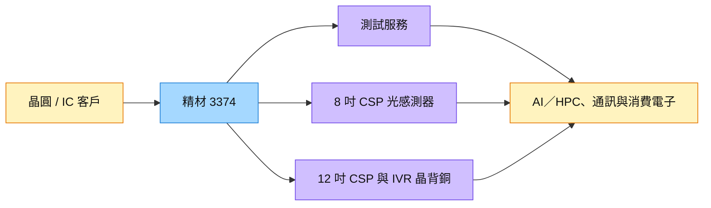

# 3374_精材（櫃）

## 基本資料

精材（3374.TWO，Xintec）提供晶圓級尺寸封裝、厚護層封裝與測試服務，應用涵蓋光感測器、CIS、手機、車用與部分 Server/HPC 晶片。2026 年主要成長動能轉向測試服務：2Q26 測試服務營收年增 103%，占營收 62%；8 吋光感測器新專案已於 2Q26 量產，12 吋產能預計 3Q26 底擴至月產 2,000 片。資料來源：[[活動_精材法說_20260814]]。

## 核心技術／競爭優勢

- **測試服務擴充**：新測試機台於 2026 年 8 月底完成裝機，3Q26 旺季可透過提高稼動率放大營收。
- **晶圓級封裝能力**：8 吋 CSP 光感測器專案已進入量產，12 吋案件持續增加，並布局晶背銅加工。
- **高附加價值專案選擇**：12 吋 IVR 整合式穩壓器晶背銅加工專案預計完成認證後逐步量產，聚焦 HPC companion chip 應用。
- **產能與客戶導入經驗**：既有測試產能已擴充，若需求再超過現有設備，仍需約兩年半重新選址、建廠與導入，形成供給門檻。

## 產品與應用

| 產品 / 服務 | 應用 | 相關客戶 / 下游 |
|---|---|---|
| 測試服務 | AI／HPC、邏輯與光感測器晶片測試 | 策略夥伴與 IC 客戶，未具名 |
| 8 吋 CSP | 手機光感測器、消費性 CIS | 客戶未具名 |
| 12 吋 CSP | 高附加價值晶圓級封裝 | 客戶未具名 |
| 12 吋 IVR 晶背銅加工 | HPC companion chip | 策略夥伴委託設備，客戶未具名 |

## 圖片 / 架構圖

圖說：精材以測試服務為主要成長引擎，並以 8 吋 CSP 與 12 吋晶背銅加工專案提高高附加價值營收。

## EPS 記錄

| 季度／期間 | EPS（元） | YoY | 備註 |
|---|---:|---:|---|
| 2026Q2 | 1.46 | — | 營收 21.85 億元、毛利率 27.7% |
| 2026H1 | 2.88 | — | 營收 40.98 億元、毛利率 28.6% |

## 時間軸

| 時間 | 事件 | 類型 | 重要性 | 備註 |
|---|---|---|---|---|
| 2026Q3 | 測試機台裝機完成、旺季稼動率提升 | 放量 | ⭐⭐⭐ | 管理層對 3Q26 毛利率轉趨樂觀 |
| 2026Q3 末 | 12 吋產能擴至月產 2,000 片 | 擴產 | ⭐⭐⭐ | 客戶驗證放慢，部分訂單延至 2027H1 |
| 2026Q4–2027Q1 | 12 吋 IVR 晶背銅加工完成認證並適量產 | 驗證／放量 | ⭐⭐⭐ | 配合 HPC companion chip |
| 2027H2 | 12 吋 IVR 晶背銅加工放量 | 放量 | ⭐⭐⭐ | 可能成為 12 吋營收主要貢獻之一 |

→ 跨公司比較詳見 [[時程_2026記憶體與AI催化劑]]。

## 供應鏈位置

- 上游：晶圓、封裝材料與測試設備供應商。
- 中游：晶圓級封裝、CSP、晶背銅加工與半導體測試服務。
- 下游：手機、車用、消費性 CIS、AI／HPC 與 Server 晶片客戶。
- 所屬研究鏈：[[供應鏈_半導體測試設備]]。

## 相關公司

目前來源未揭露可確認的客戶、供應商或台積電 OS 外包合作，`related_companies` 暫留空；市場傳言不作為公司關係。

> [!warning] 風險與注意事項
> - 客戶驗證放慢，12 吋原訂 2026H2 貢獻的部分訂單已延至 2027H1。
> - 測試新產能折舊與稼動率若未同步提升，可能壓縮毛利率。
> - 3D 感測封裝仍受新進競爭者影響，雖減幅收斂但尚未恢復成長。
> - 台積電 OS 外包僅屬市場傳言，公司未確認，不能寫成已取得訂單。

## 來源

- [[活動_精材法說_20260814]] — 公司法說會 call memo，2026-08-14

## 相關頁面

- [[供應鏈_半導體測試設備]]
- [[時程_2026記憶體與AI催化劑]]
