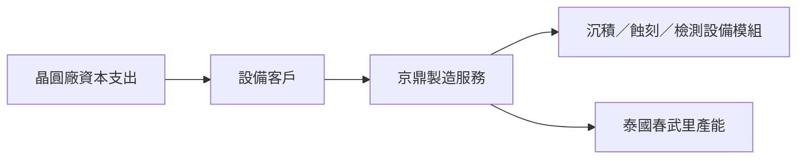

# 3413_京鼎（市）

## 基本資料

京鼎（3413.TW，Foxsemicon）提供半導體設備製造服務與模組整合，需求主要受薄膜沉積、蝕刻、檢測設備資本支出驅動。中信投顧指出，2Q26 營收 NT$63 億、年增 21%，但初期新廠成本與產品組合使毛利率僅 22.3%、EPS NT$4.61，低於其預期。

## 核心技術／競爭優勢

- 製造服務涵蓋沉積、蝕刻與檢測設備模組，受 AI 帶動的晶圓廠資本支出拉動。
- 泰國春武里一期於 2026 年 7 月開始貢獻，為海外製造規模與成本效率的觀察點。
- 券商稱整體訂單能見度約九個月、部分產品見至 2028 年；屬供應鏈調研，不等同公司保證訂單。

## 產品與應用

| 產品／服務 | 應用 | 下游 |
|---|---|---|
| 半導體設備製造服務 | 薄膜沉積、蝕刻、檢測設備 | 設備客戶（來源未具名） |
| 航太專案 | 製造服務專案 | 富蘭登航太（來源提及） |

## 圖片 / 架構圖

圖說：京鼎的需求由設備客戶與晶圓廠資本支出傳導；客戶名稱與實際訂單範圍未於本來源揭露。

## EPS 預估

| 年度 | 中信投顧 EPS（報告日：2026-09-10） | 備註 |
|---|---:|---|
| 2026E | 22.05 | 券商 estimate |
| 2027E | 29.20 | 券商 estimate |

## 目標價與評等

| 券商 | 報告發布日 | 評等 | 目標價 | 評價基礎 | 來源 |
|---|---|---|---:|---|---|
| 中信投顧 | 2026-09-10 | 買進 | NT$395 | 2027E EPS × 13.5x | [[京鼎(3413,B_買進)-CTBC260910]] |

## 時間軸

| 時間 | 事件 | 類型 | 重要性 | 備註 |
|---|---|---|---|---|
| 2026Q3 | 營收預期續季增、毛利率逐步改善 | 營運 | ⭐⭐ | 公司／券商展望，待財報驗證 |
| 2027 年中 | 春武里一期產能預計增至約 25% | 擴產 | ⭐⭐ | 券商轉述 |
| 2027H2 | 春武里二期隨設備進機逐步開出產能 | 擴產 | ⭐⭐⭐ | 仍受建置與客戶需求影響 |

## 供應鏈位置

- 下游為半導體設備客戶與晶圓廠資本支出鏈；本來源未揭露可確認的公司層級客戶關係。
- 本次尚未建立完整的設備客戶鏈頁；待取得具名設備客戶與製程節點資料後再補供應鏈地圖。

## 相關公司

本次來源未揭露可安全寫入 `related_companies` 的具名上下游公司。

> [!warning] 風險與注意事項
> - 春武里新廠初期成本、折舊與量產效率可能延後毛利率改善。
> - 客戶 forecast、訂單能見度與 2028 年後需求均有資本支出循環風險。

## 來源

- [[京鼎(3413,B_買進)-CTBC260910]]（中信投顧，2026-09-10；Buy、目標價 NT$395、泰國擴產與財測）
