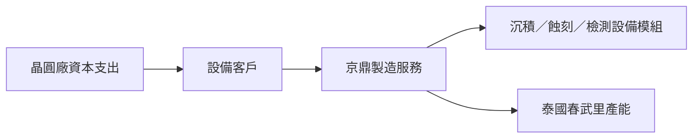

# 3413_京鼎（市）

## 基本資料

京鼎（3413.TW，Foxsemicon）提供半導體設備製造服務與模組整合，需求主要受薄膜沉積、蝕刻、檢測設備資本支出驅動。中信投顧指出，2Q26 營收 NT$63 億、年增 21%，但初期新廠成本與產品組合使毛利率僅 22.3%、EPS NT$4.61，低於其預期。

## 核心技術／競爭優勢

- 製造服務涵蓋沉積、蝕刻與檢測設備模組，受 AI 帶動的晶圓廠資本支出拉動。
- 泰國春武里一期於 2026 年 7 月開始貢獻，為海外製造規模與成本效率的觀察點。
- 券商稱整體訂單能見度約九個月、部分產品見至 2028 年；屬供應鏈調研，不等同公司保證訂單。

## 產品與應用

| 產品／服務 | 應用 | 下游 |
|---|---|---|
| 半導體設備製造服務 | 薄膜沉積、蝕刻、檢測設備 | 設備客戶（來源未具名） |
| 航太專案 | 製造服務專案 | 富蘭登航太（來源提及） |

## 圖片 / 架構圖

```mermaid
flowchart LR
    A[晶圓廠資本支出] --> B[設備客戶]
    B --> C[京鼎製造服務]
    C --> D[沉積／蝕刻／檢測設備模組]
    C --> E[泰國春武里產能]
```

圖說：京鼎的需求由設備客戶與晶圓廠資本支出傳導；客戶名稱與實際訂單範圍未於本來源揭露。

## EPS 預估

| 年度 | 中信投顧 EPS（報告日：2026-09-10） | 備註 |
|---|---:|---|
| 2026E | 22.05 | 券商 estimate |
| 2027E | 29.20 | 券商 estimate |

## 目標價與評等

| 券商 | 報告發布日 | 評等 | 目標價 | 評價基礎 | 來源 |
|---|---|---|---:|---|---|
| 中信投顧 | 2026-09-10 | 買進 | NT$395 | 2027E EPS × 13.5x | [[京鼎(3413,B_買進)-CTBC260910]] |

## 時間軸

| 時間 | 事件 | 類型 | 重要性 | 備註 |
|---|---|---|---|---|
| 2026Q3 | 營收預期續季增、毛利率逐步改善 | 營運 | ⭐⭐ | 公司／券商展望，待財報驗證 |
| 2027 年中 | 春武里一期產能預計增至約 25% | 擴產 | ⭐⭐ | 券商轉述 |
| 2027H2 | 春武里二期隨設備進機逐步開出產能 | 擴產 | ⭐⭐⭐ | 仍受建置與客戶需求影響 |

## 供應鏈位置

- 下游為半導體設備客戶與晶圓廠資本支出鏈；本來源未揭露可確認的公司層級客戶關係。
- 本次尚未建立完整的設備客戶鏈頁；待取得具名設備客戶與製程節點資料後再補供應鏈地圖。

## 2026-09-09 元大投資論壇補充

- **財務：** 2Q26 營收 63 億元（QoQ +13.3%、YoY +21.1%，單季新高）、毛利率 22.3%（短期谷底）、歸屬淨利 5.11 億元；1H26 營收 118.61 億元、EPS 8.89 元；費用率 10.1%，3Q26 目標 10.5–11%。
- **業務：** 製造服務 85%（53.63 億元；蝕刻 QoQ +20%、ALD +17%、PVD +14%）、技術維修 14%（8.82 億元、YoY +124.7%，含航太專案）、自主設備 1%；檢測設備（Metrology）QoQ +35%、YoY +607%、占比升至 14%，未來改由客戶自備高價料件，縮小營收分母並改善毛利率。
- **泰國：** 春武里廠 7 月完成認證並放量，營收占比由約 15% 升至年底 20% 以上、2027 年中一期結束時逾 25%，主要服務美商應材；羅勇廠 2Q／3Q26 營業利益轉正，泰國整體 4Q26 損益轉正；泰國二期投資 2.34 億美元，2H26 發包、2H27 起釋出產能（規模較一期翻倍）；泰國團隊約 1,300 人、雙班 24 小時。
- **產業：** 研調上修 2026 年 WFE 成長率至 19–25%，GAA、HBM 與先進封裝帶動薄膜沉積、蝕刻與檢測設備需求。
- 來源：[[活動_京鼎3413_元大論壇Memo_20260909]]（元大投顧，2026-09-09），公司說法，信心中高。

## 相關公司

| 公司 | 關係 | 說明 |
|---|---|---|
| [[AMAT.US(applied_materials)]] | 主要客戶 | 泰國春武里一期主要服務美商應材（元大論壇 Memo）；京鼎為應材前段設備模組製造夥伴 |

> [!warning] 風險與注意事項
> - 春武里新廠初期成本、折舊與量產效率可能延後毛利率改善。
> - 客戶 forecast、訂單能見度與 2028 年後需求均有資本支出循環風險。

## 來源

- [[京鼎(3413,B_買進)-CTBC260910]]（中信投顧，2026-09-10；Buy、目標價 NT$395、泰國擴產與財測）
- [[活動_京鼎3413_元大論壇Memo_20260909]]（元大投資論壇即時 Memo，2026-09-09）
