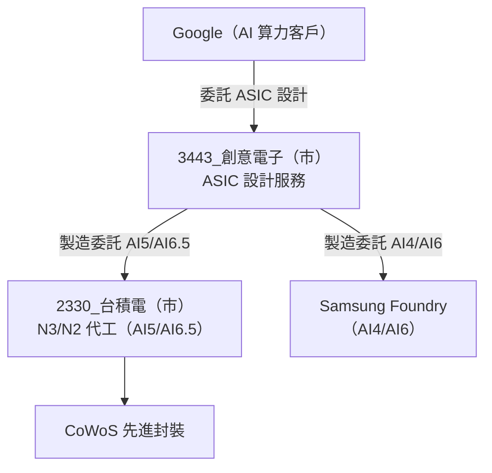

# 3443_創意電子（市）

## 基本資料

創意電子（3443 TT，GUC，Global Unichip Corp）是台積電旗下 ASIC 設計服務子公司，也是 Google AI 加速器晶片（TPU / ASIC 世代）的主要設計合作夥伴。隨著 Google AI 算力版圖快速擴張，GUC 的 AI5 世代晶片量產進入高速成長週期，AI6.5 設計亦同步推進。

成長驅動：
1. **AI5 量產放量**：AI5 世代晶片預計 2Q27 進入量產（MP），2027 年出貨量約 350 萬套（vs 原估 200 萬套，大幅上調）
2. **AI6.5 新世代接棒**：AI6.5 計畫在 4Q26-1Q27 完成 tape-out（TO），同樣使用 TSMC 製程
3. **TSMC 深度整合**：GUC 作為 TSMC 子公司，在先進製程（N3/N2）切入深度有先天優勢
4. **Hyperscaler ASIC 定制化趨勢**：Google 持續加碼自研 AI 晶片以降低對 NVIDIA GPU 依賴，GUC 直接受惠

資料來源：[[memo_AI半導體_top_picks_UMC_ABF_MLCC_ASIC_20260601]]（2026-06-01）；[[活動_創意電子3443_CallMemo_20260731]]（法說後 Call Memo，2026-07-31）

## 2Q26 財務結果

| 指標 | 數值 | QoQ |
|------|------|-----|
| 營收 | NT$139億 | +20% |
| 稅後淨利 | NT$15.5億 | — |
| EPS | NT$1.6 | — |
| 1H26 累積營收 | NT$250億 | — |

**毛利率說明**：1Q26 因 NRE 佔比高（早期設計費毛利佳）而較高；2Q26 NRE 金額雖大但進入 Tape-out 階段（光罩費 + 測試 wafer 費推低毛利率），量產毛利率已回升至理想水準。全年毛利率信心維持，惟 NRE「黑豹案」（大型客戶新專案）若延至 2027 年將小幅拖累毛利。

**2Q26 營收組成**：雲端（運算/訓練/連接性）~80%；消費性/加密貨幣/其他 ~20%。下半年組成比例大致不變，但加密貨幣將逐季遞減趨近於零，車用應用逐步填補。

## 重大人事

- **張麗絲**（新任董事長）：台積電 29 年資歷，擁有 DTCO（設計與製程協同優化）深厚背景，是 GUC 與 TSMC 供應鏈深度整合的最強背書。

## 核心技術／競爭優勢

- **Google ASIC 深度整合**：AI4/AI5/AI6/AI6.5 世代均與 GUC 深度合作（AI4/AI6 在 Samsung 代工，AI5/AI6.5 在 TSMC）
- **TSMC 子公司優勢**：能最早取得 N3/N2 先進製程工程資源與產能承諾
- **超大規模 ASIC 能力**：具備 Hyperscaler 等級 AI 加速器全晶片設計（die-level）能力
- **AI4 訂單增加**：即使進入 AI5 量產週期，AI4 世代仍見訂單上修，顯示 Google ASIC 需求廣度

## AI ASIC 數據

### Google AI 晶片世代路線圖（GUC 視角）

| 世代 | 製程 | 狀態（截至 2026-07） | 出貨量（2027E） | 備註 |
|------|------|---------------------|----------------|------|
| AI4 | Samsung | 量產中 | — | 訂單上調 |
| AI5 | TSMC | MP 2Q27 | ~350 萬套 | 原估 200 萬，大幅上修 |
| AI6 | Samsung | — | — | — |
| AI6.5 | TSMC | TO 4Q26-1Q27 | — | — |

> 「AI4/AI5/AI6/AI6.5」為 Google AI 加速器晶片代號；具體 TPU 版本對應關係仍待確認。

## 圖片 / 架構圖

![[ubs 3443_001.png]]
*圖（UBS，2026-07-30）：創意電子股價與券商歷史目標價軌跡。目標價屬券商估值，不代表公司營運指引。*

GUC 為 Google AI 晶片設計服務商，TSMC 負責先進製程代工與 CoWoS 封裝。

## 目標價與評等

| 分析來源 | 報告日 | 評等 | 目標價 | 評價基礎 | 來源 |
|---------|--------|------|--------|----------|------|
| 買方研究員 | 2026-06-01 | 推薦（ASIC picks） | NT$10,000 | — | [[memo_AI半導體_top_picks_UMC_ABF_MLCC_ASIC_20260601]] |

## 時間軸

| 時間 | 事件 | 類型 | 重要性 | 備註 |
|------|------|------|--------|------|
| 2026-Q2 | AI4 訂單增加；Turnkey 雲端大量出貨 | 訂單/量產 | ⭐⭐⭐ | 2Q26 營收 NT$139億（+20% QoQ），超預期 |
| 2026-Q2 | 圖靈中心試營運 | 研發基礎建設 | ⭐⭐ | 執行中小型專案；2H26 全面啟用 |
| 2026-H2 | 北美 CPU 下一代案量產 | 量產 | ⭐⭐⭐ | 今年底或明年初 MP |
| 2026-Q4 ～ 2027-Q1 | AI6.5 tape-out（TO） | 設計里程碑 | ⭐⭐⭐ | 下一世代設計確認，使用 TSMC 製程 |
| 2027 | 中國座艙合一客戶貢獻 | 量產 | ⭐⭐ | DRAM 64GB→40GB 精簡設計；明年起看到貢獻 |
| 2027-Q2 | AI5 進入量產（MP） | 量產 | ⭐⭐⭐ | 預計 2Q27；出貨量已由 200M 上調至 350M |
| 2027 全年 | AI5 出貨 ~3.5M 套 | 放量 | ⭐⭐⭐ | vs 原估 2M，大幅上修 |

## 業務策略定位

### TK 分層（Turnkey 服務等級）

GUC 明確以 TK1/TK2/TK3 區分服務深度，成本結構與收費標準各異，**不以低價搶進 TK1**：

| 層級 | 聚焦 | 特點 |
|------|------|------|
| TK1 | 前端設計（RTL → Physical） | 技術含量最高；不低價競爭 |
| TK2 | 封裝設計（Advanced Packaging） | CoWoS、先進封裝整合 |
| TK3 | 定位差異化，不屬上述 | 多元 NRE/Turnkey 組合 |

**與 Broadcom 的差異化策略**：不與產品公司正面競爭（Broadcom 毛利率 50%+，GUC 設計服務 30-40%），採「從 RTL 往下走 + 從封裝設計往上整合」策略，以 Physical Synthesis / Physical Implementation + Advanced Packaging 優勢卡位。

### 主要客戶驅動力（2Q26 法說更新）

| 客戶類型 | 現況 | 展望 |
|---------|------|------|
| 北美 CSP（主力）| Turnkey 雲端出貨大增，是 2Q26 超預期主因 | 下一代 CPU 案已取得，MP 今年底或明年初 |
| 北美車用 + 機器人 | 車用案延伸至機器人應用 | 成長時點取決客戶機器人工廠轉型進度 |
| 中國車用（座艙合一） | DRAM 用量由 64GB 降至 40GB，技術快速成熟 | 看好 2027 年起貢獻 |
| 加密貨幣客戶 | 約 20% 但逐季遞減 | 趨近於零；車用填補 |
| CPO 客戶 | 目前多為小型新創 | 已與大型客戶接觸中，戰略卡位優先 |

### 圖靈中心（Turing Center）

- 2Q26 起試營運，執行中小型專案
- 2H26 全面啟用，支援 N3/N2 及先進封裝研發
- 費用結構：圖靈中心本身費用穩定（主要為固定折舊），額外費用增量來自 CPO / IVR / UCIe / N2 新製程開發

→ 跨公司 ASIC 比較詳見 供應鏈_ASIC設計服務

## 供應鏈位置

- 所屬集團：台積電（TSMC）子公司（GUC = TSMC 旗下 ASIC 設計服務）
- 上游製程：[[2330_台積電（市）]]（AI5/AI6.5 TSMC N3 代工）、Samsung Foundry（AI4/AI6）
- 主要客戶：Google（AI 加速器晶片設計）
- 對標公司：[[3661_世芯-KY（市）]]（Alchip，Amazon Trainium 設計）、[[2454_聯發科（市）]]（MTK，xAI Dojo 3 潛在設計服務）

## 相關公司

| 公司 | 關係 | 說明 |
|------|------|------|
| [[2330_台積電（市）]] | 母公司 / 代工廠 | TSMC 持有 GUC 多數股份；AI5/AI6.5 採 TSMC N3/N2 製程 |
| [[3661_世芯-KY（市）]] | 同業 / 比較 | Alchip，Amazon Trainium 設計，不同 Hyperscaler 服務 |
| [[2454_聯發科（市）]] | 同業 / 比較 | MTK 追逐 xAI Dojo 3 設計服務，GUC 專注 Google |

> [!note] 觀察事項
> - AI5 出貨量由 2M 上調至 3.5M，為近期最大正面修正
> - AI6.5 TO 時間（4Q26-1Q27）提供 2028 年後持續成長能見度
> - AI4 訂單上調暗示 Google 對多世代 AI 晶片同步需求（並非只依賴最新世代）

> [!warning] 風險與注意事項
> - **Google 集中度風險**：客戶過度集中在 Google，若 Google 削減 AI 資本支出或轉向其他設計服務商，GUC 衝擊大
> - **Samsung 比重**：AI4/AI6 在 Samsung 代工，若 Samsung 良率落後或轉型，可能影響 GUC 整體出貨
> - **競爭壓力**：MediaTek 亦積極搶攻 Hyperscaler ASIC 設計服務市場（如 Google ZebraFish/v8t、xAI Dojo 3）

## 來源

- [[memo_AI半導體_top_picks_UMC_ABF_MLCC_ASIC_20260601]]（2026-06-01）
- [[memo_AI半導體_top_picks_update_UMC_Kaori_ABF_20260615v2]]（2026-06-15）
- [[活動_創意電子3443_CallMemo_20260731]]（2Q26 法說後 Call Memo，2026-07-31）

## 相關頁面

- [[AMZN.US(amazon)]]
- [[分析_2026-08記憶體_AI需求與液冷ASIC更新]]
- [[時程_2026記憶體與AI催化劑]]
- [[分析_聯發科AI_ASIC]]

## UBS 2026-07-30 更新

- 2Q26 EPS NT$11.61，高於 UBS 上修後預估；毛利率 21.5%，反映先進製程 NRE 與 turnkey 銷售組合。
- UBS 維持 Buy、目標價 NT$6,500，2026E／2027E EPS 分別為 NT$52.96／104.14，均屬券商 estimate。

來源：[[報告_MorganStanley_創意電子_20260731]]（Morgan Stanley，2026-07-31）。

### 2026-07-31 Daiwa 更新

- 2Q26 營收高於預期但毛利率 21.5% 受產品組合拖累；Daiwa 認為 TSMC 產能配置改善有助 2H26 AI CPU 與 NRE 專案出貨。
- 估值與 AI ASIC／車用專案仍屬券商 estimate；來源：[[260731_daiwa_guc]]（Daiwa，2026-07-31）。

## Daiwa 2026-08-05 更新

- Daiwa 因晶圓代工夥伴釋出更多產能及費用控制，上修 2026–2028E EPS 9–19%；Turnkey 2026 年營收估年增逾一倍至 NT$54bn，均屬券商 estimate。
- AI 專案量增但毛利率稀釋，Daiwa 仍估營業利益率改善至 14–15%；12 個月目標價由 NT$4,525 上調至 NT$5,125，評等升至 Buy。
- 關鍵驗證為晶圓代工產能支持、AI CPU／accelerator 量產與 advanced packaging 執行，不能將預估營收視為已確認訂單。

來源：[[Daiwa-3443 20260805]]（Daiwa，2026-08-05；券商 estimate）。

## Morgan Stanley 2026-07-31 更新

- 2Q26 營收 NT$13.897bn、EPS NT$11.61，高於 MS／市場預估；毛利率 21.5% 受 NRE／turnkey 組合影響。
- 管理層確認取得「下一代美國車用客戶 AI 晶片」design win；Morgan Stanley 推測為 Tesla AI6，但客戶身分屬券商 thesis，未寫成公司已確認事實。
- 下一代 Google CPU 預計 2026 年底至 2027 年初 tape-out；管理層表示可支援其他封裝技術，MS 推測意指 Intel EMIB-T。
- MS 對 2027 年 CoWoS 大客戶為 Meta ASIC 與歐洲 AI 新創的說法同屬券商推測；TSMC 產能配置預計兩個月內更明朗。
- MS 維持 Overweight、目標價 NT$5,688；2026E／2027E／2028E EPS NT$44.04／124.37／189.50，均屬 estimate。

來源：[[報告_MorganStanley_創意電子_20260731]]（Morgan Stanley，2026-07-31）。
