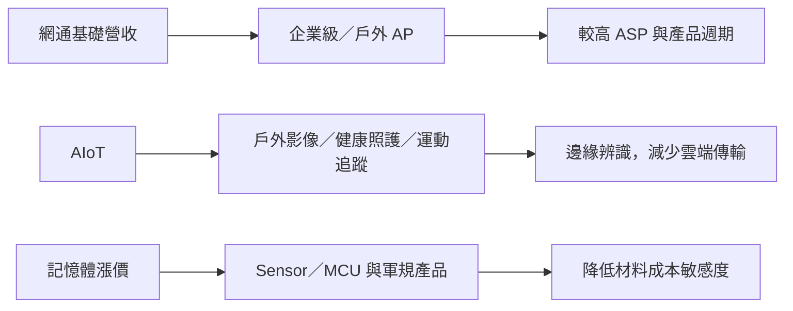

# 3447_展達（市）

## 基本資料

展達以網通與 AIoT 為主，正由低價消費網通轉向企業級／戶外 AP、軍規、感測器與 MCU 等較高附加價值產品。國泰證期資料稱，1H26 網通約占營收 62%、AIoT 約占 32%，毛利受記憶體成本與高毛利 AIoT 訂單遞延影響；泰國為主要海外製造基地，蘇州廠整併已大致完成。來源：[[memo_國泰證期_展達CallMemo_20260910]]。

## 核心技術／競爭優勢

- **產品組合轉型**：企業級與戶外 AP 單價、規格及生命週期高於消費網通，較能承受材料成本變動。
- **邊緣 AI 應用**：產品由 IP Camera 延伸至戶外影像、運動追蹤與老人照護，以在地辨識降低雲端傳輸與隱私風險。
- **低記憶體產品設計**：以 MCU、感測器及 GPS／流量功能降低對高價記憶體的依賴。
- **泰國製造彈性**：既有廠房設計產值約 60 億元；公司先提升稼動與產品組合，新增廠房待需求明朗。

## 產品與應用

| 產品 / 服務 | 應用 | 相關客戶 / 下游 |
|---|---|---|
| 網通設備與企業／戶外 AP | 企業網路、戶外連網 | 客戶未揭露 |
| AI Box／具 AI 功能 Power Switch | 邊緣 AI 與網路管理 | 產品已完成，客戶推出時程未揭露 |
| Nature Cam 與運動追蹤 | 戶外影像、GPS 與流量分析 | 終端客戶未揭露 |
| Edge AI 健康監測 | 老人照護與異常姿態／求救辨識 | 終端客戶未揭露 |
| 軍規、Sensor 與 MCU 產品 | 國防與低記憶體需求應用 | 供應鏈導入中 |

## 圖片 / 架構圖

*展達的轉型重點是以高價值網通與邊緣 AIoT 降低消費網通及記憶體成本的波動，但放量仍取決於客戶導入。*

## EPS 記錄

| 期間 | EPS（元） | YoY | 備註 |
|---|---:|---:|---|
| 2026H1 | 0.40 | 高於 0.04 | 公司／券商轉述；毛利率 9.3% |
| 2026Q2 | 0.23 | — | 對比 2026Q1 的 0.17 元 |

## 時間軸

| 時間 | 事件 | 類型 | 重要性 | 備註 |
|---|---|---|---|---|
| 2026Q3（預估） | 遞延 AIoT 高毛利訂單認列 | 放量 | ⭐⭐⭐ | 公司展望，客戶與金額未揭露 |
| 2026H2 | AI Box／Power Switch 依客戶推出 | 新產品／驗證 | ⭐⭐ | 產品已完成，出貨待確認 |
| 2027 或 2027H2（可能） | Wi-Fi 8 導入 | 規格升級 | ⭐⭐ | 受記憶體成本影響，非確定時程 |
| 3 年內（目標） | 泰國廠產值推升至 50–60 億元 | 擴產／稼動 | ⭐⭐ | 公司目標，非已承諾訂單 |

→ 相關產業催化劑見 [[時程_2026AI軟體與軍工AIoT催化劑]]。

## 供應鏈位置

- 上游：記憶體、MCU、感測器與網通元件；記憶體漲價為短期毛利主要壓力。
- 下游：企業網通、戶外連網、邊緣 AI、老人照護與軍工國防。
- 所屬供應鏈：[[供應鏈_工業自動化]]；技術應用參照 [[技術_邊緣AI]]。

## 相關公司

本次來源未揭露可確認的客戶、供應商或競爭者，故暫不建立公司關係。

> [!warning] 風險與注意事項
> - AIoT 訂單遞延與記憶體漲價已壓抑 1H26 毛利；價格轉嫁速度是核心追蹤點。
> - Wi-Fi 8 可能推至 2027 年或 2027H2，且 AI Box／Power Switch 尚未提供正式出貨資訊。
> - 泰國廠的產值目標取決於需求與客戶承諾，新增廠房目前暫緩。

## 來源

- [[memo_國泰證期_展達CallMemo_20260910]]（國泰證期研究部，2026-09-10；僅供內部使用）

## 相關頁面

- [[分析_展達網通轉向邊緣AI與高附加價值產品_20260910]]
- [[時程_2026工業自動化與人形機器人]]
